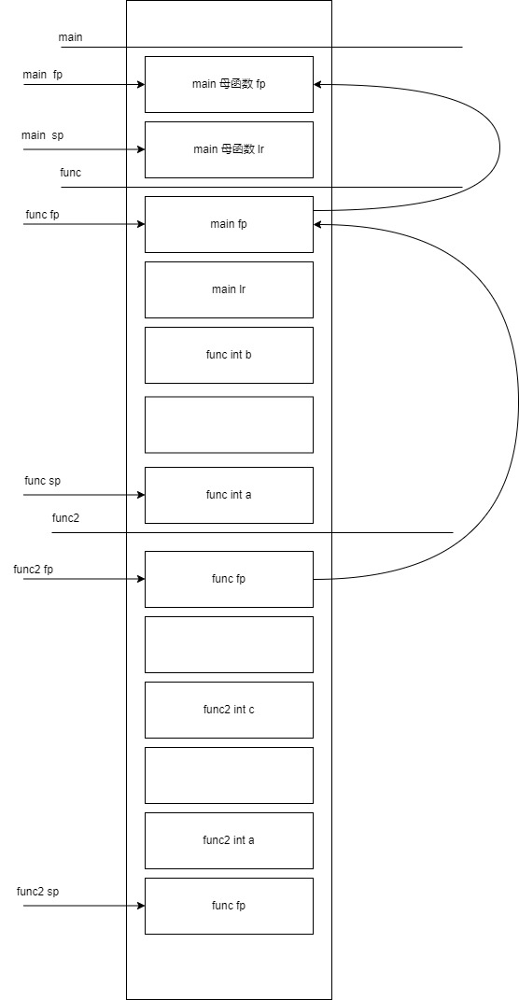

# 函数调用
```asm
#include <iostream>
using namespace std;


void func2(int a)
{
   0:	push	{fp}		; (str fp, [sp, #-4]!) // 保存func的fp
							  // 因为func2 没有函数调用，所以不需要保存lr
   4:	add	fp, sp, #0        // 设置自己的fp
   8:	sub	sp, sp, #20       // 分配栈变量
   c:	str	r0, [fp, #-16]
	int c;

	c = a;
  10:	ldr	r3, [fp, #-16]
  14:	str	r3, [fp, #-8]
	c =sizeof(a);
  18:	mov	r3, #4
  1c:	str	r3, [fp, #-8]
}
  20:	nop			; (mov r0, r0)
  24:	add	sp, fp, #0
  28:	pop	{fp}		; (ldr fp, [sp], #4)
                        // 将栈的数据弹4字节到fp，
						// fp = *sp; sp += 4;
						// fp指向母函数的fp
  2c:	bx	lr          // pc = lr

00000030 <_Z4funci>:

void func(int a)
{
  30:	push	{fp, lr}   // 保存main的fp 和 lr
  34:	add	fp, sp, #4     // 设置func的 fp , fp = sp + 4
  38:	sub	sp, sp, #16    // 为局部变量分配空间
                            // 为每个变量分配了8字节，
							// 实际上每个变量只需要4字节

  3c:	str	r0, [fp, #-16]  // 将形参的值传递给实参 a
	int b;

	b = a;
  40:	ldr	r3, [fp, #-16]
  44:	str	r3, [fp, #-8]

	func2(11);
  48:	mov	r0, #11
  4c:	bl	0 <_Z5func2i>

	b = 10;
  50:	mov	r3, #10
  54:	str	r3, [fp, #-8]
}
  58:	nop			; (mov r0, r0)
  5c:	sub	sp, fp, #4           // sp = fp - 4
  60:	pop	{fp, pc}            // fp = 母函数的fp值，pc = lr , sp += 8
                                // 此时sp回到母函数的sp的位置

00000064 <main>:

int main()
{
  64:	push	{fp, lr}   // 保存main的母函数的fp，lr , sp -= 8 ,满减栈
  68:	add	fp, sp, #4     // 设置main的 fp, fp = sp + 4， fp 指向存放lr的内存

	func(11);
  6c:	mov	r0, #11    // 传递参数数量少，使用寄存器传参
  70:	bl	30 <_Z4funci>  // lr = pc + 4 ; pc = _Z4funci

	return 0;
  74:	mov	r3, #0
}
  78:	mov	r0, r3
  7c:	pop	{fp, pc}
```



总结：

0. fp是栈帧寄存器，指向本函数的栈帧开始，sp指向本函数的当前栈位置

1. 子函数首先保存母函数的fp ，lr(如果子函数需要调用其他函数)，然后设置自己的fp

2. 子函数分配栈变量，编译阶段就可以直到要分配几个栈变量，多大空间，所以栈变量的地址和子函数fp之间偏移值是固定的，所以编译阶段借助fp就可以实现对栈变量的访问

3. 当函数返回时，由于子函数栈帧保存了母函数fp和lr，而子函数fp指向栈帧开始，所以可以将sp指向对应位置，并pop出母函数的fp和lr，这样fp寄存器就指向母函数的栈帧，pc指向母函数的代码，sp指向母函数的栈低


# const

## 从常变量到常量
C 中的const
```c
const int a = 10;
int *p = (int *)&a;
*p = 30;
cout << "*p : " << *p << endl;
cout << "a : " << a << endl;
cout << "&a : " << &a << endl;
cout << "p : " << p << endl;
```

C中被const 修饰的符号，翻译成汇编后依旧是变量，

C++的const分两种情况

1. const符号用常量初始化

编译器尽可能将a当成宏对代码进行替换

代码被修改成

```c
const int a = 10;
int *p = (int *)&a;
*p = 30;  // p的确指向了符号a对应的内存空间，并进行了修改

cout << "*p : " << *p << endl;
cout << "a : " << 10 << endl;  // *
cout << "*&a : " << 10 << endl; // *
// &a 和 p 的值都为变量a的地址
cout << "&a : " << &a << endl;
cout << "p : " << p << endl;
```

2. const符号用变量初始化

编译器无法在编译阶段将const符号常量化，

所以这种情况和c中的const一样

```c
int b = 10;
const int a = b;
int *p = (int *)&a;
*p = 30;
printf("%d", a);   // 30
printf("%d", *p);  // 30
```

## 汇编

常量
```asm
	const int a = 10;
  1c:	mov	r3, #10
  20:	str	r3, [fp, #-20]	; 0xffffffec  // 初始化栈变量 a = 10
	int *pa = (int *)&a;
  24:	sub	r3, fp, #20       // 取a的地址
  28:	str	r3, [fp, #-16]     // 将a的地址赋值给pa
	int b;

	*pa = 20;
  2c:	ldr	r3, [fp, #-16]    // 取pa的值
  30:	mov	r2, #20           
  34:	str	r2, [r3]          // 设置 pa指向的内存，为20

	b = a;                    // *****
  38:	mov	r3, #10           // 常量a，直接赋值给b
  3c:	str	r3, [fp, #-12]
	b = *pa;
  40:	ldr	r3, [fp, #-16]
  44:	ldr	r3, [r3]
  48:	str	r3, [fp, #-12]
```

常变量
```asm
	int b = 10;
   c:	mov	r3, #10
  10:	str	r3, [fp, #-12]
	const int a = b;
  14:	ldr	r3, [fp, #-12]
  18:	str	r3, [fp, #-8]

	b = a;
  1c:	ldr	r3, [fp, #-8]
  20:	str	r3, [fp, #-12]
```


# 引用
## 引用的本质
引用的汇编实现就是指针

```c
int b = 10;
int &a = b; // 引用定义时必须初始化
int &aa = 30; // 错误，必须用可取地址的右值
			  // 引用只有一级引用
a = 30;

相当于

int * const a = &b;
*a = 30;
```

引用的书写
```c
int arr[5] = {0};

// 记住引用就是指针,先写指针的方式

int (*p)[5] = &arr;

// 改成引用

int (&p)[5] = arr;
```
## 汇编
### 一般引用

```asm
	int b = 10;
  1c:	mov	r3, #10
  20:	str	r3, [fp, #-16]
	int &a = b;
  24:	sub	r3, fp, #16     // 取b的地址
  28:	str	r3, [fp, #-12]  // 将b的地址放到a

	a = 20;
  2c:	ldr	r3, [fp, #-12]  // 从a中取值，做地址
  30:	mov	r2, #20        
  34:	str	r2, [r3]        // 设置指针指向的内存
```
### 常量引用

常量引用会隐式分配一个栈变量

```asm
	int &&a = 20;
  1c:	mov	r3, #20
  20:	str	r3, [fp, #-20]	; 0xffffffec // 分配隐式变量 赋值 20
  24:	sub	r3, fp, #20        // 分配变量a, 将隐式变量的地址存放到a
  28:	str	r3, [fp, #-16]
	int b;

	a = 10;
  2c:	ldr	r3, [fp, #-16]   // 从变量a中获得隐式变量的地址
  30:	mov	r2, #10         
  34:	str	r2, [r3]         // 修改隐式变量的值为10
	b = a;
  38:	ldr	r3, [fp, #-16]   // 从变量a中获得隐式变量的地址
  3c:	ldr	r3, [r3]
  40:	str	r3, [fp, #-12]   // 根据地址获得隐式变量的值赋值给b

```
### 函数引用

```asm
void func(int &a)
{
   0:	push	{fp}		; (str fp, [sp, #-4]!)
   4:	add	fp, sp, #0
   8:	sub	sp, sp, #12
   c:	str	r0, [fp, #-8]    // 将形参赋值给实参，将main:b的地址赋值 a
	a = 10;	
  10:	ldr	r3, [fp, #-8]    // 从a中取值做地址，设置地址对应的内存的内容为10
  14:	mov	r2, #10
  18:	str	r2, [r3]
}
  1c:	nop			; (mov r0, r0)
  20:	add	sp, fp, #0
  24:	pop	{fp}		; (ldr fp, [sp], #4)
  28:	bx	lr

0000002c <main>:

int main()
{
  2c:	push	{fp, lr}
  30:	add	fp, sp, #4
  34:	sub	sp, sp, #8
  38:	ldr	r3, [pc, #72]	; 88 <main+0x5c>
  3c:	ldr	r3, [r3]
  40:	str	r3, [fp, #-8]
  44:	mov	r3, #0
	int b = 10;
  48:	mov	r3, #10
  4c:	str	r3, [fp, #-12]

	func(b);
  50:	sub	r3, fp, #12     // 将b的地址做形参
  54:	mov	r0, r3
  58:	bl	0 <_Z4funcRi>
```

```asm
	int &&c = 10;         // 定义一个常量引用
  44:	mov	r3, #10
  48:	str	r3, [fp, #-16]
  4c:	sub	r3, fp, #16
  50:	str	r3, [fp, #-12]  // 定义c

	func(c);
  54:	ldr	r3, [fp, #-12]  // 从c获得值做地址，解指针的值传递参数
  58:	ldr	r3, [r3]
  5c:	mov	r0, r3
  60:	bl	0 <_Z4funci>


```
