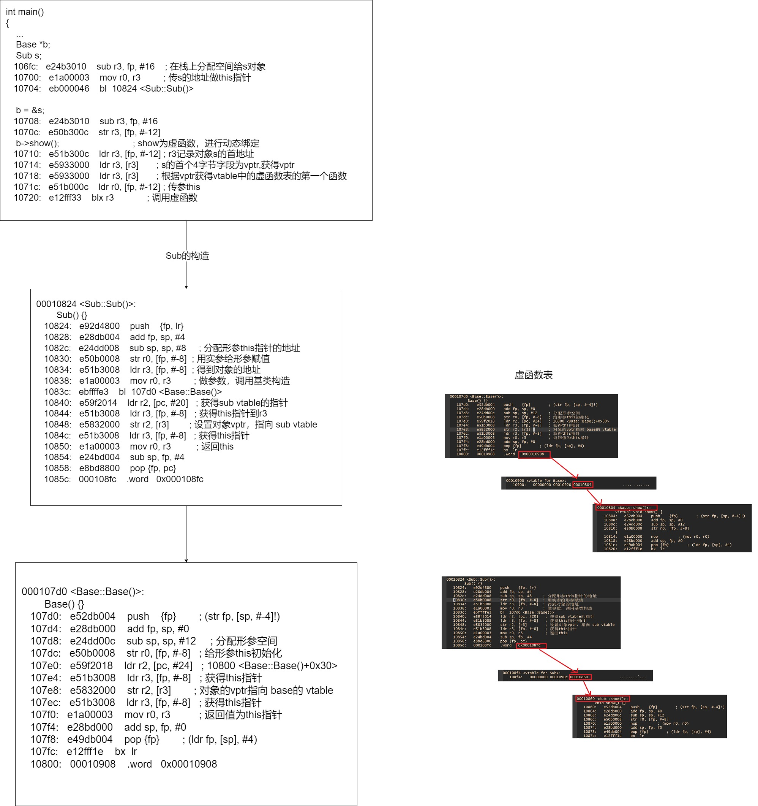
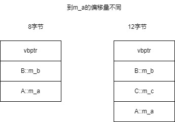
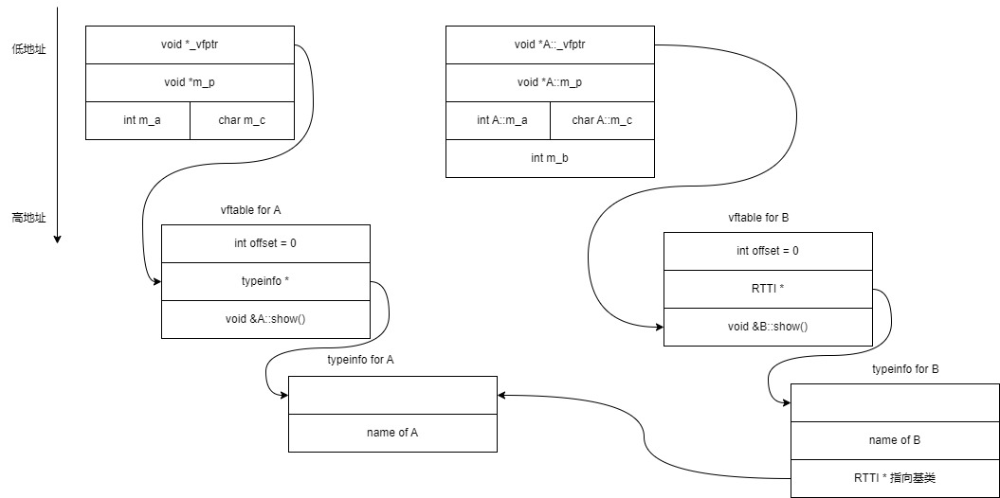
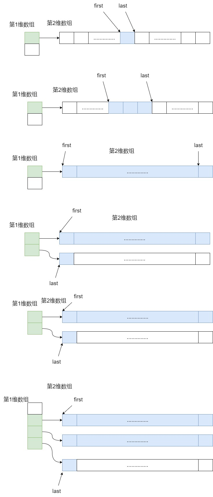

[[toc]]

# 重要的背景知识
## 涉及编译链接

### 如何生成C++函数符号的名称
C++符号根据 作用域+模板参数列表+函数名+参数列表组成

使用 c++filt 可以将根据符号得到真正的函数类型

```shell
root@u22:/mnt/share/cpp_study/test# c++filt _Z3cmpIiEiT_S0_
int cmp<int>(int, int)
```
### 链接符号

符号表是链接的关键，使用readelf可以查看

```shell
root@u22:/mnt/share/cpp_study/test# readelf -s main.o

Symbol table '.symtab' contains 16 entries:
   Num:    Value          Size Type    Bind   Vis      Ndx Name
     0: 0000000000000000     0 NOTYPE  LOCAL  DEFAULT  UND
     1: 0000000000000000     0 FILE    LOCAL  DEFAULT  ABS main.cpp
     2: 0000000000000000     0 SECTION LOCAL  DEFAULT    3 .text
     3: 000000000000001e    11 FUNC    LOCAL  DEFAULT    3 _ZL5func3v
     4: 0000000000000004     4 OBJECT  LOCAL  DEFAULT    6 _ZL1b
     5: 0000000000000000     0 SECTION LOCAL  DEFAULT    7 .text._Z3cmpIiEvT_S0_
     6: 0000000000000000     0 SECTION LOCAL  DEFAULT    8 .text._Z3cmpIdEvT_S0_
     7: 0000000000000000     0 SECTION LOCAL  DEFAULT    9 .rodata
     8: 0000000000000000    19 FUNC    GLOBAL DEFAULT    3 _Z3cmpIPKcEvT_S2_
     9: 0000000000000013    11 FUNC    GLOBAL DEFAULT    3 _Z5func2v
    10: 0000000000000000     4 OBJECT  GLOBAL DEFAULT    6 a
    11: 0000000000000029    90 FUNC    GLOBAL DEFAULT    3 main
    12: 0000000000000000    17 FUNC    WEAK   DEFAULT    7 _Z3cmpIiEvT_S0_
    13: 0000000000000000    21 FUNC    WEAK   DEFAULT    8 _Z3cmpIdEvT_S0_
    14: 0000000000000000     0 NOTYPE  GLOBAL DEFAULT  UND _Z4fun1v
    15: 0000000000000000     0 NOTYPE  GLOBAL DEFAULT  UND c

```

readelf 解释 :

- Bind（绑定）：Bind字段表示符号的绑定属性，它指示符号的可见性和链接类型。以下是常见的绑定属性：
  - LOCAL（局部）：符号只在定义它的目标文件中可见，其他目标文件无法引用它。
  - GLOBAL（全局）：符号可以被其他目标文件引用，可以在整个程序中共享。
  - WEAK（弱）：与全局符号类似，可以被其他目标文件引用。但是，链接器在有多个定义的情况下不会合并弱符号，而是选择一个默认版本。
- Vis（可见性）：Vis字段表示符号的可见性属性，它指示符号在链接时的可见范围。以下是常见的可见性属性：
  - DEFAULT（默认）：符号在链接时可以被其他目标文件引用。
  - HIDDEN（隐藏）：符号在链接时只能被定义它的目标文件引用，其他目标文件无法引用它。
  - INTERNAL（内部）：符号在链接时只能被同一目标文件中的其他符号引用，对于其他目标文件是不可见的。
- Ndx（索引）：Ndx字段表示符号的节索引，它指示符号所属的节（section）。节是目标文件中的一段数据，符号在特定的节中定义或引用。节索引指示了符号所属的节的位置。

以下是具体示例
```shell
template<typename T>
void cmp(T a, T b)
{
}

template<>
void cmp<const char *>(const char *a, const char *b) // FUNC 
{													 // void cmp<const char *>(const char *, const char *)
}													 // GLOBAL idx

extern void fun1(); // NOTYPE fun1() GLOBAL UND
extern int c;       // NOTYPE c GLOBAL UND
extern int d;       // 不生成符号

void func2() { } // FUNC func2() GLOBAL idx

static void func3() { } // FUNC func3() LOCAL idx

int a;  // OBJECT a GLOBAL idx
static int b; //  OBJECT b LOCAL idx

int main()
{
	int aa = 0;  // 不生成符号，生成代码
				 // mov r3, #0
				 // str r3, [fp, #-8]

	cmp<int>(1, 2); // FUNC 
					// int cmp<int>(int, int) 
					// WEAK
					// idx

	cmp(1.0, 2.0);  // FUNC
					// int cmp(double)(double, double)
					// WEAK
					// idx

	fun1();         // NOTYPE
					// fun1()
					// GLOBAL
					// UND

	c++;            // NOTYPE
					// c
					// GLOBAL
					// UND

	return 0;
}
```
规律总结如下:
|  | 类型 | 名称 | 连接类型 | 字节索引 |
| --------------- | --------------- | --------------- | --------------- | --------------- |
| 已定义的变量 | OBJECT | 和变量命相同 | GLOBAL/LOCAL | 存在 |
| 已定义的普通函数 | FUNC | 由函数名参数列表构成 | GLOBAL/LOCAL | 存在 |
| 已定义的模板函数 | 不生成 | - | - | - |
| 已定义的模板函数的调用处 | FUNC | 由函数名和参数列表构成 | WEAK | 存在 |
| static定义 | OBJECT/FUNC | - | LOCAL | 存在 |
| extern定义 | OBJECT/FUNC | - | GLOBAL | 存在 |
| extern引用 | NOTYPE | - | GLOBAL | UND |

# 左值右值

## 左值（Lvalue）
1.定义
左值指具有明确内存地址的表达式，通常可以出现在赋值运算符（=）的左侧。其名称中的"L"最初表示"Left"，但更准确的理解是"Location"（可寻址）。
2.核心特性
可寻址：可通过&运算符获取地址（如&a）。
持久性：生命周期较长，如变量、对象或数组元素。
可修改性：非const左值可被赋值（如a = 10）。

3.常见示例
变量名：int a = 10;中的a。
解引用指针：*ptr。
函数返回左值引用：int& func()的返回值。

## 右值（Rvalue）
1.定义
右值指临时数据或无法寻址的表达式，通常出现在赋值运算符右侧。其名称中的"R"可理解为"Read"（仅可读）或"Register"（可能存储在寄存器中）。

2.核心特性
不可寻址：无法通过&获取地址（如&(a + b)会报错）。
临时性：生命周期短暂，如字面量或表达式结果。
不可修改：不能直接赋值（如10 = a无效）。

3.常见示例
字面量：int x = 5;中的5。
算术表达式结果：a + b。
函数返回非引用值：int func()的返回值。

# const
## 常量L值引用绑定R值指针
### 语法与语义分析
1. 引用定义的特殊性
`int * const &p = (int *)0x00000000; ` 

引用类型：`int * const &` 表示一个对常量指针的引用（即 p 是`int * const` 类型的别名）。
右值绑定：右侧的 `(int *)0x00000000` 是一个右值（临时指针），而C++允许常量左值引用（const &）绑定到右值，这是语言规则的特殊设计。
匿名变量生成：由于右值本身没有内存地址，编译器会隐式创建一个匿名栈变量来存储 0x00000000，然后将引用 p 绑定到此匿名变量。
2. 引用的底层实现
引用本质：引用在底层被实现为const指针（即`int * const * p`），指向目标对象的内存地址。
操作等价性：对引用的操作（如 `*p`）会被编译器转换为对目标指针的解引用操作，例如：`*p = 0x00000000; // 等价于 *(匿名变量) = 0x00000000` 

```c
// 以下示例都是常引用，都会生成临时对象

// 引用非指针类型时，const int和 int const语义相同，const都是修饰 b 本身
const int &b = 0;
int const &b = 0;

// 引用指针类型时，const int *和 int *const语义不相同
int *const &a = (int *)0x0;
```

当引用Rvalue时就会生成临时对象

### 汇编代码解析
1. `**`匿名变量的创建与初始化
```asm
mov    r3, #0
str    r3, [fp, #-20]    ; 将0存入匿名变量（地址为fp-20）
sub    r3, fp, #20       ; 获取匿名变量地址
str    r3, [fp, #-16]    ; 将地址存入引用p（p位于fp-16）
```
步骤：
1.在栈帧位置 `fp-20` 处创建匿名变量，并初始化为 0x00000000。
2.将匿名变量的地址（fp-20）存入引用 p 的内存位置（fp-16），即 p 实际存储的是匿名变量的地址。
2. `**`引用解引用的底层操作
```asm
ldr    r3, [fp, #-16]    ; 第一次解引用：获取p的值（即匿名变量地址）
ldr    r3, [r3]          ; 第二次解引用：获取匿名变量的值（即0x00000000）
mov    r2, #0
str    r2, [r3]          ; 将0写入匿名变量指向的内存
```
双重解引用：由于 p 是对指针的引用，*p 需要两次解引用：
1.第一次解引用获取匿名变量的值（即原始指针 0x00000000）。
2.第二次解引用修改该指针指向的内存内容。
3. `**`引用作为右值赋值
```asm
ldr    r3, [fp, #-16]    ; 获取p的值（匿名变量地址）
ldr    r3, [r3]          ; 获取匿名变量的值（0x00000000）
str    r3, [fp, #-12]    ; 将值赋给指针a
```
语义等价性：`int *a = p;` 等价于 `int *a = 匿名变量;`，即 a 直接获得 0x00000000。
### 关键机制总结
1.右值绑定与匿名变量
C++通过生成匿名变量允许常量左值引用绑定到右值，解决了右值无地址的问题。
2.引用的指针本质
引用在底层被实现为 const指针，占用内存空间（与指针相同），但语法上隐藏了解引用操作。
3.常量性与安全性
`int * const &` 中的 const 确保引用目标不可变（即不能修改 p 绑定的指针），但允许修改指针指向的内容。
### 应用场景与注意事项
适用场景：
需通过引用传递指针且避免拷贝时（如跨函数传递大型对象的指针）。
风险提示：
若匿名变量生命周期短于引用（如绑定到临时对象），可能导致悬垂引用。
通过此案例可深入理解C++引用的底层机制与语言设计的灵活性。


## 常见错误及解决方法
### 常量指针与引用的绑定问题
示例1：
```c
int a = 10;
int* const p = &a;  // p是常量指针（指针不可变，指向的值可变）
int* &q = p;        // 错误！无法将int* const*绑定到int**上
                    // 错误原因：p是顶层const（指针本身不可变），而q是非常量引用，无法绑定到常量对象。
// 正确做法：
int* const &qq = p;  // 正确：引用必须同样包含顶层const
```
示例2：
```c
int a = 10;
const int* p = &a;  // p是底层const（指向的值不可变）
int*& q = p;        // 错误！无法将const int**绑定到int**上
                    // 错误原因：p的底层const属性要求引用必须同样包含底层const。
// 正确做法：
const int*& qq = p;  // 正确：引用必须匹配底层const
```
### 类型转换中的权限冲突
示例3：
```c
int* p = &a;

// 错误
// 原因: 希望获得对指针p指向空间的只读属性，但是可以修改指针本身，这样是容易出bug的
const int* &q = p;
  
// 正确
// 获得指针本身的只读属性
int* const &qq = p;  
// 获得指针本身的只读属性和指向空间的只读属性
const int* const &qq = p;  

// 正确
int*& q = p;
```
### 正确的一级指针赋值
```c
int* a;
const int* b = a;  // 正确：允许添加底层const
```
原理：非const指针可以隐式转换为底层const指针（权限收缩），但反之不可行。

### 最佳实践建议
1. 优先使用const引用参数
函数参数中若不需要修改原对象，应声明为const T&，既能避免拷贝，又能防止意外修改。

2. 明确const修饰位置
```c
int* const：指针不可变，指向的值可变
const int*：指针可变，指向的值不可变
const int* const：指针和值均不可变
```
3. 使用类型别名简化
复杂场景可通过using定义类型别名：
```c
using IntPtr = int*;
using CIntPtr = const int*;
```
### 扩展思考
右值引用与移动语义
在C++11后，通过&&右值引用可以安全绑定到临时对象，但需注意与const引用的区别。
智能指针的const应用
`std::unique_ptr<const T>`表示指向常量对象的独占指针，比原始指针更安全。

## C和C++中对const修饰变量的核心差异
### C语言中的const特性
1.本质是只读变量
C语言中const修饰的变量称为“常变量”，其值在运行时确定。虽然语法上禁止直接修改，但可以通过指针间接修改其内存中的值。

2.编译处理方式
C的const变量在汇编层面仍被视为普通变量，编译器不会进行常量替换优化。即使声明为const，其地址仍可被获取，且允许通过指针修改。

3.应用限制
不能用于定义数组长度（如`int arr[a]`会报错）。
不能作为switch语句的常量表达式。

### C++中的const特性
C++的const行为取决于初始化方式，分为两种情况：

1. 用常量初始化时（编译时常量）
```c
const int a = 10; // 编译时确定了常量的值
int *p = (int *)&a;
*p = 30;  // p的确指向了符号a对应的内存空间，并进行了修改

cout << "*p : " << *p << endl; // 30
cout << "a : " << a << endl;  // 10      // 直接替换常量
cout << "*&a : " << *&a << endl; // 10   // 直接替换常量
// &a 和 p 的值都为变量a的地址
cout << "&a : " << &a << endl; // &a
cout << "p : " << p << endl;   // &a

```
行为类似宏替换, 是真正的常量
编译器直接将a替换为字面值10，不会为其分配内存（除非取地址操作触发临时内存分配）。
示例中，`cout << a`被优化为`cout << 10`，因此即使通过指针修改内存，a的输出仍为10，而*p显示修改后的值30。

严格常量性
无法通过非const指针直接指向const变量（需强制类型转换），且修改临时内存不影响符号表中的常量值。

汇编探究
```asm
	const int a = 10;
  1c:	mov	r3, #10
  20:	str	r3, [fp, #-20]	; 0xffffffec  // 初始化栈变量 a = 10
	int *pa = (int *)&a;
  24:	sub	r3, fp, #20       // 取a的地址
  28:	str	r3, [fp, #-16]     // 将a的地址赋值给pa
	int b;

	*pa = 20;
  2c:	ldr	r3, [fp, #-16]    // 取pa的值
  30:	mov	r2, #20           
  34:	str	r2, [r3]          // 设置 pa指向的内存，为20

	b = a;                    // *****
  38:	mov	r3, #10           // 常量a，直接赋值给b
  3c:	str	r3, [fp, #-12]
	b = *pa;
  40:	ldr	r3, [fp, #-16]
  44:	ldr	r3, [r3]
  48:	str	r3, [fp, #-12]
```

2. 用变量初始化时（运行时常量）
```c
int b = 10;
const int a = b;   // 运行时确定常量的值
int *p = (int *)&a;
*p = 30;
printf("%d", a);   // 30   可以通过指针间接修改
printf("%d", *p);  // 30

```
退化为C风格的只读变量, 也称常变量
此时a的值在运行时确定，行为与C语言一致。通过指针修改其内存后，a和*p均输出30。

内存分配
编译器会为a分配内存空间，且允许通过指针间接修改（尽管语法上不建议）。

汇编探究
```asm
	int b = 10;
   c:	mov	r3, #10
  10:	str	r3, [fp, #-12]
	const int a = b;
  14:	ldr	r3, [fp, #-12]
  18:	str	r3, [fp, #-8]

	b = a;
  1c:	ldr	r3, [fp, #-8]
  20:	str	r3, [fp, #-12]
```

### 关键差异总结
| 特性         | C语言                     | C++（常量初始化时）               |
|--------------|--------------------------|----------------------------------|
| 本质         | 运行时只读变量            | 编译时常量（可能触发宏替换）      |
| 内存分配     | 始终分配内存              | 无内存分配（除非取地址操作）      |
| 指针修改     | 允许通过指针间接修改      | 修改临时内存，不影响常量值        |
| 类型安全     | 弱（允许const到非const转换） | 强（需显式强制类型转换）          |
| 应用场景     | 无法用于数组长度等常量表达式 | 可替代#define定义常量             |

### 扩展说明
C++的优化机制：若const变量由字面值初始化，编译器会将其视为常量表达式（constexpr），实现编译时优化。
类型系统差异：C++中const修饰的指针和引用具有更严格的类型检查，禁止隐式转换（如非const指针指向const变量）。
函数参数与返回值：C++中const可修饰函数参数和返回值，防止意外修改，增强代码健壮性。

# 引用
## 引用的本质与汇编实现分析
1. 引用的底层实现
从汇编角度看，引用本质是通过指针实现的常量指针（int* const），但编译器会施加严格的语义限制：

初始化约束：引用定义时必须绑定有效对象（如 `int &a = b`），对应汇编中会立即获取目标地址并存储（见示例代码的 `sub r3, fp, #16 `和 `str r3, [fp, #-12]`）
操作透明性：对引用的操作会被自动转换为指针解引用（如 `a = 20` 对应 `ldr r3, [fp, #-12]` 和 `str r2, [r3]`）
常量引用特性：右值引用（如 `int &&a = 20`）会隐式创建临时变量并绑定其地址（`str r3, [fp, #-20]` 分配栈空间）

2. 引用与指针的汇编对比
函数参数传递的汇编实现完全一致：

```asm
; 引用参数 void func(int &a)
ldr r3, [fp, #-8]  ; 获取地址
mov r2, #10
str r2, [r3]       ; 解引用写入

; 指针参数 void func(int *a)
ldr r3, [fp, #-8]
str r2, [r3]
mov r2, #10
```
这说明引用参数本质是通过指针实现的，但语法层面隐藏了解引用操作

## 引用的高级特性与扩展
1. 引用与指针的本质区别
虽然底层实现相似，但存在关键语义差异：

不可变性：引用绑定后不可修改目标（类似 `int* const`），而指针可重新指向
空值安全性：引用必须初始化且不能为 `nullptr`，避免空指针崩溃风险
多级支持：支持指针的多级间接访问（如 `int***`），但引用仅支持一级
语法简化：无需显式解引用（`a=30` vs `*p=30`），支持操作符重载的自然表达

2. 现代C++中的引用演进
右值引用（C++11）：通过 `&&` 实现移动语义，允许高效资源转移（如 `std::move`）
`std::string&& rref = std::move(s); // 避免深拷贝`
转发引用（万能引用）：配合模板实现完美转发（`template<typename T> void f(T&&)`）
string_view（C++17）：提供非拥有式字符串视图，比 `const string&` 更灵活高效

## 引用使用场景与最佳实践
1. 适用场景
函数参数：避免大型对象拷贝（如传递 `vector<T>&`）
返回值优化：支持链式调用（如 `ostream& operator<<`）
范围for循环：`for(auto& elem : container)` 直接修改元素
接口设计：`const T&` 表示只读参数，明确设计意图
2. 典型错误规避
```c
int& func() {
    int x = 10;    // 局部变量
    return x;      // 错误！返回悬空引用
}

const int& r = 42; // 合法：编译器生成临时变量并延长生命周期
int& r = 42;       // 非法：非常量引用不能绑定右值
```

## 总结：引用 vs 指针的哲学差异
引用在底层虽由指针实现，但代表了不同的编程范式：
| 特性         | 引用                     | 指针                     |
|--------------|--------------------------|--------------------------|
| 抽象层级     | 高级别名机制             | 低级内存操作工具         |
| 安全性       | 强制初始化、非空         | 允许未初始化/空值        |
| 可读性       | 隐式解引用，代码简洁     | 显式*和->操作            |
| 应用场景     | 参数传递、操作符重载     | 动态内存、多级间接访问   |
正如Bjarne Stroustrup所强调，引用是C++抽象机制的重要组成部分，它通过限制指针的自由度来提升安全性和表达力，而非简单的语法糖。

## 代码示例
### 如何书写复杂的引用
```c
int b = 10;
int &a = b; // 引用定义时必须初始化
int &aa = 30; // 错误，必须用可取地址的右值
			  // 引用只有一级引用
a = 30;
// 相当于
int * const a = &b;
*a = 30;
```

```c
int arr[5] = {0};

// 记住引用就是指针,先写指针的方式
int (*p)[5] = &arr;
// 改成引用
int (&p)[5] = arr;
```
### 汇编理解引用实现
#### 一般引用
```asm
	int b = 10;
  1c:	mov	r3, #10
  20:	str	r3, [fp, #-16]
	int &a = b;
  24:	sub	r3, fp, #16     // 取b的地址
  28:	str	r3, [fp, #-12]  // 将b的地址放到a

	a = 20;
  2c:	ldr	r3, [fp, #-12]  // 从a中取值，做地址
  30:	mov	r2, #20        
  34:	str	r2, [r3]        // 设置指针指向的内存
```
#### 常量引用
常量引用会隐式分配一个栈变量
```asm
	int &&a = 20;
  1c:	mov	r3, #20
  20:	str	r3, [fp, #-20]	; 0xffffffec // 分配隐式变量 赋值 20
  24:	sub	r3, fp, #20        // 分配变量a, 将隐式变量的地址存放到a
  28:	str	r3, [fp, #-16]
	int b;

	a = 10;
  2c:	ldr	r3, [fp, #-16]   // 从变量a中获得隐式变量的地址
  30:	mov	r2, #10         
  34:	str	r2, [r3]         // 修改隐式变量的值为10
	b = a;
  38:	ldr	r3, [fp, #-16]   // 从变量a中获得隐式变量的地址
  3c:	ldr	r3, [r3]
  40:	str	r3, [fp, #-12]   // 根据地址获得隐式变量的值赋值给b
```

#### 右值引用和const引用

```asm
    int const &a = 20;
   10750:	mov	r3, #20
   10754:	str	r3, [fp, #-20]	@ 0xffffffec
   10758:	sub	r3, fp, #20
   1075c:	str	r3, [fp, #-16]
```
```asm
    int &&a = 20;
   10750:	mov	r3, #20
   10754:	str	r3, [fp, #-20]	@ 0xffffffec
   10758:	sub	r3, fp, #20
   1075c:	str	r3, [fp, #-16]
```

两者都是在栈分配临时变量，并让引用变量指向临时变量，不同在于const引用变量只能参与读操作，而右值引用可以读写

#### 函数引用
```asm
void func(int &a)
{
   0:	push	{fp}		; (str fp, [sp, #-4]!)
   4:	add	fp, sp, #0
   8:	sub	sp, sp, #12
   c:	str	r0, [fp, #-8]    // 将形参赋值给实参，将main:b的地址赋值 a
	a = 10;	
  10:	ldr	r3, [fp, #-8]    // 从a中取值做地址，设置地址对应的内存的内容为10
  14:	mov	r2, #10
  18:	str	r2, [r3]
}
  1c:	nop			; (mov r0, r0)
  20:	add	sp, fp, #0
  24:	pop	{fp}		; (ldr fp, [sp], #4)
  28:	bx	lr

0000002c <main>:

int main()
{
  2c:	push	{fp, lr}
  30:	add	fp, sp, #4
  34:	sub	sp, sp, #8
  38:	ldr	r3, [pc, #72]	; 88 <main+0x5c>
  3c:	ldr	r3, [r3]
  40:	str	r3, [fp, #-8]
  44:	mov	r3, #0
	int b = 10;
  48:	mov	r3, #10
  4c:	str	r3, [fp, #-12]

	func(b);
  50:	sub	r3, fp, #12     // 将b的地址做形参
  54:	mov	r0, r3
  58:	bl	0 <_Z4funcRi>
```

```asm
	int &&c = 10;         // 定义一个常量引用
  44:	mov	r3, #10
  48:	str	r3, [fp, #-16]
  4c:	sub	r3, fp, #16
  50:	str	r3, [fp, #-12]  // 定义c

	func(c);
  54:	ldr	r3, [fp, #-12]  // 从c获得值做地址，解指针的值传递参数
  58:	ldr	r3, [r3]
  5c:	mov	r0, r3
  60:	bl	0 <_Z4funci>
```

# 内联函数
## 定义与原理
1. 概念
内联函数（inline）通过编译时将函数体代码直接嵌入调用处，避免传统函数调用的参数传递、栈帧创建等开销，从而提升执行效率。

示例：
```c
inline int add(int a, int b) { return a + b; }
//调用时可能被替换为
int result = 3 + 5;。
```
2. 工作原理
编译阶段替换：编译器在编译时分析函数是否符合内联条件，若符合则将调用替换为函数体代码。
条件限制：复杂函数（含循环、递归、switch等）通常不会被内联，即使使用inline关键字。

## 核心优势
1. 性能提升
消除函数调用开销（参数压栈、跳转指令等），尤其对短小且频繁调用的函数效果显著。
提高缓存命中率：代码布局更连续，减少跳转指令对CPU缓存的干扰。
2. 类型安全与调试支持
相比宏（预处理阶段文本替换），内联函数支持类型检查、调试，且行为更符合函数逻辑。

## 缺点与限制
1. 代码膨胀
多次调用内联函数会导致代码重复，增加程序体积，可能影响内存占用和缓存效率。

2. 编译器自主性
inline仅为建议性关键字，编译器根据函数复杂度、调用频率等决定是否内联。例如：
函数体过大或含复杂控制结构时，编译器可能拒绝内联。
虚函数在多态场景下无法内联（运行时绑定）。

## 使用规范
1. 适用场景
短小函数（建议1-5行）且调用频繁。
替代宏定义，提升安全性和可维护性。

2. 定义要求
隐式内联：类内直接定义的成员函数自动视为内联。
显式声明：类外定义需在声明和定义处均加inline关键字。
避免分离声明与定义：否则可能导致链接错误（内联函数无独立地址）。

## 与宏的对比

| 特性         | 内联函数                 | 宏                       |
|--------------|--------------------------|--------------------------|
| 处理阶段     | 编译时替换逻辑           | 预处理时文本替换         |
| 类型安全     | 支持类型检查             | 无类型安全，易引发歧义（如`#define SQUARE(x) x*x`） |
| 调试支持     | 可调试                   | 不可调试                 |
| 作用域       | 可访问类成员             | 无法访问类成员           |

## 高级特性
1. 内联变量（C++17）
允许在头文件中定义inline变量，避免多编译单元重复定义的链接错误。
```c
inline int globalSize = 100; // 头文件中定义
```
2. 递归与尾部调用优化
递归函数通常无法内联，但某些编译器支持尾部递归优化。

## 总结
内联函数是C++性能优化的重要手段，需权衡空间与时间效率。适用于短小、高频调用的函数，避免滥用导致代码膨胀。开发者应结合编译器行为（如GCC需开启优化选项）和实际场景合理使用。

# C++函数默认参数详解
## 一、默认参数的顺序规则
### 1. 定义顺序必须从右向左
默认参数的声明必须从形参列表的最右侧开始连续设置，且右侧参数必须全部有默认值后才能为左侧参数设置默认值。例如：
```cpp
int func(int a, int b = 2, int c = 3);  // 正确：从右向左连续设置
int func(int a = 1, int b, int c = 3);   // 错误：中间参数未设置默认值
```
### 2. 调用顺序必须从左向右
函数调用时，实参按从左到右的顺序匹配形参，未显式传递的参数会使用默认值，但不能跳过中间参数：
```cpp
func(1);       // 等效于 func(1, 2, 3)
func(1, 5);    // 等效于 func(1, 5, 3)
func(1, , 8);  // 错误：不能跳过中间参数
```
## 二、声明与定义的规则
### 1. 默认值只能指定一次
默认参数只能在函数声明或定义中的一处设置，推荐在头文件的函数声明中指定，避免重复定义导致编译错误。
```cpp
// 正确：声明时指定默认值
void connect(string ip = "127.0.0.1", int port = 8080);
// 定义中不重复指定
void connect(string ip, int port) { /* ... */ }
```
### 2. 函数重载与默认参数的取舍
默认参数适用于功能相同但参数可选的场景，而函数重载更适合参数类型或数量不同的情况。例如：
```cpp
// 默认参数简化调用
void drawRect(int w, int h, bool fill = false);
// 函数重载处理不同类型
void log(int value);
void log(double value);
```
## 三、底层实现与汇编分析
### 1. 参数传递机制
默认参数在编译时处理，调用时编译器会自动填充缺失的参数值。例如用户提供的汇编代码中：
```cpp
func(1);  // 对应汇编代码中 r1=2, r2=3（填充默认值）
```
参数按从右向左压栈（_cdecl调用约定），默认值在编译阶段被硬编码到调用指令中。
### 2. 默认值的存储限制
默认参数的值必须是编译期常量（如字面量、全局变量），不能是局部变量或运行时动态值：
```cpp
int global = 5;
void test(int a = global);       // 合法
void errorExample() {
    int local = 10;
    void test2(int b = local);   // 非法：局部变量无法作为默认值
}
```

## 四、注意事项与最佳实践
### 1. 默认参数的陷阱
- 默认值在编译时确定，若依赖动态值（如函数返回值）会导致固定值：
  ```cpp
  int getDefault() { return rand(); }
  void demo(int val = getDefault());  // 默认值固定为编译时的getDefault()返回值
  ```
- 避免在类构造函数中使用默认参数替代重载，可能引发二义性。
### 2. 设计建议
- 优先为高频使用的参数设置默认值，简化调用（如日志函数中的输出格式参数）。
- 默认参数与函数重载结合时需谨慎，避免歧义调用。

## 五、总结
默认参数通过编译期自动填充缺失参数的机制，显著提升了代码的简洁性和可读性。其核心规则可归纳为：
1. 定义顺序右起连续，调用顺序左起连续；
2. 声明与定义分离，避免重复设置；
3. 默认值需为编译期常量，慎用动态依赖。
通过合理使用默认参数，可以减少冗余代码，例如数据库连接函数`connect("server", "user")`无需重复指定端口和密码，使接口设计更加优雅。

# C++ 中的函数重载（Function Overloading）
函数重载是一种允许在同一作用域内定义多个同名函数但参数列表不同的特性。以下是其核心要点：

## 1. 函数重载的定义与规则
**定义**：函数重载要求函数名相同，但参数列表必须不同。参数列表的差异包括：
- **参数数量不同**：例如 `void func(int a)` 和 `void func(int a, int b)`
- **参数类型不同**：例如 `void func(int a)` 和 `void func(double a)`
- **参数顺序不同**：例如 `void func(int a, double b)` 和 `void func(double a, int b)`

**返回值无关**：仅返回值类型不同不构成重载，例如 `int func()` 和 `double func()` 会导致编译错误。

**示例**：
```cpp
int add(int a, int b) { return a + b; }
double add(double a, double b) { return a + b; }  // 参数类型不同，构成重载
```
## 2. 实现原理：名称修饰（Name Mangling）

C++ 编译器通过 **名称修饰** 技术为每个函数生成唯一的符号名，编码了函数名、参数类型等信息。例如：

- `void Swap(int a, int b)` 可能被修饰为 `_Swap_int_int`
- `void Swap(double a, double b)` 被修饰为 `_Swap_double_double`

这种机制使得链接器能区分不同重载版本，即使函数名相同，参数列表不同的函数在底层被视为独立实体。

## 3. 应用场景与优势

- **统一接口**：对功能相似但参数类型不同的操作提供一致的函数名。例如：
  ```cpp
  int Max(int a, int b);          // 比较两个整数
  int Max(const vector<int>& v);  // 比较数组中的最大值
  ```
- **增强可读性**：避免为类似功能定义不同名称的函数（如 `Swap_int`、`Swap_float`）。

## 4. 注意事项与限制

- **作用域限制**：重载需在同一作用域内，不同作用域的同名函数会隐藏而非重载（如类成员函数与全局函数）。
- **类型转换与匹配优先级**：
  - 完全匹配 > 类型提升（如 `char` 转 `int`）> 隐式转换（如 `int` 转 `double`）。
  - 若存在多个匹配，可能引发歧义错误。例如：
    ```cpp
    void func(int a, double b);
    void func(double a, int b);
    func(1, 1);  // 错误：无法确定调用哪个版本
    ```
- **引用与右值引用**：
  - 左值引用（`int&`）与右值引用（`int&&`）可构成重载。
  - 常量引用（`const int&`）能匹配字面量，而普通引用不能。

## 5. 与 C 语言的对比
C 语言不支持函数重载，因为其编译后的符号仅依赖函数名。而 C++ 通过名称修饰实现重载，这也是 C++ 调用 C 函数时需用 `extern "C"` 禁用修饰的原因。

## 总结
函数重载通过参数列表的差异实现“一函数多态”，提升了代码复用性和可读性。其底层依赖编译器的名称修饰技术，开发者需注意参数匹配规则与作用域限制。合理使用重载能简化接口设计，但过度使用可能导致代码复杂度增加。

## c和cpp互相调用
c 调用cpp，无法直接调用，把cpp源码包裹在 `extern "C"`

cpp 调用c, 无法直接调用，把c源码包裹在 `extern "C"`

```c
#ifdef __cplusplus
// 如果编译器为g++，则按c规则编译
// 即 cmp_int(int a, int b) 生成符号 cmp_int
// 如果编译器为gcc, 则没有extern "C" {
// 则gcc 直接编译代码
extern "C" {
#endif

// 注意声明也要放在extern "C"中，因为声明也会生成链接符号，
// 只是符号为 UNDEF 属性
void cmp_int(int a, int b);

void cmp_int(int a, int b)
{}

void cmp_char(const char *a, const char *b)
{}

void cmp_double(double a, double b)
{}

int main()
{
	cmp_int(1, 2);
	cmp_double(1.2, 2.2);
	cmp_char("1", "2");
	return 0;
}

#ifdef __cplusplus
}
#endif
```

# new
## new与malloc

### 1. 初始化行为

- `malloc`仅分配内存，不调用构造函数，返回未初始化的内存块。
- `new`分配内存后自动调用构造函数（对类对象），支持初始化表达式（如`new int(5)`）。

```cpp
A* pa = new A(3);  // 分配内存并调用构造函数
A* pa_malloc = (A*)malloc(sizeof(A));  // 仅分配内存，需手动构造
```

### 2. 失败处理机制

- `malloc`通过返回`NULL`表示失败，需手动检查。
- `new`默认抛出`std::bad_alloc`异常，支持`nothrow`版本返回`nullptr`。

```cpp
int* p = new (nothrow) int(0);  // 失败返回nullptr
```

### 3. 类型安全

- `malloc`返回`void*`，需强制类型转换。
- `new`直接返回目标类型指针，无需转换。

## new的三种形态

### 1. New Operator（new表达式）

最常见的用法，完成三步操作：

1. 调用`operator new`分配内存
2. 调用构造函数
3. 返回类型化指针

```cpp
A* pa = new A(3);  // 完整过程
```
### 2. Operator New（内存分配函数）

负责纯内存分配，可重载（类内或全局）。默认实现调用`malloc`，失败时触发`new_handler`。

```cpp
void* operator new(size_t size) {
    cout << "Custom allocation"; 
    return malloc(size);
}
```

### 3. Placement New（定位new）

在已分配的内存上构造对象，不分配新内存。常用于内存池或特定地址初始化。

```cpp
char buffer[sizeof(A)];
A* pa = new (buffer) A(3);  // 在buffer上构造对象
```

## new的高级用法

### 1. 数组分配

使用`new[]`分配数组，支持初始化列表或默认初始化。

```cpp
int* arr = new int[10]{1,2,3};  // 前三个元素初始化，其余为0
```

### 2. 常量对象

分配`const`对象需在初始化时赋值。

```cpp
const int* p = new const int(40);  // 必须初始化
```

### 3. 不抛出异常的nothrow版本

通过`new (nothrow)`抑制异常，需检查指针有效性。

## operator new的重载与配对

### 1. 类内重载

可自定义类的内存分配策略（如日志记录）。

```cpp
class A {
public:
    void* operator new(size_t size) {
        cout << "Allocating A";
        return ::operator new(size);  // 调用全局operator new
    }
};
```

### 2. 全局重载

重载全局`operator new`需谨慎（影响所有动态分配）。需同时重载`operator delete`以保证一致性。

## delete的注意事项

- `delete`操作符行为：先调用析构函数 → 释放内存（通过`operator delete`）。
- 若重载`operator new`，建议同步重载`operator delete`。
- 数组需使用`delete[]`，否则可能引发内存泄漏或未定义行为。

## 总结对比表

| 特性 | new/delete | malloc/free |
|------|------------|-------------|
| 构造函数/析构函数 | 自动调用 | 不调用 |
| 类型安全 | 是 | 需强制转换 |
| 失败处理 | 异常或nothrow | 返回NULL |
| 内存初始化 | 支持 | 需手动初始化 |
| 重载机制 | 支持operator new/delete | 不可重载 |

通过合理选择`new`的不同形态和重载机制，可以实现高效、灵活的内存管理策略。


# 类
## 指向类成员的指针
### 1. 基本概念与定义
指向类成员的指针是C++中用于访问类成员的特殊指针类型，其本质存储的是成员在类中的偏移量（而非绝对内存地址）。这种指针分为两类：

- **指向数据成员的指针**：如 `int stu::*p = &stu::age;`
- **指向成员函数的指针**：如 `void (stu::*p4)() = &stu::func;`

#### 定义格式：
```cpp
// 数据成员指针
类型说明符 类名::*指针名 = &类名::成员名;

// 成员函数指针
返回值类型 (类名::*指针名)(参数列表) = &类名::成员函数名;
```

### 2. 使用方式与底层原理
通过对象或对象指针访问成员指针时：

- 对象实例访问：`s.*p = 20;`
- 对象指针访问：`s->*p = 20;`

底层汇编代码显示（如用户提供的示例）：
- 成员指针存储的是偏移量（如 `age` 偏移 `0`，`name` 偏移 `4`）
- 访问时通过对象基地址 + 偏移量计算成员地址


#### 示例
```c
class stu {
	public:
		int age;
		const char *name;
		char **pname;
		void func() { cout << "hello world" << endl; }
		static int a;
};

int stu::a = 10;

stu s;
s.age = 10;
int stu::*p = &stu::age;
// 将 int stu::* -> int stu::*
s.*p = 20;
// s.(*p) = 20; // 错误，s.的优先级应该更高
cout << s.*p << endl;

const char *stu::*p2 = &stu::name;
//const char stu::*p2 = &stu::name;
// 错误无法 const char * stu:: * -> const char stu:: *

s.*p2 = "hello";
cout << s.*p2 << endl;

char **stu::*p3 = &stu::pname;
// char **stu::* -> char **stu::*

void (stu::*p4)() = &stu::func;
// 将 void (stu::*)(void) -> void (stu::*)(void)
(s.*p4)();

int *p5 = &stu::a;
cout << "p5 " << *p5 << endl;


	stu *s = new stu;

	int stu::*p1 = &stu::age;
	const char *stu::*p2 = &stu::name;
	char **stu::*p3 = &stu::pname;
	void (stu::*p4)() = &stu::func;
	int *p5 = &stu::a;

	(s->*p4)();

	delete s;


```

```asm
	int stu::*p = &stu::age;
  24:	mov	r3, #0
  28:	str	r3, [fp, #-32]	; 0xffffffe0

	char *stu::*p2 = &stu::name;
  40:	mov	r3, #4
  44:	str	r3, [fp, #-28]	; 0xffffffe4

	char **stu::*p3 = &stu::pname;
  5c:	mov	r3, #8
  60:	str	r3, [fp, #-24]	; 0xffffffe8


# 使用
	s.*p2 = "hello";
  48:	ldr	r3, [fp, #-28]	; 获得存放的偏移量值
  4c:	sub	r2, fp, #20     ; 获得s对象的地址
  50:	add	r3, r2, r3      ; s对象的地址加偏移量得到属性的地址
  54:	ldr	r2, [pc, #56]	; 获得 "hello"
  58:	str	r2, [r3]        ; 将"hello"的地址写入属性的内存空间
```

## 类的各种属性和方法 
### 常方法

常方法通过 `const` 修饰，其 `this` 指针为 `const stu *const this`，限制对成员变量的修改：

方便用户传入const类型的参数

### 应用场景：
- 实现只读接口
- 允许 `const` 对象调用方法

#### 示例

```c
class stu {

	// 两个show构成函数重载 
	void show() {
		// this : stu * const this;
	}	
	void show() const  {
		// this : const stu * const this;
	}
};
```
### 静态属性
- 只能访问静态成员
- 无 `this` 指针，可直接通过类名调用
```c
class stu{
	public:
		static int a;
		// 静态成员方法，只能访问静态属性
		static void func() { a++;}
}
// 在编译时定义。静态属性属于类，不属于成员
int stu::a = 10;
```
## 初始化列表
### 定义与语法
初始化列表用于在构造函数中直接初始化成员变量，语法为：
```cpp
构造函数(参数列表) : 成员1(初始值), 成员2(初始值) { ... }
```
### 核心特性
- **执行顺序**：按成员在类中的声明顺序初始化，而非初始化列表书写顺序
- **性能优势**：避免默认构造 + 赋值的额外开销（直接调用拷贝构造）
- **强制使用场景**：
  - 常量成员（`const`）
  - 引用成员
  - 无默认构造函数的类类型成员

### 与构造函数体的区别
- **初始化列表**：在对象内存分配后立即执行，属于初始化阶段
- **构造函数体**：在初始化阶段之后执行，属于赋值操作阶段

### 示例
```c
class A {
	public:
	A(int a, int b)
		:a(a), b(b){
	}

	int a;
	int b;
};

class stu {
	public:
		stu(int a, int b, int c)
			:a(a, b), age(c) // A a(a, b); int age = c 
							 // 先调用初始化列表
							 // 初始化列表的执行顺序为成员定义顺序
		{
			// 再调用自己的构造函数
			// age在这里初始化，则为
			// age = c;

		}
		int age;
		A a;
};

```

## 五、总结

| 特性         | 关键点                                   |
|--------------|------------------------------------------|
| 成员指针     | 存储偏移量，通过对象地址+偏移访问成员    |
| 常方法       | 限制修改成员，支持const对象调用          |
| 静态成员     | 类级别共享，需类外定义                   |
| 初始化列表   | 提升性能，强制初始化场景，顺序依赖声明   |


# 模板
## 模板函数
### 实例化与类型推演
- 函数模板在编译阶段实例化，编译器根据调用时的实参自动推导类型（如`cmp(3,4)`推导为`int`类型）。
- 若推导失败（如`cmp(3.0,4)`参数类型不一致），需显式指定模板参数。
- 显式实例化可通过`template int cmp<bool>(bool, bool)`强制生成特定类型的符号。

### 特例化与符号生成
- 特例化模板函数（如`cmp<const char*>`）会生成全局符号，优先级高于普通函数模板。
- 普通函数（如`cmp(int,int)`）若存在，调用时优先级最高，但未实现会导致链接错误（如代码中`extern`声明但未定义）。

### 实现规范
- 模板函数需在头文件中实现，否则分离编译时可能导致符号未定义错误。
- 特例化版本需与原模板声明在同一作用域，且参数需完全匹配。

### 示例

```cpp
#include <iostream>
#include <string.h>
using namespace std;

/*
 * 1. 函数模板的实例化
 * 2. 类型推演
 * 3. 特例模板函数
 * 4. 模板函数在编译阶段实例化，所以实现和调用分开会导致符号未定义，所以通常写在头文件，并#include使用
 * 5. 模板函数和普通函数
 */

template<typename T>
int cmp(T a, T b)  // 生成 WEAK 链接符号, 对于LOCAL和GLOBAL都可以覆盖此符号
{
	cout << "template cmp" << endl;
	return a > b;
}

// 特例模板函数
// 当使用模板函数特例，不论函数是否被引用，
// 都会生成 GLOBAL 或 LOCAL 的 链接符号 int cmp<const char *>(const char *,const char *)
template<>
int cmp<const char *>(const char *a, const char *b)
{
	return strcmp(a, b);
}

// 显示告诉编译器进行模板实例化 
template int cmp(bool, bool); // int cmp<bool>(bool, bool)


// 有普通函数声明，会生成符号  GLOBAL cmp(int, int) UND
// 在编译函数调用时，因为已经有有了适当的符号，就不会进行模板实例化
extern int cmp(int a, int b);

#if 0
// 注意 普通函数生成的符号为 cmp(int, int) GLOBAL, 没有返回值
int cmp(int a, int b)
{
	cout << "normal cmp" << endl;
	return a > b;
}
#endif

int main()
{
	// 当编译器自上而下扫描到模板的调用处，
	// 根据模板实参，将模板函数实例化，
	// 生成对应代码
	// cmp<int>(3, 4); // --> 生成 int cmp<int>(int, int) 链接符号  WEAK
	//
	cmp(3, 4); // --> 生成 int cmp<int>(int, int) 链接符号  WEAK

	// 若没有显示指定模板实参，
	// 编译器自动推演模板实参类型
//	cmp(3.0, 4.0);  // --> 生成 int cmp<double>(double, double) 链接符号 WEAK

	// 下面情况无法推演后找不到对于函数模板
	// cmp(3.0, 4);

	// 当使用模板原有比较逻辑是错误的
	// 需要实现模板特例化
//	cmp("aaa", "bbb");

	return 0;
}
```

## 模板非类型参数

### 定义与限制
- 非类型参数允许使用整型、指针、引用等编译期常量（如`template<typename T, int SIZE>`中的`SIZE`）。
- 用途：实现编译期确定的逻辑（如排序算法的数组大小）。

### 示例

- 代码中`sort`函数通过`SIZE`参数控制冒泡排序的循环次数，避免动态内存分配。
- 与非类型参数结合的模板函数需注意类型安全（如`myswap`确保操作合法）。
```c
template<typename T>
void myswap(T &a, T &b)
{
	T tmp;

	tmp = a;
	a = b;
	b = tmp;
}

/*
 * 模板非类型参数，用于做常量
 * 非类型参数只能用：整形，指针，引用，double
 */
template<typename T, int SIZE>
void sort(T *arr)
{
	int i, j;
	bool is_ok;

	for (i = 0; i < SIZE - 1 ; i ++) {
		is_ok = true;
		for (j = 0; j < SIZE - 1 - i; j++) {
			if (arr[j] > arr[j + 1]) {
				myswap(arr[j], arr[j + 1]);
				is_ok = false;
			}
		}
	}	
}

```

## 模板类
### stack
```c
template<typename T>
class stack {
	public:
		~stack()
		{
			delete [] data;
		}

		stack() 
			:data(nullptr), size(0), len(0)
		{}

		stack(const stack<T> &s)
		{
			int i;

			data = new T[s.size];
			size = s.size;
			len = s.len;
			for (i = 0; i < s.len; i++)
				data[i] = s.data[i];
		}

		stack<T>& operator=(const stack<T> &s)
		{
			int i;

			if (this == &s)
				return *this;

			delete[] data;
			data = new T[s.size];	
			size = s.size;
			len = s.len;
			for (i = 0; i < s.len; i++)
				data[i] = s.data[i];
		}

		void push(T obj)
		{
			if (len == size)	
				expand();
			data[len++] = obj;
		}

		T pop()
		{
			if (len <= 0)
				throw "stack is empty";
			return data[len-- - 1];
		}
		T top() const;

	private:
		T *data;
		int size;
		int len;

		void expand() {
			T *tmp;

			tmp = data;
			size *= 2;
			data = new T[size];
			for (int i = 0; i < len; i++)
				data[i] = tmp[i];

			delete [] tmp;
		}
};

template<typename T>
T stack<T>::top() const
{
	if (len <= 0)
		throw "stack is empty";
	return data[len - 1];
}

void func()
{
	stack<int> s;

	s.push(1);
	s.push(2);
	s.push(3);
	s.push(4);

	cout << "top" << s.top() << endl;
	cout << "pop" << s.pop() << endl;

	stack<int> s2 = s;

	cout << "top" << s2.top() << endl;

	cout << "pop" << s.pop() << endl;
	cout << "pop" << s.pop() << endl;
	cout << "pop" << s.pop() << endl;
}
```

# 匿名对象
匿名对象是C++中一种特殊的临时对象，其核心特点是无命名、生命周期短暂，常用于简化代码或优化性能。

## 匿名对象的定义与生命周期
### 基本概念
匿名对象通过直接调用构造函数创建，不指定对象名（如 `ClassName()`）。其生命周期仅限于当前表达式，表达式结束后立即调用析构函数销毁。例如：

```cpp
Solution().Sum_Solution(2);  // 匿名对象调用成员函数后立即销毁
```
### 生命周期规则
- **默认情况**：匿名对象在创建行结束时销毁，如 `A(10);` 在行末析构。
- **延长生命周期**：若用常量引用接收匿名对象（如 `const A& ref = A();`），其生命周期会延长至引用作用域结束。

### 与有名对象的对比
| 特性         | 有名对象               | 匿名对象                     |
|--------------|------------------------|------------------------------|
| 生命周期     | 作用域内有效           | 当前表达式结束即销毁         |
| 可访问性     | 可通过名称多次访问     | 仅限当前表达式使用           |
| 内存管理     | 需显式管理             | 自动销毁，减少内存泄漏风险   |

## 匿名对象的使用场景
### 简化临时操作
当需要临时调用对象的成员函数时，直接使用匿名对象避免命名冗余。例如：

```cpp
std::cout << RolePlayer().GetHP();  // 输出后立即销毁
```

### 作为函数参数或返回值
- **参数传递**：匿名对象可直接传递给函数参数，如 `func(MyClass())`，减少中间变量的创建。
- **返回值优化**：函数返回匿名对象时，编译器可通过 **RVO（返回值优化）** 直接构造目标对象，避免拷贝开销。例如：

#### 匿名对象做返回值的示例
通常函数返回对象本身，则会调用拷贝构造，构造一个匿名对象。
匿名对象本质是在母函数栈上分配一个对象，并将对象的地址传给子函数，
子函数返回匿名对象前，使用匿名对象的地址进行拷贝构造

```asm
// 返回匿名对象的子函数
test back(int b, int c)
{
   107c8:	push	{fp, lr}
   107cc:	add	fp, sp, #4
   107d0:	sub	sp, sp, #16
   107d4:	str	r0, [fp, #-8]   // 获得母函数匿名对象的地址
   107d8:	str	r1, [fp, #-12]
   107dc:	str	r2, [fp, #-16]
	return a;
   107e0:	ldr	r1, [pc, #16]  // 第二个参数，a的地址
   107e4:	ldr	r0, [fp, #-8]  // 用匿名对象的地址做 this指针，传参数
   107e8:	bl	109ac <test::test(test const&)>  // 调用拷贝构造，匿名对象内存上构造对象 
}
   107ec:	ldr	r0, [fp, #-8]
   107f0:	sub	sp, fp, #4
   107f4:	pop	{fp, pc}
   107f8:	.word	0x000210d8

// 母函数
const test &aa = back(1, 2);
	const test &aa = back(1, 2);
   10814:	sub	r3, fp, #16 // 母函数分配一个匿名test 对象, 获得其地址
   10818:	mov	r2, #2
   1081c:	mov	r1, #1
   10820:	mov	r0, r3   // 匿名对象的地址做第一个参数
   10824:	bl	107c8 <back(int, int)>
   10828:	sub	r3, fp, #16   // 匿名对象已经构造完成，母函数可以直接使用
```
本质上匿名对象是可读写的，但是cpp语法规定匿名对象是常量，
所以母函数只能用常引用接受匿名对象。
```cpp
const test &aa = back(1, 2);
```
更好的方法是
```cpp
test aa = back(1, 2);
```
此时，不会再调用一次对aa对象的构造函数，
因为cpp编译器优化过，`back(1, 2)` 相当于 `back(&aa, 1, 2)`
也就是说，aa的地址被传递给子函数，子函数返回时基于aa的地址进行构造,
所以aa可以直接使用

## 三、匿名对象与编译器优化
用户提供的汇编代码展示了匿名对象在函数返回时的处理机制：
### 1. 返回匿名对象的底层逻辑
- 母函数在栈上分配匿名对象的内存，并将地址传递给子函数。
- 子函数通过拷贝构造函数在目标地址直接构造对象，避免中间拷贝。

### 2. RVO与移动语义
- **RVO优化**：编译器将返回的匿名对象直接构造到接收变量中（如 `test aa = back(1, 2);`），省去临时对象的构造与析构。
- **移动语义**：若类支持移动构造函数，匿名对象的资源可被“移动”而非拷贝，进一步提升性能。

### 3. 常量性限制
C++语法规定匿名对象为常量，必须通过常引用接收（如 `const test &aa = back(...);`）。若直接赋值给变量（如 `test aa = back(...);`），编译器会优化为直接在 `aa` 的地址构造对象。

# oop
## 继承
继承的本质是代码的复用

不论使用何种继承方式，子类都会得到父类的全部成员

### 继承和访问限定

继承和访问限定遵循一下规律：

- 被继承的成员的访问限定不超过继承访问的访问限定
 - 访问限定的大小为 public > protected > private
- 被继承的private不论何种继承方式，子类都不可见
- 只有public成员可以对外部访问
- protected和private唯一区别在于继承

| 继承方式 | 基类访问限定 | 派生类访问限定 | 外部访问限定 |
| ------ | ---| --- | --- |
| public | public | public | Y |
| public | protected | protected | N |
| public | private | 存在但不可见 | N |
| protected | public | protected | N |
| protected | protected | protected | N |
| protected | private | 存在但不可见 | N |
| private | public | private | N |
| private | protected | private | N |
| private | private | 存在但不可见 | N |

### 继承和构造析构
- 构造：基类 -> 组合类(按照定义顺序) -> 自己
- 析构: 自己 -> 组合类(按照定义顺序取反) -> 基类

### 方法的重载隐藏覆盖
- 重载：作用域相同，函数名相同，参数列表不同，所以基类和子相同函数名的方法不构成重载
- 隐藏：当子类定义了func方法，则隐藏基类的所有func方法
- 覆盖: 和动态相关

### 基类对象和子类对象的互相转换
不论时对象转换，还是指向对象的指针转换，只允许子类转换为基类。

特别是基类指针指向子类对象，只能访问基类部分的属性。

## 虚函数表，静态绑定，动态绑定 
### 虚函数表的创建和vptr


1. 类定义有virtual修饰的函数，则会生成该类的vftable.

2. 子类即使没有显示声明虚函数，但子类继承的基类，所以子类也有vptr vftable，并且子类的vftable里记录的虚函数值为基类的vftable虚函数值

3. 若子类定义了相关虚函数，则会重写子类vftable中相关虚函数的地址，也就会覆盖从基类继承的虚函数地址

4. 即使子类没有显示使用virtual关键字，只要函数名，返回值，参数列表和继承的函数相同，则也被当作虚函数重写

当基类定义了虚函数，但是子类没有重写虚函数，子类依旧会继承虚函数
```asm
00010b0c <vtable for Derive>:
   10b0c:	00000000 00010b34 0001093c 00010a20     ....4...<... ...
   10b1c:	00010a5c                                \...

00010b20 <vtable for Base>:
   10b20:	00000000 00010b48 0001093c 00010980     ....H...<.......
   10b30:	000109b4                                ....
```
可以发现子类也有vtable，并且虚函数列表字段内容相同。


### 虚函数的调用

在调用时，若函数为虚函数，则使用动态绑定，否则使用静态绑定。

动态绑定原理是
- 根据对象获得对象的vptr指针
- 根据vptr指针获得对应类的vftable
- 根据偏移值和vftable基地址得到对应虚函数的地址
- 调用虚函数

```asm
	Sub s;	
   1082c:	ldr	r3, [pc, #100]	; 10898 <main+0x84>
   10830:	str	r3, [fp, #-16]
	Base *b;

	b = &s;
   10834:	sub	r3, fp, #16
   10838:	str	r3, [fp, #-12]

	b->show();
   1083c:	ldr	r3, [fp, #-12]  // b指针指向s对象，通过指针取s对象的vptr属性的地址
   10840:	ldr	r3, [r3]        // 从vptr指针获得vftable的地址
   10844:	ldr	r3, [r3]        // 从vftable获得 void show()虚函数的地址
   10848:	ldr	r0, [fp, #-12]  // 传递this做参数
   1084c:	blx	r3              // 调用 Sub::show()
	b->show(1);
   10850:	ldr	r3, [fp, #-12]  // b指针指向s对象，通过指针取s对象的vptr属性的地址
   10854:	ldr	r3, [r3]        // 从vptr指针获得vftable的地址
   10858:	add	r3, r3, #4      // 地址偏移4字节，获得 void show(int) 虚函数的地址的地址
   1085c:	ldr	r3, [r3]        // 获得void show (int)虚函数的地址
   10860:	mov	r1, #1          // 参数1
   10864:	ldr	r0, [fp, #-12]  // 参数this
   10868:	blx	r3              // 调用 Base::show(int) , 因为这是从基类继承来的，且没有被覆盖
```

```cpp
class Base {
	public:
		virtual void show() {
			cout << "Base::show()" << endl;
		}
		virtual void show(int i) {
			cout << "Base::show(int i)" << endl;
		}
		void func() {}
};

class Sub : public Base {
};

class Sub2 : public Sub {
};

int main()
{
	Sub *s;	
	Sub2 s2;
	Base *b, bb;

	s = &s2;
	s->show();
	s->func();
```


```asm
	Sub *s;	
	Sub2 s2;
   1082c:	ldr	r3, [pc, #96]	; 10894 <main+0x80>
   10830:	str	r3, [fp, #-20]	; 0xffffffec
	Base *b, bb;
   10834:	ldr	r3, [pc, #92]	; 10898 <main+0x84>
   10838:	str	r3, [fp, #-16]

	s = &s2;
   1083c:	sub	r3, fp, #20
   10840:	str	r3, [fp, #-12]
	s->show();    // Sub类的show函数为virtual，所以使用动态绑定 
   10844:	ldr	r2, [fp, #-12]
   10848:	ldr	r3, [fp, #-12]
   1084c:	ldr	r3, [r3]
   10850:	ldr	r3, [r3]
   10854:	mov	r0, r2
   10858:	blx	r3
	s->func();   // Sub类的func为普通函数，所以使用静态绑定
   1085c:	ldr	r3, [fp, #-12]
   10860:	mov	r0, r3
   10864:	bl	109a8 <Base::func()>
```

### vptr和构造函数


调用基类构造函数时，vptr指向基类的vtable中的虚函数表，调用自己的构造函数时，vptr才指向本类vtable中的虚函数表。

注意构造函数中可以使用多态，因为本类vptr的绑定紧跟在基类构造返回后.
```cpp
0001095c <Sub::Sub()>:
		Sub() {
   1095c:	e92d4800 	push	{fp, lr}
   10960:	e28db004 	add	fp, sp, #4
   10964:	e24dd010 	sub	sp, sp, #16
   10968:	e50b0010 	str	r0, [fp, #-16]
   1096c:	e51b3010 	ldr	r3, [fp, #-16]
   10970:	e1a00003 	mov	r0, r3
   10974:	ebffffda 	bl	108e4 <Base::Base()>
   10978:	e59f2030 	ldr	r2, [pc, #48]	; vptr指向本类vtable
   1097c:	e51b3010 	ldr	r3, [fp, #-16]
   10980:	e5832000 	str	r2, [r3]
			b = this;
   10984:	e51b3010 	ldr	r3, [fp, #-16]
   10988:	e50b3008 	str	r3, [fp, #-8]
			b->show();
   1098c:	e51b3008 	ldr	r3, [fp, #-8]  ; 多态调用
   10990:	e5933000 	ldr	r3, [r3]
   10994:	e5933000 	ldr	r3, [r3]
   10998:	e51b0008 	ldr	r0, [fp, #-8]
   1099c:	e12fff33 	blx	r3
		}
   109a0:	e51b3010 	ldr	r3, [fp, #-16]
   109a4:	e1a00003 	mov	r0, r3
   109a8:	e24bd004 	sub	sp, fp, #4
   109ac:	e8bd8800 	pop	{fp, pc}
   109b0:	00010a90 	.word	0x00010a90
```


### 哪些函数不能实现成虚函数
1. 构造函数不能实现为虚函数

因为多态依赖vptr指向对象对应类的vtable，而这个操作在对象的构造函数中完成，

所以构造函数若做虚函数，则vptr还没有指向正确的vtable导致无法调用正确的构造函数。

2. 静态方法不能实现为虚函数

因为多态依赖vptr指针，vptr存储在确定的对象里，而静态方法不需要对象

### 虚析构函数

如果要使用多态，则基类析构函数推荐使用虚函数，因为若不为虚函数，则可能漏掉调用子类的析构

```cpp
	Base *b = new Sub;
   10864:	e3a00004 	mov	r0, #4
   10868:	ebffff97 	bl	106cc <operator new(unsigned int)@plt>
   1086c:	e1a03000 	mov	r3, r0
   10870:	e1a04003 	mov	r4, r3
   10874:	e1a00004 	mov	r0, r4
   10878:	eb00005a 	bl	109e8 <Sub::Sub()>
   1087c:	e50b4010 	str	r4, [fp, #-16]
	delete b;
   10880:	e51b4010 	ldr	r4, [fp, #-16]        ; 获得指针b
   10884:	e3540000 	cmp	r4, #0                ; 如果b == 0 则异常
   10888:	0a000003 	beq	1089c <main+0x44>     
   1088c:	e1a00004 	mov	r0, r4                ; 调用Base的析构
   10890:	eb000047 	bl	109b4 <Base::~Base()>
   10894:	e1a00004 	mov	r0, r4
   10898:	ebffff97 	bl	106fc <operator delete(void*)@plt>
```

```cpp
	Base *b = new Sub;
   10864:	e3a00004 	mov	r0, #4
   10868:	ebffff97 	bl	106cc <operator new(unsigned int)@plt>
   1086c:	e1a03000 	mov	r3, r0
   10870:	e1a04003 	mov	r4, r3
   10874:	e1a00004 	mov	r0, r4
   10878:	eb000068 	bl	10a20 <Sub::Sub()>
   1087c:	e50b4010 	str	r4, [fp, #-16]
	delete b;
   10880:	e51b3010 	ldr	r3, [fp, #-16]
   10884:	e3530000 	cmp	r3, #0
   10888:	0a000005 	beq	108a4 <main+0x4c>
   1088c:	e51b3010 	ldr	r3, [fp, #-16]   ; 获得vptr
   10890:	e5933000 	ldr	r3, [r3]         ; 获得vtable中的虚函数表
   10894:	e2833008 	add	r3, r3, #8       ; 虚函数表基地址偏移8字节得到虚函数的指针
   10898:	e5933000 	ldr	r3, [r3]         ; 获得虚函数
   1089c:	e51b0010 	ldr	r0, [fp, #-16]
   108a0:	e12fff33 	blx	r3               ; 调用虚析构函数
```

### 是不是所有虚函数的调用都是动态绑定？
不是，构造函数中直接调用虚函数，使用静态绑定

必须由指针或引用访问虚函数，才为动态绑定 ,否则是静态绑定

### virtual方法和默认参数
```cpp
class Base {
	public:
		virtual void show(int i = 10) { cout << "Base::show " << i << endl;}
		virtual ~Base() {}
};

class Derive: public Base {
	public:
		virtual void show(int i = 20) { cout << "Derive::show " << i << endl;}
		virtual ~Derive() {}
}; 

	Base *p = new Derive;
	p->show();
	delete p;
```
注意 打印:
```shell
Derive::show 10
```

注意默认参数使用的是基类的默认参数。
```asm
	p->show();
   10838:	e51b3010 	ldr	r3, [fp, #-16]
   1083c:	e5933000 	ldr	r3, [r3]
   10840:	e5933000 	ldr	r3, [r3]
   10844:	e3a0100a 	mov	r1, #10   ; 使用默认参数做参数
   10848:	e51b0010 	ldr	r0, [fp, #-16]
   1084c:	e12fff33 	blx	r3
```

原因是，使用默认参数传参，是编译时确定，编译器无法确定动态绑定那个函数，

所以编译器完全按照调用时当时的对象是什么类型，就使用对应类型定义的函数声明的默认参数。

### virtual 和访问域控制
```cpp
class Base {
	public:
		virtual void show(int i = 10) { cout << "Base::show " << i << endl;}
		virtual ~Base() {}
};

class Derive: public Base {
	private:
		virtual void show(int i = 20) { cout << "Derive::show " << i << endl;}
	public:
		virtual ~Derive() {}
}; 

int main()
{
	Base *p = new Derive;

	p->show();
	delete p;

	return 0;
}
```
虽然Derive::show是private，但是依旧可以访问，

因为访问域是在编译阶段判定，编译器发现 p 是 Base，且`Base::show`是 public，所以可以调用。运行阶段找到`Derive::show`，并运行

### 基类指针指向子类对象的哪个域
基类指针指向子类对象的首地址，第一个字段。

因为偏移量是固定的


## 抽象类
### 什么时候定义抽象类
1. 为了定义一个统一的接口

2. 为了继承公共属性

### 抽象类的特点
1. 抽象类方法没有明确实现，只有接口定义 

2. 抽象类不能定义对象，但可以定义指针和引用

## 面试题
### 1
```cpp
class Animal {
	public:
		Animal(const char *name) : _name(name) {}
		virtual void bark() = 0;
		virtual ~Animal() {}
	protected:
		string _name;
};

class Dog : public Animal {
	public:
		Dog(const char *name) : Animal(name) {}
		void bark() {
			cout << _name << " : wang wang !" << endl;
		}
		~Dog() {}
};

class Cat : public Animal {
	public:
		Cat(const char *name) : Animal(name) {}
		void bark() {
			cout << _name << " : miao miao !" << endl;
		}
		~Cat() {}
};

int main()
{
	Dog d("Jim");
	Cat c("Tom");

	int *p = (int *)&d;
	int *p2 = (int *)&c;
	int tmp;

	tmp = *p;
	*p = *p2;
	*p2 = tmp;

	Animal *a;
	a = &d;
	a->bark(); // Jim : miao miao !
	a = &c;
	a->bark(); // Tom : wang wang !

	return 0;
}
```

### 2
```cpp
class Base {
	public:
		virtual void show(int i = 10) { cout << "Base::show " << i << endl;}
		virtual ~Base() {}
};

class Derive: public Base {
	private:
		virtual void show(int i = 20) { cout << "Derive::show " << i << endl;}
	public:
		virtual ~Derive() {}
}; 

int main()
{
	Base *p = new Derive;

	p->show(); // 能否调用
	delete p;

	return 0;
}
```

### 3.
```cpp
class Base {
	public:
		Base() {
			memset(this, 0x0, sizeof(*this));
		}
		virtual void show() { cout << "Base::show " << endl;}
		virtual ~Base() {}
};

class Derive: public Base {
	public:
		virtual void show() { cout << "Derive::show " << endl;}
		virtual ~Derive() {}
}; 

int main()
{
    // 哪个可以正常调用，为什么？

	// 1
	Base *p = new Derive;
	p->show();
	delete p;

	// 2
	p = new Base;
	p->show();
	delete p;

	return 0;
}
```

## 多重继承
### 虚继承
#### 多继承时，如果属性有二义性，则使用虚继承
```cpp
  class A {
      public:
          int m_a;
          A() { m_a = 1; }
  };

  class B : virtual public A {
      public:
          int m_b;
          B() { m_b = 1; }
  };

  class C : public B {
      public:
          int m_c;
          C() { m_c = 1; }
  };
```
如果不加 virtual ，则会编译报错

#### 被虚继承时的对象内存布局

B虚继承A，B中添加vbptr指向vbtable，并且B中A的属性移动到高地址，C继承B，C的属性在B的属性后

虚继承后，对象内存增加一个指针

### 菱形继承
菱形继承是设计不合理的体现

菱形继承中基类二义性的问题使用虚继承解决。

需要注意构造函数
```cpp
  class A {
      public:
          int m_a;
          A(int a) :m_a(a) {}
  };

  class B : virtual public A {
      public:
          int m_b;
          B(): A(0) { m_b = 1; }
  };

  class C : public B {
      public:
          int m_c;
          C(): A(0) { m_c = 1; } // C类必须直接调用A的构造，不能通过B的构造间接构造A
  };
```

导致上面情况的原因是：

```asm
  00010a44 <C::C()>:
          C() { m_c = 1; }
     10a44:   e92d4800    push    {fp, lr}
     10a48:   e28db004    add fp, sp, #4
     10a4c:   e24dd008    sub sp, sp, #8
     10a50:   e50b0008    str r0, [fp, #-8]
     10a54:   e51b3008    ldr r3, [fp, #-8]
     10a58:   e283300c    add r3, r3, #12
     10a5c:   e1a00003    mov r0, r3
     10a60:   ebffffc7    bl  10984 <A::A()>  // 当C继承的类中有通过虚继承获得的，则会直接调用虚继承对应的类的构造
     10a64:   e51b3008    ldr r3, [fp, #-8]
     10a68:   e59f2030    ldr r2, [pc, #48]   ; 10aa0 <C::C()+0x5c>
     10a6c:   e1a01002    mov r1, r2
     10a70:   e1a00003    mov r0, r3
     10a74:   ebffffce    bl  109b4 <B::B()>  // 调用中间类的构造，这个构造是特别的
     10a78:   e59f2024    ldr r2, [pc, #36]   ; 10aa4 <C::C()+0x60>
     10a7c:   e51b3008    ldr r3, [fp, #-8]
     10a80:   e5832000    str r2, [r3]
     10a84:   e51b3008    ldr r3, [fp, #-8]

    // C中调用的B的构造是特别的，这个B构造中没有调用A的构造
  000109b4 <B::B()>:
          B() { m_b = 1; }
     109b4:   e52db004    push    {fp}        ; (str fp, [sp, #-4]!)
     109b8:   e28db000    add fp, sp, #0
     109bc:   e24dd00c    sub sp, sp, #12
     109c0:   e50b0008    str r0, [fp, #-8]
     109c4:   e50b100c    str r1, [fp, #-12]
     109c8:   e51b300c    ldr r3, [fp, #-12]
     109cc:   e5932000    ldr r2, [r3]
     109d0:   e51b3008    ldr r3, [fp, #-8]
     109d4:   e5832000    str r2, [r3]
     109d8:   e51b3008    ldr r3, [fp, #-8]
     109dc:   e3a02001    mov r2, #1
     109e0:   e5832004    str r2, [r3, #4]
     109e4:   e51b3008    ldr r3, [fp, #-8]
     109e8:   e1a00003    mov r0, r3
     109ec:   e28bd000    add sp, fp, #0
     109f0:   e49db004    pop {fp}        ; (ldr fp, [sp], #4)
     109f4:   e12fff1e    bx  lr

    // g++另外生成了一段B的构造，这个构造中调用了A的构造，并且设置vbptr
    // 对应 B类定义b对象，会调用下面的构造
  000109f8 <B::B()>:
     109f8:   e92d4800    push    {fp, lr}
     109fc:   e28db004    add fp, sp, #4
     10a00:   e24dd008    sub sp, sp, #8
     10a04:   e50b0008    str r0, [fp, #-8]
     10a08:   e51b3008    ldr r3, [fp, #-8]
     10a0c:   e2833008    add r3, r3, #8
     10a10:   e1a00003    mov r0, r3
     10a14:   ebffffda    bl  10984 <A::A()>
     10a18:   e59f2020    ldr r2, [pc, #32]   ; 10a40 <B::B()+0x48>
     10a1c:   e51b3008    ldr r3, [fp, #-8]
     10a20:   e5832000    str r2, [r3]
     10a24:   e51b3008    ldr r3, [fp, #-8]
     10a28:   e3a02001    mov r2, #1
     10a2c:   e5832004    str r2, [r3, #4]
     10a30:   e51b3008    ldr r3, [fp, #-8]
     10a34:   e1a00003    mov r0, r3
     10a38:   e24bd004    sub sp, fp, #4
     10a3c:   e8bd8800    pop {fp, pc}
     10a40:   00010b48    .word   0x00010b48
```

# C++类内存布局分析
## 普通类
```cpp
class A {
public:
  void *m_p;
  int m_a;
  char m_c;
  A() {
      m_p = nullptr;
      m_a = 0;
      m_c = 0;
  }
};

class B : public A{
public:
  int m_b;
  B() {
      m_b = 0;
  }
};

```
gdb 分析
```
p a
$1 = {m_p = 0x0, m_a = 0, m_c = 0 '\000'}
p b
$2 = {<A> = {m_p = 0x0, m_a = 0, m_c = 0 '\000'}, m_b = 0}
```

g++分析
```
  Class A
     size=16 align=8
     base size=13 base align=8
  A (0x0x7fab1e332cc0) 0

  Class B
     size=24 align=8
     base size=20 base align=8
  B (0x0x7fab1e354a28) 0
  A (0x0x7fab1e332ea0) 0
```

内存布局


可以发现对齐，一个类按多少字节对齐，默认是根据类中最大的属性。

#### 访问虚继承部分的属性
```cpp

class A {
        public:
                int m_a;
                A() { m_a = 1; }
};

class B : virtual public A {
        public:
                int m_b;
                B() { m_b = 1; }
};

class C : public B {
        public:
                int m_c;
                C() { m_c = 1; }
};

void func(B *p)
{
        cout << p->m_a << endl;
}

int main()
{
        C c;
        B b;

        func(&c);
        func(&b);

        return 0;
}
```

上面示例中， func的形参 p无法使用固定偏移量，因为传B 和 传C的内存布局不同


那么g++只有使用vbtable记录的偏移量来访问m_a
```asm
  void func(B *p)
  {
     10830:   e92d4800    push    {fp, lr}
     10834:   e28db004    add fp, sp, #4
     10838:   e24dd008    sub sp, sp, #8
     1083c:   e50b0008    str r0, [fp, #-8]
      cout << p->m_a << endl;                // A::m_a是被虚继承
     10840:   e51b3008    ldr r3, [fp, #-8]  // 得到 vbptr
     10844:   e5933000    ldr r3, [r3]       // 得到 vbtable
     10848:   e243300c    sub r3, r3, #12    // 偏移固定值得到m_a相关偏移量的地址
     1084c:   e5933000    ldr r3, [r3]       // 获得m_a的偏移量
     10850:   e1a02003    mov r2, r3
     10854:   e51b3008    ldr r3, [fp, #-8]  // 获得对象的基地址
     10858:   e0833002    add r3, r3, r2     // 增加偏移量得到 m_a的地址
     1085c:   e5933000    ldr r3, [r3]       // 获得 m_a
     10860:   e1a01003    mov r1, r3
     10864:   e59f001c    ldr r0, [pc, #28]   ; 10888 <func(B*)+0x58>
     10868:   ebffffa8    bl  10710 <std::ostream::operator<<(int)@plt>
     1086c:   e1a03000    mov r3, r0
     10870:   e59f1014    ldr r1, [pc, #20]   ; 1088c <func(B*)+0x5c>
     10874:   e1a00003    mov r0, r3
     10878:   ebffff9b    bl  106ec <std::ostream::operator<<(std::ostream& (*)(std::ostream&))@plt>
  }
```

可见访问虚继承的属性很浪费cpu

## 虚基类
```cpp
  class A {
  public:
      void *m_p;
      int m_a;
      char m_c;
      A() {
          m_p = nullptr;
          m_a = 0;
          m_c = 0;
      }
      virtual void show() {}
  };

  class B : public A{
  public:
      int m_b;
      B() {
          m_b = 0;
      }
      void show() {}
  };
```
gdb
```
(gdb) p a                                                                                               
$5 = {_vptr.A = 0x555555754d70 <vtable for A+16>, m_p = 0x0, m_a = 0, m_c = 0 '\000'}                  
(gdb) p b                                                                                             
$6 = {<A> = {_vptr.A = 0x555555754d58 <vtable for B+16>, m_p = 0x0, m_a = 0, m_c = 0 '\000'}, m_b = 0}
```
g++
```
Vtable for A
A::_ZTV1A: 3 entries
0     (int (*)(...))0
8     (int (*)(...))(& _ZTI1A)
16    (int (*)(...))A::show

Class A
 size=24 align=8
 base size=21 base align=8
A (0x0x7fd354d6ccc0) 0
  vptr=((& A::_ZTV1A) + 16)

Vtable for B
B::_ZTV1B: 3 entries
0     (int (*)(...))0
8     (int (*)(...))(& _ZTI1B)
16    (int (*)(...))B::show

Class B
 size=32 align=8
 base size=28 base align=8
B (0x0x7fd354d8ea28) 0
  vptr=((& B::_ZTV1B) + 16)
A (0x0x7fd354d6cf00) 0
    primary-for B (0x0x7fd354d8ea28)

```
反汇编信息
```asm

  000108b4 <vtable for B>:
     108b4:   00000000 000108cc 00010820              ........ ...

  000108c0 <vtable for A>:
     108c0:   00000000 000108dc 000107b8              ............

  000108cc <typeinfo for B>:
     108cc:   00020ee0 000108d8 000108dc              ............

  000108d8 <typeinfo name for B>:
     108d8:   00004231                                1B..

  000108dc <typeinfo for A>:
     108dc:   00020eb4 000108e4                       ........

  000108e4 <typeinfo name for A>:
     108e4:                                            1A.
```


## 虚继承
```cpp
  class A {
  public:
      void *m_p;
      int m_a;
      char m_c;
      A() {
          m_p = nullptr;
          m_a = 0;
          m_c = 0;
      }
  };

  class B : virtual public A{
  public:
      int m_b;
      B() {
          m_b = 0;
      }
  };

```

gdb
```
(gdb) p a                                                                                        
$1 = {m_p = 0x0, m_a = 0, m_c = 0 '\000'}                                                       
(gdb) p b                                                                                      
$2 = {<A> = {m_p = 0x0, m_a = 0, m_c = 0 '\000'}, _vptr.B = 0x555555754d60 <VTT for B>, m_b = 0}
```

g++
```
  Class A
     size=16 align=8
     base size=13 base align=8
  A (0x0x7f11a3edfcc0) 0

  Vtable for B
  B::_ZTV1B: 3 entries
  0     16
  8     (int (*)(...))0
  16    (int (*)(...))(& _ZTI1B)

  VTT for B
  B::_ZTT1B: 1 entries
  0     ((& B::_ZTV1B) + 24)

  Class B
     size=32 align=8
     base size=12 base align=8
  B (0x0x7f11a3f01a28) 0
      vptridx=0 vptr=((& B::_ZTV1B) + 24)
  A (0x0x7f11a3edfea0) 16 virtual
        vbaseoffset=-24
```

# 类型转换
## const_cast
```cpp
const int *piconst = nullptr;
const int i = 10;
int *pi;
double *pd;

/
pi = const_cast<int *>(piconst);
pi = const_cast<int *>(&i);
//  pd = const_cast<double *>(piconst); // error
```
- 用于指针或引用去除const
- const_cast<目标类型>(被转换的变量)
- 被转换的变量必须为指针类型或引用
- 原类型和目标类型必须有关联，如int -> double就不行

## static_cast
```cpp
int *pi;
unsigned int *pui;
short *ps;
double d;
short s;

// pi = static_cast<int *>(&s); // error
// ps = static_cast<short *>(pi); // error 字节大小变化，不可以
//pi = static_cast<int *>(pui); // error 内存的使用不同

// 基类 -> 派生类 指针 引用
C *pc;
A *pa;

pc = static_cast<C *>(pa);

A a;
A &aa = a;

C &cc = static_cast<C &>(aa);
```
- 只提供编译器认为有联系的类型转换
- 为编译阶段检查转换是否合法
- 如子类转换为基类指针，能转换，但运行时是否合法编译器不保证

## reinterpret_cast
```cpp
int *pi;
unsigned int *pui;
short *ps;
double d;
short s;

pi = reinterpret_cast<int *>(&s);
ps = reinterpret_cast<short *>(pi);
pi = reinterpret_cast<int *>(pui);
```
- 类似于c风格的强制类型转换
- 编译器不进行严格类型关联检查

## dynamic_cast
```cpp
class A {
  public:
      virtual void show() {}
};

class B : public A {
  public:
      void show() { cout << "B::show()" << endl;}
};

class B2 : public A {
  public:
      void show() { cout << "B2::show()" << endl;}
      void show2() { cout << "B2::show2()" << endl;}
};

class C : public B {
  public:
      void show() {}
};

void func(A *pa)
{
  B2 *pb2 = dynamic_cast<B2 *>(pa);
  if (pb2) {
      pb2->show2();
  }
  else {
      pa->show();
  }
}

B b;
B2 b2;

func(&b);
func(&b2);
```
- 根据RTTI进行运行时类型转换检查
- 如果支持类型转换则返回非nullptr

# STL
## 概览
- 顺序容器
    - vector
    - deque
    - list
- 容器适配器
    - stack
    - queue
    - priority_queue
- 关联容器
    - 无序关联容器
        - unordered_set
        - unordered_multiset
        - unordered_map
        - unordered_multimap
    - 有序关联容器
        - set
        - multiset
        - map
        - multimap
- 近容器
    - 数组
    - string
    - bitset
- 迭代器
    - iterator
    - const_iterator
    - reverse_iterator
    - const_reverse_iteraotr
- 函数对象
    - greater
    - less
- 泛型算法
    - sort
    - find
    - find_if
    - binary_search
    - for_earch

## 顺序容器
### vector


底层为动态数组，每次以原来大小进行2倍扩容
* 动态数组
* 二倍扩容
* first指针指向数组首元素，导致只有push_back的效率为O(1)，其他效率都为O(n)

1. insert
```cpp
push_back(T &obj);  // 末尾添加元素
insert(vector<T>::iterator it, T &obj);  // 迭代器指定位置添加元素
```

2. delete
```cpp
pop_back(); //  末尾删除元素
```

3. modify

4. select


### deque


* 底层是二维数组
* 4K扩容
* 使用两个指针first指针和last指针，指向已占用数组的首尾
* first last从空闲空间的中间开始分配
* 当二维空间消耗完了，就对一维数组进行扩容
* push_back 和 push_front 效率为O(1)

### list
双向循环链表

* insert O(1)
* 访问[] O(n)

### vector deque list 对比
- vector vs deque
    - 扩容
        - vector 是基于连续的数组，经常扩容，每次扩容都会进行对象的析构和构造
        - deque 基于不连续的数组，扩容时，不会进行对象的深拷贝
        - list 是离散的，不涉及扩容
    
    - 中间删除
        - deque 删除中间元素，需要进行元素移动，如果有多个二维数组，则需要跨数组移动，效率低
        - vector删除中间元素，需要进行元素移动，但是由于内存一定连续，所以效率相对高


- list vs vector
    - 增删
        - list O(1)
        - vector O(n)
    - 访问
        - list O(n)
        - vector O(1)


## 关联容器
* 一般关联容器
* unordered_xx
* unordered_multixx
* multixx
有序指元素可以按序遍历，维护顺序需要cpu，导致无序更常用 

multi指元素可以重复

### 无序关联容器
底层使用hash表

#### unordered_set
```cpp
#include <iostream>
#include <unordered_set>
using namespace std;

int main()
{
        unordered_set<int> s;

        for (int i = 0; i < 20; i++)
                s.insert(i);

        for (auto it = s.begin(); it != s.end(); ++it)
                cout << *it << " ";
        cout << endl;

        auto it = s.find(3);
        if (it != s.end())
                s.erase(it);
        s.erase(10);

        for (auto it = s.begin(); it != s.end(); ++it)
                cout << *it << " ";
        cout << endl;

        return 0;
}
```
#### unordered_map
```cpp
int main()
{
        unordered_map<int, const char *> stu_map;

        /*
         * insert参数
         *    struct pair {
         *       T1 first;
         *       T2 second;
         *    };
         */
        stu_map.insert(make_pair(1000, "Jim"));
        stu_map.insert(make_pair(1010, "Tom"));
        stu_map.insert(make_pair(1020, "Jun"));

        cout << "size : " << stu_map.size() << endl;
        /*
         * operator[] :
         *   如果key存在，则返回
         *   如果key不存在，则插入value为默认构造元素，并返回
         */
        cout << "1000 : " << stu_map[1000] << endl;

        // map可以修改value
        stu_map[1010] = "Tom2";

        // find 返回的是 struct pair
        auto it = stu_map.find(1010);
        cout << "key : " << it->first << ", " << "Second : " << it->second << endl;

        stu_map.erase(1000);

        return 0;
}
```

### 有序关联容器
底层使用红黑树
#### set
```cpp
class Stu {
        public:
                Stu(int id = 0, string name = "")
                        :_id(id), _name(name) {}
                friend ostream &operator<<(ostream &out, const Stu &s);
                // 对于顺序关联容器，需定义 < 的常方法
                bool operator<(const Stu &s) const {
                        return this->_id < s._id;
                }
        private:
                string _name;
                int _id;
};

ostream &operator<<(ostream &out, const Stu &s)
{
        out << s._id << " " << s._name;
        return out;
}

int main()
{
        set<Stu> stu_set;

        stu_set.insert(Stu(70, "aa"));
        stu_set.insert(Stu(20, "bb"));
        stu_set.insert(Stu(10, "cc"));
        stu_set.insert(Stu(30, "dd"));
        stu_set.insert(Stu(20, "xx")); // 不支持重复，重复添加的元素会被忽略

        for (Stu pos : stu_set)
                cout << pos << endl;

        return 0;
}
```
#### map
```cpp
class Stu {
        public:
                Stu(int id = 0, const char *name = "")
                        :_id(id), _name(name) {}
                friend ostream &operator<<(ostream &out, const Stu &stu);
        private:
                int _id;
                string _name;
};

ostream &operator<<(ostream &out, const Stu &stu)
{
        out << stu._id << ", " << stu._name << endl;
        return out;
}

int main()
{
        map<int, Stu>stu_map;
        Stu *pstu;

        pstu = new Stu(12, "aa");
        // map 不需要定义 operator< 因为他使用 key 的operator<
        // 这里key为 int ，int 的< 是存在的
        // 由map根据key值，计算位置，插入元素
        stu_map.insert(make_pair(12, Stu(12, "aa")));
        stu_map.insert(make_pair(13, Stu(13, "bb")));
        stu_map.insert(make_pair(10, Stu(10, "cc")));

        // 由程序员指定插入位置
        stu_map[1] = Stu(111, "xxx");

        // 中序遍历红黑树
        for (const pair<int, Stu>pos : stu_map)
                cout << pos.second;
        cout << endl;

        return 0;
}
```
## 迭代器
```cpp
// 正向迭代器
  for (map<int, Stu>::iterator it = stu_map.begin(); it != stu_map.end(); ++it)
      cout << it->second;
  cout << endl;

// const正向迭代器
  /*
   * class iterator : public const_iterator
   * 所以 iterator --> const_iterator
   */
  for (map<int, Stu>::const_iterator it = stu_map.begin(); it != stu_map.end(); ++it)
      cout << it->second;
  cout << endl;

// 反向迭代器
  for (map<int, Stu>::reverse_iterator it = stu_map.rbegin(); it != stu_map.rend(); ++it)
      cout << it->second;
  cout << endl;

// const反向迭代器
  for (map<int, Stu>::const_reverse_iterator it = stu_map.rbegin(); it != stu_map.rend(); ++it)
      cout << it->second;
  cout << endl;
```

## 函数对象
### 只有函数的类

```cpp
#include <iostream>
using namespace std;

template<typename T>
class Sum {
        public:
                T operator()(T a, T b)
                {
                        return a + b;
                }
};

int main()
{
        Sum<int> *psum = new Sum<int>;
        (*psum)(1, 2);

        return 0;
}
```
函数只有重载小括号操作，其对象表现为函数的表达式

```asm
      Sum<int> *psum = new Sum<int>;
     105e0:   mov r0, #1
     105e4:   bl  10490 <operator new(unsigned int)@plt>
     105e8:   mov r3, r0
     105ec:   str r3, [fp, #-8]
      (*psum)(1, 2);
     105f0:   mov r2, #2
     105f4:   mov r1, #1
     105f8:   ldr r0, [fp, #-8]
     105fc:   bl  10690 <Sum<int>::operator()(int, int)>

```
对于此类对象，也就需要占用一个字节，并且调用类方法时依旧需要传递r0参数

### 函数指针和模板
```cpp
#include <iostream>
using namespace std;

template<typename T>
bool myless(const T &a, const T &b)
{
        return a < b;
}

template<typename T>
bool mygreater(const T &a, const T &b)
{
        return a > b;
}

template<typename T, typename Compile>
bool compare(const T &a, const T &b, Compile comp)
{
        return comp(a, b);
}

int main()
{
        cout << compare(1, 2, myless<int>) << endl;
        cout << compare(1, 2, mygreater<int>) << endl;

        return 0;
}
```
通过函数指针做参数，可以让函数更加灵活

缺点是，函数指针调用函数，无法内联。因为内联是在编译阶段，但是函数指针调用是运行阶段。

```asm
  00010940 <bool myless<int>(int const&, int const&)>:
  bool myless(const T &a, const T &b)
     10940:   push    {fp}        ; (str fp, [sp, #-4]!)
     10944:   add fp, sp, #0
     10948:   sub sp, sp, #12
     1094c:   str r0, [fp, #-8]
     10950:   str r1, [fp, #-12]
      return a < b;
     10954:   ldr r3, [fp, #-8]
     10958:   ldr r2, [r3]
     1095c:   ldr r3, [fp, #-12]
     10960:   ldr r3, [r3]
     10964:   cmp r2, r3
     10968:   movlt   r3, #1
     1096c:   movge   r3, #0
     10970:   and r3, r3, #255    ; 0xff
  }

  00010984 <bool compare<int, bool (*)(int const&, int const&)>(int const&, int const&, bool (*)(int const&, int const&))>:
  bool compare(const T &a, const T &b, Compile comp)
     10984:   push    {fp, lr}
     10988:   add fp, sp, #4
     1098c:   sub sp, sp, #16
     10990:   str r0, [fp, #-8]
     10994:   str r1, [fp, #-12]
     10998:   str r2, [fp, #-16]
      return comp(a, b);
     1099c:   ldr r3, [fp, #-16]
     109a0:   ldr r1, [fp, #-12]
     109a4:   ldr r0, [fp, #-8]
     109a8:   blx r3
     109ac:   mov r3, r0
  }
```

无法避免压栈和栈帧开辟等操作

### 使用函数对象做参数实现函数的灵活性
```cpp
template<typename T>
class myless {
    public:
        inline bool operator()(const T a, const T b) {
                return a < b;
        }
        // 可以添加赋值参数
        static int cnt;
};

template<typename T>
int myless<T>::cnt = 0;

template<typename T>
class mygreater {
    public:
        inline bool operator()(const T a, const T b) {
                return a > b;
        }
};

template<typename T, typename Compile>
bool compare(const T a, const T b, Compile comp)
{
    // 编译阶段确定了 comp的类型，
    // 就可以确定 operator() 函数的定义
    // 所以可以使用内联函数
    return comp(a, b);
}

int main(int argc, char **argv)
{
    // 编译阶段自动推导生成 compare(int, int, myless<int>)
    compare(1, 2, myless<int>());
    // 编译阶段自动推导生成 compare(int, int, greater<int>)
    compare(1, 2, mygreater<int>());

    return 0;
}
```

