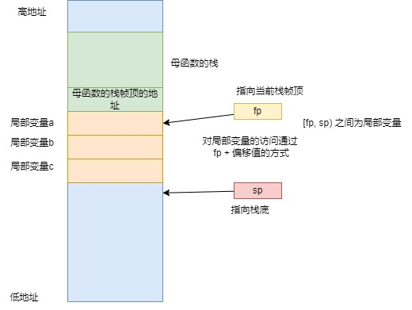

# 明确函数调用的面对的问题
1. 局部变量是如何实现的
2. 函数怎么返回后沿着调用处继续执行

# 局部变量的访问与栈帧


```c
  int main()
  {
  	 // 此时fp指向母函数的栈帧顶，记录母函数的栈帧顶到栈中
     103ec:   push    {fp}        ; (str fp, [sp, #-4]!)
	 // 设置本函数的栈帧顶
     103f0:   add fp, sp, #0
	 // 开辟栈空间给局部变量
     103f4:   sub sp, sp, #12
      int a, b;

      a = 1;
     103f8:   mov r3, #1
	 // 使用fp + 偏移值的方式访问局部变量
     103fc:   str r3, [fp, #-12]
      b = 2;
     10400:   mov r3, #2
     10404:   str r3, [fp, #-8]

      return 0;
     10408:   mov r3, #0
  }
```

# 函数如何传递参数

母函数使用寄存器传递参数，注意从右往左的顺序写入寄存器
```c
	func(1, 2, 3);
   10434:	mov	r2, #3
   10438:	mov	r1, #2
   1043c:	mov	r0, #1
   10440:	bl	103ec <func(int, int, int)>
```

子函数记录下母函数栈帧顶后，分配自己的栈帧，实参和局部变量一样从栈中分配，通过fp和偏移值访问实参变量，使用寄存器给实参传入值，注意给实参赋值的顺序，从左往右赋值
```c
   103ec:	push	{fp}		; (str fp, [sp, #-4]!)
   103f0:	add	fp, sp, #0
   103f4:	sub	sp, sp, #36	; 0x24
   103f8:	str	r0, [fp, #-24]	; 0xffffffe8
   103fc:	str	r1, [fp, #-28]	; 0xffffffe4
   10400:	str	r2, [fp, #-32]	; 0xffffffe0
	int aa = a;
   10404:	ldr	r3, [fp, #-24]	; 0xffffffe8
   10408:	str	r3, [fp, #-16]
	int bb = b;
   1040c:	ldr	r3, [fp, #-28]	; 0xffffffe4
   10410:	str	r3, [fp, #-12]
	int cc =c;
   10414:	ldr	r3, [fp, #-32]	; 0xffffffe0
   10418:	str	r3, [fp, #-8]
```

# 函数如何返回母函数并继续执行
母函数将返回地址写入lr寄存器
```c
   10440:	bl	103ec <func(int, int, int)>
```
子函数首先记录母函数的栈帧顶指针

当函数要返回时，回退sp，并将母函数的栈帧顶指针写入fp

跳转到lr记录的地址执行
```c
   103ec:	push	{fp}		; (str fp, [sp, #-4]!)
   103f0:	add	fp, sp, #0
   ...
   10420:	add	sp, fp, #0
   10424:	pop	{fp}		; (ldr fp, [sp], #4)
   10428:	bx	lr
```

