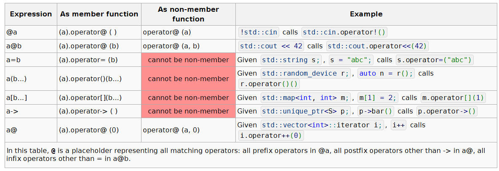

# operator支持的功能

```c
// 重载运算符;
// 无法重载运算符:: (作用域解析)、. (成员访问)、.* (通过指向成员的指针进行成员访问)和?: (条件三目)。
operator op

// 分配函数;
operator new
operator new []

// 释放函数;
operator delete
operator delete []
```

# 重载触发

在这个表格中，@是一个占位符，代表所有匹配的运算符：所有前缀运算符在@a中，除了->之外的所有后缀运算符在a@中，除了=之外的所有中缀运算符在a@b中。

重载函数可以隐式或显示调用
```c
std::string str = "Hello, ";
str.operator+=("world");                      // same as str += "world";
operator<<(operator<<(std::cout, str), '\n'); // same as std::cout << str << '\n';
                                              // (since C++17) except for sequencing
```

# 典型实现方法
## operator=

```cpp
// copy assignment
T& operator=(const T& other)
{
    // Guard self assignment
    if (this == &other)
        return *this;
 
    // assume *this manages a reusable resource, such as a heap-allocated buffer mArray
    if (size != other.size)           // resource in *this cannot be reused
    {
        temp = new int[other.size];   // allocate resource, if throws, do nothing
        delete[] mArray;              // release resource in *this
        mArray = temp;
        size = other.size;
    } 
 
    std::copy(other.mArray, other.mArray + other.size, mArray);
    return *this;
}

// move assignment
T& operator=(T&& other) noexcept
{
    // Guard self assignment
    if (this == &other)
        return *this; // delete[]/size=0 would also be ok
 
    delete[] mArray;                               // release resource in *this
    mArray = std::exchange(other.mArray, nullptr); // leave other in valid state
    size = std::exchange(other.size, 0);
    return *this;
}

// copy assignment (copy-and-swap idiom)
T& T::operator=(T other) noexcept // call copy or move constructor to construct other
{
    std::swap(size, other.size); // exchange resources between *this and other
    std::swap(mArray, other.mArray);
    return *this;
} // destructor of other is called to release the resources formerly managed by *this
```

## operator>> operator<<

通常实现为非成员方法，有时实现为友元函数
```cpp
std::ostream& operator<<(std::ostream& os, const T& obj)
{
    // write obj to stream
    return os;
}
 
std::istream& operator>>(std::istream& is, T& obj)
{
    // read obj from stream
    if (/* T could not be constructed */)
        is.setstate(std::ios::failbit);
    return is;
}
```
## operator ()

重载小括号后，对象称为函数对象类型
```c
// An object of this type represents a linear function of one variable a * x + b.
struct Linear
{
    double a, b;
 
    double operator()(double x) const
    {
        return a * x + b;
    }
};
 
int main()
{
    Linear f{2, 1};  // Represents function 2x + 1.
    Linear g{-1, 0}; // Represents function -x.
    // f and g are objects that can be used like a function.
 
    double f_0 = f(0);
    double f_1 = f(1);
 
    double g_0 = g(0);
}
```
一些stl 算法接受函数对象，以自定义行为。
```cpp
#include <algorithm>
#include <iostream>
#include <vector>
 
struct Sum
{
    int sum = 0;
    void operator()(int n) { sum += n; }
};
 
int main()
{
    std::vector<int> v = {1, 2, 3, 4, 5};
    Sum s = std::for_each(v.begin(), v.end(), Sum());
    std::cout << "The sum is " << s.sum << '\n';
}
```
## operator++ operator++(int)
```cpp
struct X
{
    // prefix increment
    X& operator++()
    {
        // actual increment takes place here
        return *this; // return new value by reference
    }
 
    // postfix increment
    X operator++(int)
    {
        X old = *this; // copy old value
        operator++();  // prefix increment
        return old;    // return old value
    }
 
    // prefix decrement
    X& operator--()
    {
        // actual decrement takes place here
        return *this; // return new value by reference
    }
 
    // postfix decrement
    X operator--(int)
    {
        X old = *this; // copy old value
        operator--();  // prefix decrement
        return old;    // return old value
    }
};
```
## operator+ operator+=
```cpp
class X
{
public:
    X& operator+=(const X& rhs) // 复合赋值运算符 (不一定是成员函数,
    {                           // 但通常是，以便修改私有成员)
        /* addition of rhs to *this takes place here */
        return *this; // return the result by reference
    }
 
    // 定义在class内的友元函数是内联的，并且对 ADL查找隐藏。
    // lhs 传值，是为了优化 a+b+c, 否则两个参数都为 const 引用
    friend X operator+(X lhs,
                       const X& rhs)
    {
        lhs += rhs; // reuse compound assignment
        return lhs; // return the result by value (uses move constructor)
    }
};
```

## operator<

标准算法（如std::sort）和容器（如std::set）默认情况下需要用户提供类型的operator<进行定义，

并要求它实现严格弱排序（从而满足Compare的要求）。一个惯用的方法是使用std::tie提供的词典比较来为结构实现严格弱排序：
```c
struct Record
{
    std::string name;
    unsigned int floor;
    double weight;
 
    friend bool operator<(const Record& l, const Record& r)
    {
        // 如果 谁的name 小，则返回，
        // 如果 name 相同，则比较 floor,
        // 如果 floor 相同，则比较 weight
        return std::tie(l.name, l.floor, l.weight)
             < std::tie(r.name, r.floor, r.weight);
    }
};
```
通常，一旦提供了operator<，其他关系运算符会根据operator<来实现。

```cpp
inline bool operator< (const X& lhs, const X& rhs) { /* do actual comparison */ }
inline bool operator> (const X& lhs, const X& rhs) { return rhs < lhs; }
inline bool operator<=(const X& lhs, const X& rhs) { return !(lhs > rhs); }
inline bool operator>=(const X& lhs, const X& rhs) { return !(lhs < rhs); }
```

同样，不等运算符通常是根据operator==来实现的：
```cpp
inline bool operator==(const X& lhs, const X& rhs) { /* do actual comparison */ }
inline bool operator!=(const X& lhs, const X& rhs) { return !(lhs == rhs); }
```

当提供了三向比较（例如std::memcmp或std::string::compare）时，所有六个二向比较运算符都可以通过它来表达：
```cpp
inline bool operator==(const X& lhs, const X& rhs) { return cmp(lhs,rhs) == 0; }
inline bool operator!=(const X& lhs, const X& rhs) { return cmp(lhs,rhs) != 0; }
inline bool operator< (const X& lhs, const X& rhs) { return cmp(lhs,rhs) <  0; }
inline bool operator> (const X& lhs, const X& rhs) { return cmp(lhs,rhs) >  0; }
inline bool operator<=(const X& lhs, const X& rhs) { return cmp(lhs,rhs) <= 0; }
inline bool operator>=(const X& lhs, const X& rhs) { return cmp(lhs,rhs) >= 0; }
```

如果不等式运算符operator==被定义，编译器会自动生成不等式运算符。同样地，如果定义了三方比较运算符operator<=>，

编译器也会自动生成四个关系运算符。当operator<=>被默认定义时，编译器会生成operator==和operator!=。

```cpp
struct Record
{
    std::string name;
    unsigned int floor;
    double weight;
 
    auto operator<=>(const Record&) const = default;
};
// records can now be compared with ==, !=, <, <=, >, and >=
```

## operator[]
提供类似于数组的访问方式并允许读写操作的自定义类通常会为运算符[]定义两个重载版本：常量版本和非常量版本。

```cpp
struct T
{
          value_t& operator[](std::size_t idx)       { return mVector[idx]; }
    const value_t& operator[](std::size_t idx) const { return mVector[idx]; }
};
```
