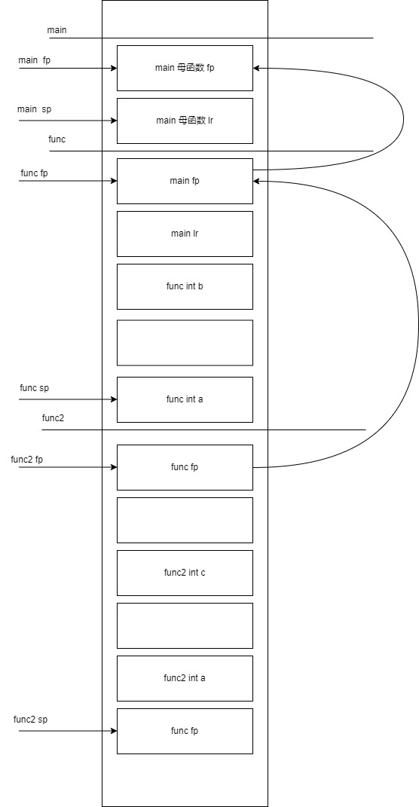

# 编译原理
## 预编译
## 编译
词法，语法分析，生成汇编

编译后会根据源文件生成符号

## 汇编

### 链接符号
```shell
template<typename T>
void cmp(T a, T b)
{
}

template<>
void cmp<const char *>(const char *a, const char *b) // FUNC 
{													 // void cmp<const char *>(const char *, const char *)
}													 // GLOBAL idx

extern void fun1(); // NOTYPE fun1() GLOBAL UND
extern int c;       // NOTYPE c GLOBAL UND
extern int d;       // 不生成符号

void func2() { } // FUNC func2() GLOBAL idx

static void func3() { } // FUNC func3() LOCAL idx

int a;  // OBJECT a GLOBAL idx
static int b; //  OBJECT b LOCAL idx

int main()
{
	int aa = 0;  // 不生成符号，生成代码
				 // mov r3, #0
				 // str r3, [fp, #-8]

	cmp<int>(1, 2); // FUNC 
					// int cmp<int>(int, int) 
					// WEAK
					// idx

	cmp(1.0, 2.0);  // FUNC
					// int cmp(double)(double, double)
					// WEAK
					// idx

	fun1();         // NOTYPE
					// fun1()
					// GLOBAL
					// UND

	c++;            // NOTYPE
					// c
					// GLOBAL
					// UND

	return 0;
}
```

```shell
root@u22:/mnt/share/cpp_study/test# readelf -s main.o

Symbol table '.symtab' contains 16 entries:
   Num:    Value          Size Type    Bind   Vis      Ndx Name
     0: 0000000000000000     0 NOTYPE  LOCAL  DEFAULT  UND
     1: 0000000000000000     0 FILE    LOCAL  DEFAULT  ABS main.cpp
     2: 0000000000000000     0 SECTION LOCAL  DEFAULT    3 .text
     3: 000000000000001e    11 FUNC    LOCAL  DEFAULT    3 _ZL5func3v
     4: 0000000000000004     4 OBJECT  LOCAL  DEFAULT    6 _ZL1b
     5: 0000000000000000     0 SECTION LOCAL  DEFAULT    7 .text._Z3cmpIiEvT_S0_
     6: 0000000000000000     0 SECTION LOCAL  DEFAULT    8 .text._Z3cmpIdEvT_S0_
     7: 0000000000000000     0 SECTION LOCAL  DEFAULT    9 .rodata
     8: 0000000000000000    19 FUNC    GLOBAL DEFAULT    3 _Z3cmpIPKcEvT_S2_
     9: 0000000000000013    11 FUNC    GLOBAL DEFAULT    3 _Z5func2v
    10: 0000000000000000     4 OBJECT  GLOBAL DEFAULT    6 a
    11: 0000000000000029    90 FUNC    GLOBAL DEFAULT    3 main
    12: 0000000000000000    17 FUNC    WEAK   DEFAULT    7 _Z3cmpIiEvT_S0_
    13: 0000000000000000    21 FUNC    WEAK   DEFAULT    8 _Z3cmpIdEvT_S0_
    14: 0000000000000000     0 NOTYPE  GLOBAL DEFAULT  UND _Z4fun1v
    15: 0000000000000000     0 NOTYPE  GLOBAL DEFAULT  UND c

```

readelf 解释 :

- Bind（绑定）：Bind字段表示符号的绑定属性，它指示符号的可见性和链接类型。以下是常见的绑定属性：
 - LOCAL（局部）：符号只在定义它的目标文件中可见，其他目标文件无法引用它。
 - GLOBAL（全局）：符号可以被其他目标文件引用，可以在整个程序中共享。
 - WEAK（弱）：与全局符号类似，可以被其他目标文件引用。但是，链接器在有多个定义的情况下不会合并弱符号，而是选择一个默认版本。
- Vis（可见性）：Vis字段表示符号的可见性属性，它指示符号在链接时的可见范围。以下是常见的可见性属性：
 - DEFAULT（默认）：符号在链接时可以被其他目标文件引用。
 - HIDDEN（隐藏）：符号在链接时只能被定义它的目标文件引用，其他目标文件无法引用它。
 - INTERNAL（内部）：符号在链接时只能被同一目标文件中的其他符号引用，对于其他目标文件是不可见的。
- Ndx（索引）：Ndx字段表示符号的节索引，它指示符号所属的节（section）。节是目标文件中的一段数据，符号在特定的节中定义或引用。节索引指示了符号所属的节的位置。


### C++符号
C++符号根据 作用域+模板参数列表+函数名+参数列表组成

使用 c++filt 可以将根据符号得到真正的函数类型
```shell
root@u22:/mnt/share/cpp_study/test# c++filt _Z3cmpIiEiT_S0_
int cmp<int>(int, int)
```

## 链接
## 加载

# 函数调用
```asm
#include <iostream>
using namespace std;


void func2(int a)
{
   0:	push	{fp}		; (str fp, [sp, #-4]!) // 保存func的fp
							  // 因为func2 没有函数调用，所以不需要保存lr
   4:	add	fp, sp, #0        // 设置自己的fp
   8:	sub	sp, sp, #20       // 分配栈变量
   c:	str	r0, [fp, #-16]
	int c;

	c = a;
  10:	ldr	r3, [fp, #-16]
  14:	str	r3, [fp, #-8]
	c =sizeof(a);
  18:	mov	r3, #4
  1c:	str	r3, [fp, #-8]
}
  20:	nop			; (mov r0, r0)
  24:	add	sp, fp, #0
  28:	pop	{fp}		; (ldr fp, [sp], #4)
                        // 将栈的数据弹4字节到fp，
						// fp = *sp; sp += 4;
						// fp指向母函数的fp
  2c:	bx	lr          // pc = lr

00000030 <_Z4funci>:

void func(int a)
{
  30:	push	{fp, lr}   // 保存main的fp 和 lr
  34:	add	fp, sp, #4     // 设置func的 fp , fp = sp + 4
  38:	sub	sp, sp, #16    // 为局部变量分配空间
                            // 为每个变量分配了8字节，
							// 实际上每个变量只需要4字节

  3c:	str	r0, [fp, #-16]  // 将实参的值传递给形参 a
	int b;

	b = a;
  40:	ldr	r3, [fp, #-16]
  44:	str	r3, [fp, #-8]

	func2(11);
  48:	mov	r0, #11
  4c:	bl	0 <_Z5func2i>

	b = 10;
  50:	mov	r3, #10
  54:	str	r3, [fp, #-8]
}
  58:	nop			; (mov r0, r0)
  5c:	sub	sp, fp, #4           // sp = fp - 4
  60:	pop	{fp, pc}            // fp = 母函数的fp值，pc = lr , sp += 8
                                // 此时sp回到母函数的sp的位置

00000064 <main>:

int main()
{
  64:	push	{fp, lr}   // 保存main的母函数的fp，lr , sp -= 8 ,满减栈
  68:	add	fp, sp, #4     // 设置main的 fp, fp = sp + 4， fp 指向存放lr的内存

	func(11);
  6c:	mov	r0, #11    // 传递参数数量少，使用寄存器传参
  70:	bl	30 <_Z4funci>  // lr = pc + 4 ; pc = _Z4funci

	return 0;
  74:	mov	r3, #0
}
  78:	mov	r0, r3
  7c:	pop	{fp, pc}
```



总结：

0. fp是栈帧寄存器，指向本函数的栈帧开始，sp指向本函数的当前栈位置

1. 子函数首先保存母函数的fp ，lr(如果子函数需要调用其他函数)，然后设置自己的fp

2. 子函数分配栈变量，编译阶段就可以直到要分配几个栈变量，多大空间，所以栈变量的地址和子函数fp之间偏移值是固定的，所以编译阶段借助fp就可以实现对栈变量的访问

3. 当函数返回时，由于子函数栈帧保存了母函数fp和lr，而子函数fp指向栈帧开始，所以可以将sp指向对应位置，并pop出母函数的fp和lr，这样fp寄存器就指向母函数的栈帧，pc指向母函数的代码，sp指向母函数的栈低


# const
## 速记
### 引用0x00000000
```
	// 定义引用p，引用目标是 int * const, 引用目标本身是右值，
	// 用于做指针
	// 1. 首先给右值目标创建匿名栈变量, 赋值0x00000000
	// 2. 将匿名变量的地址赋值给 p, 右值本没有地址，
	//    但创建匿名变量后就有地址
	int * const &p = (int *)0x00000000;
  1c:	mov	r3, #0
  20:	str	r3, [fp, #-20]	; 创建匿名变量，因为const
  24:	sub	r3, fp, #20     ; 取得匿名变量的地址
  28:	str	r3, [fp, #-16]  ; p 指向 匿名变量
  	// p是引用，本质是指针，所以解指针两次
	// 将0x00000000写入匿名变量
	*p = 0x00000000;
  2c:	ldr	r3, [fp, #-16]  ; 第一次解指针, 因为p是引用
  30:	ldr	r3, [r3]        ; 第二次解指针，因为使用 *p
  34:	mov	r2, #0
  38:	str	r2, [r3]        ; 将0x00000000写入匿名变量
	int *a = p;
  3c:	ldr	r3, [fp, #-16]  ; p是const做右值，将p直接改成 [fp, #-16]
  40:	ldr	r3, [r3]
  44:	str	r3, [fp, #-12]
```
### 
```c
int a = 10;
int *const p = &a; // int * const = int *      // 正确
int *&q = p;       // int ** pq = &p; 
                   // int ** = int * const *   // 错误，const做右值，左值必须const
				   // 应该改成
int * const *pp = &p;
int * const &qq = p;


int a = 10;      
const int *p = &a; // const int * = int *
int *&q = p;       // int ** pq = &p;
                   // int ** = const int **    // 错误
                   // const int *&qq = p;

int a = 10;        
int *p = &a;       // int * = int *
const int *&q = p; // const int ** = int **    // 错误
                   // 改成
int *&q = p;       // const int ** = int **

此外一级指针是正确的
int *a;
const int *b = a;


```


## 从常变量到常量
C 中的const
```c
const int a = 10;
int *p = (int *)&a;
*p = 30;
cout << "*p : " << *p << endl;
cout << "a : " << a << endl;
cout << "&a : " << &a << endl;
cout << "p : " << p << endl;
```

C中被const 修饰的符号，翻译成汇编后依旧是变量，

C++的const分两种情况

1. const符号用常量初始化

编译器尽可能将a当成宏对代码进行替换

代码被修改成

```c
const int a = 10;
int *p = (int *)&a;
*p = 30;  // p的确指向了符号a对应的内存空间，并进行了修改

cout << "*p : " << *p << endl;
cout << "a : " << 10 << endl;  // *
cout << "*&a : " << 10 << endl; // *
// &a 和 p 的值都为变量a的地址
cout << "&a : " << &a << endl;
cout << "p : " << p << endl;
```

2. const符号用变量初始化

编译器无法在编译阶段将const符号常量化，

所以这种情况和c中的const一样

```c
int b = 10;
const int a = b;
int *p = (int *)&a;
*p = 30;
printf("%d", a);   // 30
printf("%d", *p);  // 30
```

## 汇编

常量
```asm
	const int a = 10;
  1c:	mov	r3, #10
  20:	str	r3, [fp, #-20]	; 0xffffffec  // 初始化栈变量 a = 10
	int *pa = (int *)&a;
  24:	sub	r3, fp, #20       // 取a的地址
  28:	str	r3, [fp, #-16]     // 将a的地址赋值给pa
	int b;

	*pa = 20;
  2c:	ldr	r3, [fp, #-16]    // 取pa的值
  30:	mov	r2, #20           
  34:	str	r2, [r3]          // 设置 pa指向的内存，为20

	b = a;                    // *****
  38:	mov	r3, #10           // 常量a，直接赋值给b
  3c:	str	r3, [fp, #-12]
	b = *pa;
  40:	ldr	r3, [fp, #-16]
  44:	ldr	r3, [r3]
  48:	str	r3, [fp, #-12]
```

常变量
```asm
	int b = 10;
   c:	mov	r3, #10
  10:	str	r3, [fp, #-12]
	const int a = b;
  14:	ldr	r3, [fp, #-12]
  18:	str	r3, [fp, #-8]

	b = a;
  1c:	ldr	r3, [fp, #-8]
  20:	str	r3, [fp, #-12]
```


# 引用
## 引用的本质
引用的汇编实现就是指针

```c
int b = 10;
int &a = b; // 引用定义时必须初始化
int &aa = 30; // 错误，必须用可取地址的右值
			  // 引用只有一级引用
a = 30;

相当于

int * const a = &b;
*a = 30;
```

引用的书写
```c
int arr[5] = {0};

// 记住引用就是指针,先写指针的方式

int (*p)[5] = &arr;

// 改成引用

int (&p)[5] = arr;
```
## 汇编
### 一般引用

```asm
	int b = 10;
  1c:	mov	r3, #10
  20:	str	r3, [fp, #-16]
	int &a = b;
  24:	sub	r3, fp, #16     // 取b的地址
  28:	str	r3, [fp, #-12]  // 将b的地址放到a

	a = 20;
  2c:	ldr	r3, [fp, #-12]  // 从a中取值，做地址
  30:	mov	r2, #20        
  34:	str	r2, [r3]        // 设置指针指向的内存
```
### 常量引用

常量引用会隐式分配一个栈变量

```asm
	int &&a = 20;
  1c:	mov	r3, #20
  20:	str	r3, [fp, #-20]	; 0xffffffec // 分配隐式变量 赋值 20
  24:	sub	r3, fp, #20        // 分配变量a, 将隐式变量的地址存放到a
  28:	str	r3, [fp, #-16]
	int b;

	a = 10;
  2c:	ldr	r3, [fp, #-16]   // 从变量a中获得隐式变量的地址
  30:	mov	r2, #10         
  34:	str	r2, [r3]         // 修改隐式变量的值为10
	b = a;
  38:	ldr	r3, [fp, #-16]   // 从变量a中获得隐式变量的地址
  3c:	ldr	r3, [r3]
  40:	str	r3, [fp, #-12]   // 根据地址获得隐式变量的值赋值给b

```
### 函数引用
```asm
void func(int &a)
{
   0:	push	{fp}		; (str fp, [sp, #-4]!)
   4:	add	fp, sp, #0
   8:	sub	sp, sp, #12
   c:	str	r0, [fp, #-8]    // 将形参赋值给实参，将main:b的地址赋值 a
	a = 10;	
  10:	ldr	r3, [fp, #-8]    // 从a中取值做地址，设置地址对应的内存的内容为10
  14:	mov	r2, #10
  18:	str	r2, [r3]
}
  1c:	nop			; (mov r0, r0)
  20:	add	sp, fp, #0
  24:	pop	{fp}		; (ldr fp, [sp], #4)
  28:	bx	lr

0000002c <main>:

int main()
{
  2c:	push	{fp, lr}
  30:	add	fp, sp, #4
  34:	sub	sp, sp, #8
  38:	ldr	r3, [pc, #72]	; 88 <main+0x5c>
  3c:	ldr	r3, [r3]
  40:	str	r3, [fp, #-8]
  44:	mov	r3, #0
	int b = 10;
  48:	mov	r3, #10
  4c:	str	r3, [fp, #-12]

	func(b);
  50:	sub	r3, fp, #12     // 将b的地址做形参
  54:	mov	r0, r3
  58:	bl	0 <_Z4funcRi>
```

```asm
	int &&c = 10;         // 定义一个常量引用
  44:	mov	r3, #10
  48:	str	r3, [fp, #-16]
  4c:	sub	r3, fp, #16
  50:	str	r3, [fp, #-12]  // 定义c

	func(c);
  54:	ldr	r3, [fp, #-12]  // 从c获得值做地址，解指针的值传递参数
  58:	ldr	r3, [r3]
  5c:	mov	r0, r3
  60:	bl	0 <_Z4funci>
```

# 内联函数
## 内联函数和普通函数的区别
内联函数在编译阶段确定，没有函数调用的开销，包括 实参压栈，pc 跳转，母函数fp, lr 压栈, 开辟栈帧，返回返回值，函数出栈。

内联函数是直接在函数调用处展开函数

内联函数没有对应符号

# 函数默认参数
## 默认值的顺序
函数调用，实参从左往右，
默认参数定义，形参从右往左给默认参数

```c
int func(int a, int b = 2, int c = 3)
{
  return 0;
}

func(1, 2, 3);
func(1, 2);
func(1);
```
## 声明和默认值
函数定义可以给默认值，但推荐声明给默认值，且只有一次声明给默认值

```c
  int func(int a, int b = 2, int c = 3);

  int main()
  {

      func(1, 2, 3);
      func(1, 2);
      func(1);

      return 0;
  }

  int func(int a, int b, int c)
  {
      return 0;
  }
```

错误
```c
  int func(int a, int b, int c);

  int main()
  {

      func(1, 2, 3);
>>    func(1, 2);
>>    func(1);

      return 0;
  }

  int func(int a, int b = 2, int c = 3)
  {
      return 0;
  }
```

## 汇编
```asm
00000030 <main>:
{
  30:	push	{r4, lr}
	func(1);
  34:	mov	r2, #3
  38:	mov	r1, #2
  3c:	mov	r0, #1
  40:	bl	0 <_Z4funciii>
	func(4, 5);
  44:	mov	r2, #3
  48:	mov	r1, #5
  4c:	mov	r0, #4
  50:	bl	0 <_Z4funciii>
	func();
  54:	mov	r2, #3
  58:	mov	r1, #2
  5c:	mov	r0, #1
  60:	bl	0 <_Z4funciii>
}
```
# 函数重载
函数名相同，参数列表不同（包括参数类型顺序，参数类型，参数数量）

函数重载的原因是cpp编译器定义函数符号时，是根据函数名和参数列表确定，所以不同参数列表的同名函数有不同的链接符号


## c和cpp互相调用
c 调用cpp，无法直接调用，把cpp源码包裹在 `extern "C"`

cpp 调用c, 无法直接调用，把c源码包裹在 `extern "C"`

```c
#ifdef __cplusplus
// 如果编译器为g++，则按c规则编译
// 即 cmp_int(int a, int b) 生成符号 cmp_int
// 如果编译器为gcc, 则没有extern "C" {
// 则gcc 直接编译代码
extern "C" {
#endif

// 注意声明也要放在extern "C"中，因为声明也会生成链接符号，
// 只是符号为 UNDEF 属性
void cmp_int(int a, int b);

void cmp_int(int a, int b)
{}

void cmp_char(const char *a, const char *b)
{}

void cmp_double(double a, double b)
{}

int main()
{
	cmp_int(1, 2);
	cmp_double(1.2, 2.2);
	cmp_char("1", "2");
	return 0;
}

#ifdef __cplusplus
}
#endif
```

# new delete
## new 和 malloc的区别
malloc 只分配内存，不进行初始化内存，通过返回值NULL判断是否成功, 需要类型强制转换。

new 分配内存，可以进行内存初始化，默认通过抛出异常`bad_alloc`通知失败，不需要强制类型转换

```cpp
try {
	int *p = new int(20);
	// 下面这句没有意义，因为分配失败直接异常，
	// 即不会运行到下面这句
	// if (p == nullptr) {}
	delete p;
}
catch (const bad_alloc & e) {
	
}

int *p1 = (int *)malloc(sizeof(*p1));
free(p1);
```

## 不同的new
```cpp
try {
	int *p = new int(20);
	int *arr = new int [10]{10};
	int *arr3 = new int [10](); // 初始化为0
	int *arr2 = new int [3]{1, 2};

	int *p2 = new (nothrow)int(0); // 不抛出异常
	if (p2 == nullptr) {

	}

	const int *p3 = new const int (40);

	// 定位new，在指定内存上分配int大小的内存，
	// 初始化为50
	int data;
	int *p4 = new (&data) int(50);


	delete [] arr;
	delete [] arr2;
	delete p;
}
catch (const bad_alloc & e) {
	
}
```
# 类
## 指向类成员的指针
```c
class stu {
	public:
		int age;
		const char *name;
		char **pname;
		void func() { cout << "hello world" << endl; }
		static int a;
};

int stu::a = 10;

stu s;
s.age = 10;
int stu::*p = &stu::age;
// 将 int stu::* -> int stu::*
s.*p = 20;
// s.(*p) = 20; // 错误，s.的优先级应该更高
cout << s.*p << endl;

const char *stu::*p2 = &stu::name;
//const char stu::*p2 = &stu::name;
// 错误无法 const char * stu:: * -> const char stu:: *

s.*p2 = "hello";
cout << s.*p2 << endl;

char **stu::*p3 = &stu::pname;
// char **stu::* -> char **stu::*

void (stu::*p4)() = &stu::func;
// 将 void (stu::*)(void) -> void (stu::*)(void)
(s.*p4)();

int *p5 = &stu::a;
cout << "p5 " << *p5 << endl;


	stu *s = new stu;

	int stu::*p1 = &stu::age;
	const char *stu::*p2 = &stu::name;
	char **stu::*p3 = &stu::pname;
	void (stu::*p4)() = &stu::func;
	int *p5 = &stu::a;

	(s->*p4)();

	delete s;


```

指向类成员的指针，本质上存放偏移量
```asm
	int stu::*p = &stu::age;
  24:	mov	r3, #0
  28:	str	r3, [fp, #-32]	; 0xffffffe0

	char *stu::*p2 = &stu::name;
  40:	mov	r3, #4
  44:	str	r3, [fp, #-28]	; 0xffffffe4

	char **stu::*p3 = &stu::pname;
  5c:	mov	r3, #8
  60:	str	r3, [fp, #-24]	; 0xffffffe8


# 使用
	s.*p2 = "hello";
  48:	ldr	r3, [fp, #-28]	; 获得存放的偏移量值
  4c:	sub	r2, fp, #20     ; 获得s对象的地址
  50:	add	r3, r2, r3      ; s对象的地址加偏移量得到属性的地址
  54:	ldr	r2, [pc, #56]	; 获得 "hello"
  58:	str	r2, [r3]        ; 将"hello"的地址写入属性的内存空间
```

## 类的各种属性和方法 
### 常方法

常方法的this指针是 `const stu *const this` 所以属性只能读，通常用于实现类读接口的实现。

方便用户传入const类型的参数

```c
class stu {

	// 两个show构成函数重载 
	void show() {
		// this : stu * const this;
	}	
	void show() const  {
		// this : const stu * const this;
	}
};

```

### 静态属性
```c
class stu{
	public:
		static int a;
		// 静态成员方法，只能访问静态属性
		static void func() { a++;}
}
// 在编译时定义。静态属性属于类，不属于成员
int stu::a = 10;
```
## 初始化列表
```c
class A {
	public:
	A(int a, int b)
		:a(a), b(b){
	}

	int a;
	int b;
};

class stu {
	public:
		stu(int a, int b, int c)
			:a(a, b), age(c) // A a(a, b); int age = c 
							 // 先调用初始化列表
							 // 初始化列表的执行顺序为成员定义顺序
		{
			// 再调用自己的构造函数
			// age在这里初始化，则为
			// age = c;

		}
		int age;
		A a;
};

```

# 模板
## 模板函数
```cpp
#include <iostream>
#include <string.h>
using namespace std;

/*
 * 1. 函数模板的实例化
 * 2. 类型推演
 * 3. 特例模板函数
 * 4. 模板函数在编译阶段实例化，所以实现和调用分开会导致符号未定义，所以通常写在头文件，并#include使用
 * 5. 模板函数和普通函数
 */

template<typename T>
int cmp(T a, T b)  // 生成 WEAK 链接符号, 对于LOCAL和GLOBAL都可以覆盖此符号
{
	cout << "template cmp" << endl;
	return a > b;
}

// 特例模板函数
// 当使用模板函数特例，不论函数是否被引用，
// 都会生成 GLOBAL 或 LOCAL 的 链接符号 int cmp<const char *>(const char *,const char *)
template<>
int cmp<const char *>(const char *a, const char *b)
{
	return strcmp(a, b);
}

// 显示告诉编译器进行模板实例化 
template int cmp(bool, bool); // int cmp<bool>(bool, bool)


// 有普通函数声明，会生成符号  GLOBAL cmp(int, int) UND
// 在编译函数调用时，因为已经有有了适当的符号，就不会进行模板实例化
extern int cmp(int a, int b);

#if 0
// 注意 普通函数生成的符号为 cmp(int, int) GLOBAL, 没有返回值
int cmp(int a, int b)
{
	cout << "normal cmp" << endl;
	return a > b;
}
#endif

int main()
{
	// 当编译器自上而下扫描到模板的调用处，
	// 根据模板实参，将模板函数实例化，
	// 生成对应代码
	// cmp<int>(3, 4); // --> 生成 int cmp<int>(int, int) 链接符号  WEAK
	//
	cmp(3, 4); // --> 生成 int cmp<int>(int, int) 链接符号  WEAK

	// 若没有显示指定模板实参，
	// 编译器自动推演模板实参类型
//	cmp(3.0, 4.0);  // --> 生成 int cmp<double>(double, double) 链接符号 WEAK

	// 下面情况无法推演后找不到对于函数模板
	// cmp(3.0, 4);

	// 当使用模板原有比较逻辑是错误的
	// 需要实现模板特例化
//	cmp("aaa", "bbb");


	return 0;
}
```

模板非类型参数
```c
template<typename T>
void myswap(T &a, T &b)
{
	T tmp;

	tmp = a;
	a = b;
	b = tmp;
}

/*
 * 模板非类型参数，用于做常量
 * 非类型参数只能用：整形，指针，引用，double
 */
template<typename T, int SIZE>
void sort(T *arr)
{
	int i, j;
	bool is_ok;

	for (i = 0; i < SIZE - 1 ; i ++) {
		is_ok = true;
		for (j = 0; j < SIZE - 1 - i; j++) {
			if (arr[j] > arr[j + 1]) {
				myswap(arr[j], arr[j + 1]);
				is_ok = false;
			}
		}
	}	
}

```

## 模板类
### stack
```c
template<typename T>
class stack {
	public:
		~stack()
		{
			delete [] data;
		}

		stack() 
			:data(nullptr), size(0), len(0)
		{}

		stack(const stack<T> &s)
		{
			int i;

			data = new T[s.size];
			size = s.size;
			len = s.len;
			for (i = 0; i < s.len; i++)
				data[i] = s.data[i];
		}

		stack<T>& operator=(const stack<T> &s)
		{
			int i;

			if (this == &s)
				return *this;

			delete[] data;
			data = new T[s.size];	
			size = s.size;
			len = s.len;
			for (i = 0; i < s.len; i++)
				data[i] = s.data[i];
		}

		void push(T obj)
		{
			if (len == size)	
				expand();
			data[len++] = obj;
		}

		T pop()
		{
			if (len <= 0)
				throw "stack is empty";
			return data[len-- - 1];
		}
		T top() const;

	private:
		T *data;
		int size;
		int len;

		void expand() {
			T *tmp;

			tmp = data;
			size *= 2;
			data = new T[size];
			for (int i = 0; i < len; i++)
				data[i] = tmp[i];

			delete [] tmp;
		}
};

template<typename T>
T stack<T>::top() const
{
	if (len <= 0)
		throw "stack is empty";
	return data[len - 1];
}


void func()
{
	stack<int> s;

	s.push(1);
	s.push(2);
	s.push(3);
	s.push(4);

	cout << "top" << s.top() << endl;
	cout << "pop" << s.pop() << endl;

	stack<int> s2 = s;

	cout << "top" << s2.top() << endl;

	cout << "pop" << s.pop() << endl;
	cout << "pop" << s.pop() << endl;
	cout << "pop" << s.pop() << endl;
}
```

# 匿名对象

函数返回对象本身，则会调用拷贝构造，构造一个匿名对象。

匿名对象本质是在母函数栈上分配一个对象，并将对象的地址传给子函数，

子函数返回匿名对象前，使用匿名对象的地址进行拷贝构造

```asm
// 返回匿名对象的子函数
test back(int b, int c)
{
   107c8:	push	{fp, lr}
   107cc:	add	fp, sp, #4
   107d0:	sub	sp, sp, #16
   107d4:	str	r0, [fp, #-8]   // 获得母函数匿名对象的地址
   107d8:	str	r1, [fp, #-12]
   107dc:	str	r2, [fp, #-16]
	return a;
   107e0:	ldr	r1, [pc, #16]  // 第二个参数，a的地址
   107e4:	ldr	r0, [fp, #-8]  // 用匿名对象的地址做 this指针，传参数
   107e8:	bl	109ac <test::test(test const&)>  // 调用拷贝构造，匿名对象内存上构造对象 
}
   107ec:	ldr	r0, [fp, #-8]
   107f0:	sub	sp, fp, #4
   107f4:	pop	{fp, pc}
   107f8:	.word	0x000210d8

// 母函数
const test &aa = back(1, 2);
	const test &aa = back(1, 2);
   10814:	sub	r3, fp, #16 // 母函数分配一个匿名test 对象, 获得其地址
   10818:	mov	r2, #2
   1081c:	mov	r1, #1
   10820:	mov	r0, r3   // 匿名对象的地址做第一个参数
   10824:	bl	107c8 <back(int, int)>
   10828:	sub	r3, fp, #16   // 匿名对象已经构造完成，母函数可以直接使用
```

本质上匿名对象是可读写的，但是cpp语法规定匿名对象是常量，

所以母函数只能用常引用接受匿名对象。

```cpp
const test &aa = back(1, 2);
```

更好的方法是

```cpp
test aa = back(1, 2);
```
此时，不会再调用一次对aa对象的构造函数，

因为cpp编译器优化过，`back(1, 2)` 相当于 `back(&aa, 1, 2)`

也就是说，aa的地址被传递给子函数，子函数返回时基于aa的地址进行构造,

所以aa可以直接使用


