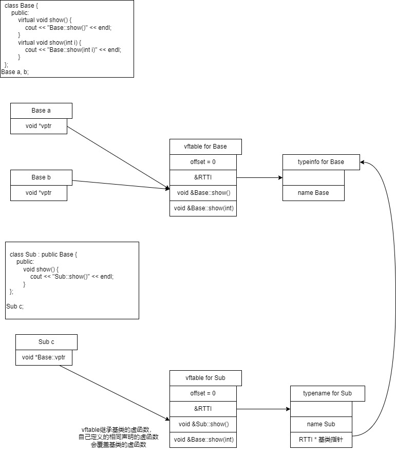

# 编译原理
## 预编译
## 编译
词法，语法分析，生成汇编

编译后会根据源文件生成符号

## 汇编

### 链接符号
```shell
template<typename T>
void cmp(T a, T b)
{
}

template<>
void cmp<const char *>(const char *a, const char *b) // FUNC 
{													 // void cmp<const char *>(const char *, const char *)
}													 // GLOBAL idx

extern void fun1(); // NOTYPE fun1() GLOBAL UND
extern int c;       // NOTYPE c GLOBAL UND
extern int d;       // 不生成符号

void func2() { } // FUNC func2() GLOBAL idx

static void func3() { } // FUNC func3() LOCAL idx

int a;  // OBJECT a GLOBAL idx
static int b; //  OBJECT b LOCAL idx

int main()
{
	int aa = 0;  // 不生成符号，生成代码
				 // mov r3, #0
				 // str r3, [fp, #-8]

	cmp<int>(1, 2); // FUNC 
					// int cmp<int>(int, int) 
					// WEAK
					// idx

	cmp(1.0, 2.0);  // FUNC
					// int cmp(double)(double, double)
					// WEAK
					// idx

	fun1();         // NOTYPE
					// fun1()
					// GLOBAL
					// UND

	c++;            // NOTYPE
					// c
					// GLOBAL
					// UND

	return 0;
}
```

```shell
root@u22:/mnt/share/cpp_study/test# readelf -s main.o

Symbol table '.symtab' contains 16 entries:
   Num:    Value          Size Type    Bind   Vis      Ndx Name
     0: 0000000000000000     0 NOTYPE  LOCAL  DEFAULT  UND
     1: 0000000000000000     0 FILE    LOCAL  DEFAULT  ABS main.cpp
     2: 0000000000000000     0 SECTION LOCAL  DEFAULT    3 .text
     3: 000000000000001e    11 FUNC    LOCAL  DEFAULT    3 _ZL5func3v
     4: 0000000000000004     4 OBJECT  LOCAL  DEFAULT    6 _ZL1b
     5: 0000000000000000     0 SECTION LOCAL  DEFAULT    7 .text._Z3cmpIiEvT_S0_
     6: 0000000000000000     0 SECTION LOCAL  DEFAULT    8 .text._Z3cmpIdEvT_S0_
     7: 0000000000000000     0 SECTION LOCAL  DEFAULT    9 .rodata
     8: 0000000000000000    19 FUNC    GLOBAL DEFAULT    3 _Z3cmpIPKcEvT_S2_
     9: 0000000000000013    11 FUNC    GLOBAL DEFAULT    3 _Z5func2v
    10: 0000000000000000     4 OBJECT  GLOBAL DEFAULT    6 a
    11: 0000000000000029    90 FUNC    GLOBAL DEFAULT    3 main
    12: 0000000000000000    17 FUNC    WEAK   DEFAULT    7 _Z3cmpIiEvT_S0_
    13: 0000000000000000    21 FUNC    WEAK   DEFAULT    8 _Z3cmpIdEvT_S0_
    14: 0000000000000000     0 NOTYPE  GLOBAL DEFAULT  UND _Z4fun1v
    15: 0000000000000000     0 NOTYPE  GLOBAL DEFAULT  UND c

```

readelf 解释 :

- Bind（绑定）：Bind字段表示符号的绑定属性，它指示符号的可见性和链接类型。以下是常见的绑定属性：
 - LOCAL（局部）：符号只在定义它的目标文件中可见，其他目标文件无法引用它。
 - GLOBAL（全局）：符号可以被其他目标文件引用，可以在整个程序中共享。
 - WEAK（弱）：与全局符号类似，可以被其他目标文件引用。但是，链接器在有多个定义的情况下不会合并弱符号，而是选择一个默认版本。
- Vis（可见性）：Vis字段表示符号的可见性属性，它指示符号在链接时的可见范围。以下是常见的可见性属性：
 - DEFAULT（默认）：符号在链接时可以被其他目标文件引用。
 - HIDDEN（隐藏）：符号在链接时只能被定义它的目标文件引用，其他目标文件无法引用它。
 - INTERNAL（内部）：符号在链接时只能被同一目标文件中的其他符号引用，对于其他目标文件是不可见的。
- Ndx（索引）：Ndx字段表示符号的节索引，它指示符号所属的节（section）。节是目标文件中的一段数据，符号在特定的节中定义或引用。节索引指示了符号所属的节的位置。


### C++符号
C++符号根据 作用域+模板参数列表+函数名+参数列表组成

使用 c++filt 可以将根据符号得到真正的函数类型
```shell
root@u22:/mnt/share/cpp_study/test# c++filt _Z3cmpIiEiT_S0_
int cmp<int>(int, int)
```

## 链接
## 加载

# 函数调用
```asm
#include <iostream>
using namespace std;


void func2(int a)
{
   0:	push	{fp}		; (str fp, [sp, #-4]!) // 保存func的fp
							  // 因为func2 没有函数调用，所以不需要保存lr
   4:	add	fp, sp, #0        // 设置自己的fp
   8:	sub	sp, sp, #20       // 分配栈变量
   c:	str	r0, [fp, #-16]
	int c;

	c = a;
  10:	ldr	r3, [fp, #-16]
  14:	str	r3, [fp, #-8]
	c =sizeof(a);
  18:	mov	r3, #4
  1c:	str	r3, [fp, #-8]
}
  20:	nop			; (mov r0, r0)
  24:	add	sp, fp, #0
  28:	pop	{fp}		; (ldr fp, [sp], #4)
                        // 将栈的数据弹4字节到fp，
						// fp = *sp; sp += 4;
						// fp指向母函数的fp
  2c:	bx	lr          // pc = lr

00000030 <_Z4funci>:

void func(int a)
{
  30:	push	{fp, lr}   // 保存main的fp 和 lr
  34:	add	fp, sp, #4     // 设置func的 fp , fp = sp + 4
  38:	sub	sp, sp, #16    // 为局部变量分配空间
                            // 为每个变量分配了8字节，
							// 实际上每个变量只需要4字节

  3c:	str	r0, [fp, #-16]  // 将实参的值传递给形参 a
	int b;

	b = a;
  40:	ldr	r3, [fp, #-16]
  44:	str	r3, [fp, #-8]

	func2(11);
  48:	mov	r0, #11
  4c:	bl	0 <_Z5func2i>

	b = 10;
  50:	mov	r3, #10
  54:	str	r3, [fp, #-8]
}
  58:	nop			; (mov r0, r0)
  5c:	sub	sp, fp, #4           // sp = fp - 4
  60:	pop	{fp, pc}            // fp = 母函数的fp值，pc = lr , sp += 8
                                // 此时sp回到母函数的sp的位置

00000064 <main>:

int main()
{
  64:	push	{fp, lr}   // 保存main的母函数的fp，lr , sp -= 8 ,满减栈
  68:	add	fp, sp, #4     // 设置main的 fp, fp = sp + 4， fp 指向存放lr的内存

	func(11);
  6c:	mov	r0, #11    // 传递参数数量少，使用寄存器传参
  70:	bl	30 <_Z4funci>  // lr = pc + 4 ; pc = _Z4funci

	return 0;
  74:	mov	r3, #0
}
  78:	mov	r0, r3
  7c:	pop	{fp, pc}
```


总结：

0. fp是栈帧寄存器，指向本函数的栈帧开始，sp指向本函数的当前栈位置

1. 子函数首先保存母函数的fp ，lr(如果子函数需要调用其他函数)，然后设置自己的fp

2. 子函数分配栈变量，编译阶段就可以直到要分配几个栈变量，多大空间，所以栈变量的地址和子函数fp之间偏移值是固定的，所以编译阶段借助fp就可以实现对栈变量的访问

3. 当函数返回时，由于子函数栈帧保存了母函数fp和lr，而子函数fp指向栈帧开始，所以可以将sp指向对应位置，并pop出母函数的fp和lr，这样fp寄存器就指向母函数的栈帧，pc指向母函数的代码，sp指向母函数的栈低


# const
## 速记
### 引用0x00000000
```
	// 定义引用p，引用目标是 int * const, 引用目标本身是右值，
	// 用于做指针
	// 1. 首先给右值目标创建匿名栈变量, 赋值0x00000000
	// 2. 将匿名变量的地址赋值给 p, 右值本没有地址，
	//    但创建匿名变量后就有地址
	int * const &p = (int *)0x00000000;
  1c:	mov	r3, #0
  20:	str	r3, [fp, #-20]	; 创建匿名变量，因为const
  24:	sub	r3, fp, #20     ; 取得匿名变量的地址
  28:	str	r3, [fp, #-16]  ; p 指向 匿名变量
  	// p是引用，本质是指针，所以解指针两次
	// 将0x00000000写入匿名变量
	*p = 0x00000000;
  2c:	ldr	r3, [fp, #-16]  ; 第一次解指针, 因为p是引用
  30:	ldr	r3, [r3]        ; 第二次解指针，因为使用 *p
  34:	mov	r2, #0
  38:	str	r2, [r3]        ; 将0x00000000写入匿名变量
	int *a = p;
  3c:	ldr	r3, [fp, #-16]  ; p是const做右值，将p直接改成 [fp, #-16]
  40:	ldr	r3, [r3]
  44:	str	r3, [fp, #-12]
```
### 
```c
int a = 10;
int *const p = &a; // int * const = int *      // 正确
int *&q = p;       // int ** pq = &p; 
                   // int ** = int * const *   // 错误，const做右值，左值必须const
				   // 应该改成
int * const *pp = &p;
int * const &qq = p;


int a = 10;      
const int *p = &a; // const int * = int *
int *&q = p;       // int ** pq = &p;
                   // int ** = const int **    // 错误
                   // const int *&qq = p;

int a = 10;        
int *p = &a;       // int * = int *
const int *&q = p; // const int ** = int **    // 错误
                   // 改成
int *&q = p;       // const int ** = int **

此外一级指针是正确的
int *a;
const int *b = a;


```


## 从常变量到常量
C 中的const
```c
const int a = 10;
int *p = (int *)&a;
*p = 30;
cout << "*p : " << *p << endl;
cout << "a : " << a << endl;
cout << "&a : " << &a << endl;
cout << "p : " << p << endl;
```

C中被const 修饰的符号，翻译成汇编后依旧是变量，

C++的const分两种情况

1. const符号用常量初始化

编译器尽可能将a当成宏对代码进行替换

代码被修改成

```c
const int a = 10;
int *p = (int *)&a;
*p = 30;  // p的确指向了符号a对应的内存空间，并进行了修改

cout << "*p : " << *p << endl;
cout << "a : " << 10 << endl;  // *
cout << "*&a : " << 10 << endl; // *
// &a 和 p 的值都为变量a的地址
cout << "&a : " << &a << endl;
cout << "p : " << p << endl;
```

2. const符号用变量初始化

编译器无法在编译阶段将const符号常量化，

所以这种情况和c中的const一样

```c
int b = 10;
const int a = b;
int *p = (int *)&a;
*p = 30;
printf("%d", a);   // 30
printf("%d", *p);  // 30
```

## 汇编

常量
```asm
	const int a = 10;
  1c:	mov	r3, #10
  20:	str	r3, [fp, #-20]	; 0xffffffec  // 初始化栈变量 a = 10
	int *pa = (int *)&a;
  24:	sub	r3, fp, #20       // 取a的地址
  28:	str	r3, [fp, #-16]     // 将a的地址赋值给pa
	int b;

	*pa = 20;
  2c:	ldr	r3, [fp, #-16]    // 取pa的值
  30:	mov	r2, #20           
  34:	str	r2, [r3]          // 设置 pa指向的内存，为20

	b = a;                    // *****
  38:	mov	r3, #10           // 常量a，直接赋值给b
  3c:	str	r3, [fp, #-12]
	b = *pa;
  40:	ldr	r3, [fp, #-16]
  44:	ldr	r3, [r3]
  48:	str	r3, [fp, #-12]
```

常变量
```asm
	int b = 10;
   c:	mov	r3, #10
  10:	str	r3, [fp, #-12]
	const int a = b;
  14:	ldr	r3, [fp, #-12]
  18:	str	r3, [fp, #-8]

	b = a;
  1c:	ldr	r3, [fp, #-8]
  20:	str	r3, [fp, #-12]
```


# 引用
## 引用的本质
引用的汇编实现就是指针

```c
int b = 10;
int &a = b; // 引用定义时必须初始化
int &aa = 30; // 错误，必须用可取地址的右值
			  // 引用只有一级引用
a = 30;

相当于

int * const a = &b;
*a = 30;
```

引用的书写
```c
int arr[5] = {0};

// 记住引用就是指针,先写指针的方式

int (*p)[5] = &arr;

// 改成引用

int (&p)[5] = arr;
```
## 汇编
### 一般引用

```asm
	int b = 10;
  1c:	mov	r3, #10
  20:	str	r3, [fp, #-16]
	int &a = b;
  24:	sub	r3, fp, #16     // 取b的地址
  28:	str	r3, [fp, #-12]  // 将b的地址放到a

	a = 20;
  2c:	ldr	r3, [fp, #-12]  // 从a中取值，做地址
  30:	mov	r2, #20        
  34:	str	r2, [r3]        // 设置指针指向的内存
```
### 常量引用

常量引用会隐式分配一个栈变量

```asm
	int &&a = 20;
  1c:	mov	r3, #20
  20:	str	r3, [fp, #-20]	; 0xffffffec // 分配隐式变量 赋值 20
  24:	sub	r3, fp, #20        // 分配变量a, 将隐式变量的地址存放到a
  28:	str	r3, [fp, #-16]
	int b;

	a = 10;
  2c:	ldr	r3, [fp, #-16]   // 从变量a中获得隐式变量的地址
  30:	mov	r2, #10         
  34:	str	r2, [r3]         // 修改隐式变量的值为10
	b = a;
  38:	ldr	r3, [fp, #-16]   // 从变量a中获得隐式变量的地址
  3c:	ldr	r3, [r3]
  40:	str	r3, [fp, #-12]   // 根据地址获得隐式变量的值赋值给b

```
### 函数引用
```asm
void func(int &a)
{
   0:	push	{fp}		; (str fp, [sp, #-4]!)
   4:	add	fp, sp, #0
   8:	sub	sp, sp, #12
   c:	str	r0, [fp, #-8]    // 将形参赋值给实参，将main:b的地址赋值 a
	a = 10;	
  10:	ldr	r3, [fp, #-8]    // 从a中取值做地址，设置地址对应的内存的内容为10
  14:	mov	r2, #10
  18:	str	r2, [r3]
}
  1c:	nop			; (mov r0, r0)
  20:	add	sp, fp, #0
  24:	pop	{fp}		; (ldr fp, [sp], #4)
  28:	bx	lr

0000002c <main>:

int main()
{
  2c:	push	{fp, lr}
  30:	add	fp, sp, #4
  34:	sub	sp, sp, #8
  38:	ldr	r3, [pc, #72]	; 88 <main+0x5c>
  3c:	ldr	r3, [r3]
  40:	str	r3, [fp, #-8]
  44:	mov	r3, #0
	int b = 10;
  48:	mov	r3, #10
  4c:	str	r3, [fp, #-12]

	func(b);
  50:	sub	r3, fp, #12     // 将b的地址做形参
  54:	mov	r0, r3
  58:	bl	0 <_Z4funcRi>
```

```asm
	int &&c = 10;         // 定义一个常量引用
  44:	mov	r3, #10
  48:	str	r3, [fp, #-16]
  4c:	sub	r3, fp, #16
  50:	str	r3, [fp, #-12]  // 定义c

	func(c);
  54:	ldr	r3, [fp, #-12]  // 从c获得值做地址，解指针的值传递参数
  58:	ldr	r3, [r3]
  5c:	mov	r0, r3
  60:	bl	0 <_Z4funci>
```

# 内联函数
## 内联函数和普通函数的区别
内联函数在编译阶段确定，没有函数调用的开销，包括 实参压栈，pc 跳转，母函数fp, lr 压栈, 开辟栈帧，返回返回值，函数出栈。

内联函数是直接在函数调用处展开函数

内联函数没有对应符号

# 函数默认参数
## 默认值的顺序
函数调用，实参从左往右，
默认参数定义，形参从右往左给默认参数

```c
int func(int a, int b = 2, int c = 3)
{
  return 0;
}

func(1, 2, 3);
func(1, 2);
func(1);
```
## 声明和默认值
函数定义可以给默认值，但推荐声明给默认值，且只有一次声明给默认值

```c
  int func(int a, int b = 2, int c = 3);

  int main()
  {

      func(1, 2, 3);
      func(1, 2);
      func(1);

      return 0;
  }

  int func(int a, int b, int c)
  {
      return 0;
  }
```

错误
```c
  int func(int a, int b, int c);

  int main()
  {

      func(1, 2, 3);
>>    func(1, 2);
>>    func(1);

      return 0;
  }

  int func(int a, int b = 2, int c = 3)
  {
      return 0;
  }
```

## 汇编
```asm
00000030 <main>:
{
  30:	push	{r4, lr}
	func(1);
  34:	mov	r2, #3
  38:	mov	r1, #2
  3c:	mov	r0, #1
  40:	bl	0 <_Z4funciii>
	func(4, 5);
  44:	mov	r2, #3
  48:	mov	r1, #5
  4c:	mov	r0, #4
  50:	bl	0 <_Z4funciii>
	func();
  54:	mov	r2, #3
  58:	mov	r1, #2
  5c:	mov	r0, #1
  60:	bl	0 <_Z4funciii>
}
```
# 函数重载
函数名相同，参数列表不同（包括参数类型顺序，参数类型，参数数量）

函数重载的原因是cpp编译器定义函数符号时，是根据函数名和参数列表确定，所以不同参数列表的同名函数有不同的链接符号


## c和cpp互相调用
c 调用cpp，无法直接调用，把cpp源码包裹在 `extern "C"`

cpp 调用c, 无法直接调用，把c源码包裹在 `extern "C"`

```c
#ifdef __cplusplus
// 如果编译器为g++，则按c规则编译
// 即 cmp_int(int a, int b) 生成符号 cmp_int
// 如果编译器为gcc, 则没有extern "C" {
// 则gcc 直接编译代码
extern "C" {
#endif

// 注意声明也要放在extern "C"中，因为声明也会生成链接符号，
// 只是符号为 UNDEF 属性
void cmp_int(int a, int b);

void cmp_int(int a, int b)
{}

void cmp_char(const char *a, const char *b)
{}

void cmp_double(double a, double b)
{}

int main()
{
	cmp_int(1, 2);
	cmp_double(1.2, 2.2);
	cmp_char("1", "2");
	return 0;
}

#ifdef __cplusplus
}
#endif
```

# new delete
## new 和 malloc的区别
malloc 只分配内存，不进行初始化内存，通过返回值NULL判断是否成功, 需要类型强制转换。

new 分配内存，可以进行内存初始化，默认通过抛出异常`bad_alloc`通知失败，不需要强制类型转换

```cpp
try {
	int *p = new int(20);
	// 下面这句没有意义，因为分配失败直接异常，
	// 即不会运行到下面这句
	// if (p == nullptr) {}
	delete p;
}
catch (const bad_alloc & e) {
	
}

int *p1 = (int *)malloc(sizeof(*p1));
free(p1);
```

## 不同的new
```cpp
try {
	int *p = new int(20);
	int *arr = new int [10]{10};
	int *arr3 = new int [10](); // 初始化为0
	int *arr2 = new int [3]{1, 2};

	int *p2 = new (nothrow)int(0); // 不抛出异常
	if (p2 == nullptr) {

	}

	const int *p3 = new const int (40);

	// 定位new，在指定内存上分配int大小的内存，
	// 初始化为50
	int data;
	int *p4 = new (&data) int(50);


	delete [] arr;
	delete [] arr2;
	delete p;
}
catch (const bad_alloc & e) {
	
}
```
# 类
## 指向类成员的指针
```c
class stu {
	public:
		int age;
		const char *name;
		char **pname;
		void func() { cout << "hello world" << endl; }
		static int a;
};

int stu::a = 10;

stu s;
s.age = 10;
int stu::*p = &stu::age;
// 将 int stu::* -> int stu::*
s.*p = 20;
// s.(*p) = 20; // 错误，s.的优先级应该更高
cout << s.*p << endl;

const char *stu::*p2 = &stu::name;
//const char stu::*p2 = &stu::name;
// 错误无法 const char * stu:: * -> const char stu:: *

s.*p2 = "hello";
cout << s.*p2 << endl;

char **stu::*p3 = &stu::pname;
// char **stu::* -> char **stu::*

void (stu::*p4)() = &stu::func;
// 将 void (stu::*)(void) -> void (stu::*)(void)
(s.*p4)();

int *p5 = &stu::a;
cout << "p5 " << *p5 << endl;


	stu *s = new stu;

	int stu::*p1 = &stu::age;
	const char *stu::*p2 = &stu::name;
	char **stu::*p3 = &stu::pname;
	void (stu::*p4)() = &stu::func;
	int *p5 = &stu::a;

	(s->*p4)();

	delete s;


```

指向类成员的指针，本质上存放偏移量
```asm
	int stu::*p = &stu::age;
  24:	mov	r3, #0
  28:	str	r3, [fp, #-32]	; 0xffffffe0

	char *stu::*p2 = &stu::name;
  40:	mov	r3, #4
  44:	str	r3, [fp, #-28]	; 0xffffffe4

	char **stu::*p3 = &stu::pname;
  5c:	mov	r3, #8
  60:	str	r3, [fp, #-24]	; 0xffffffe8


# 使用
	s.*p2 = "hello";
  48:	ldr	r3, [fp, #-28]	; 获得存放的偏移量值
  4c:	sub	r2, fp, #20     ; 获得s对象的地址
  50:	add	r3, r2, r3      ; s对象的地址加偏移量得到属性的地址
  54:	ldr	r2, [pc, #56]	; 获得 "hello"
  58:	str	r2, [r3]        ; 将"hello"的地址写入属性的内存空间
```

## 类的各种属性和方法 
### 常方法

常方法的this指针是 `const stu *const this` 所以属性只能读，通常用于实现类读接口的实现。

方便用户传入const类型的参数

```c
class stu {

	// 两个show构成函数重载 
	void show() {
		// this : stu * const this;
	}	
	void show() const  {
		// this : const stu * const this;
	}
};

```

### 静态属性
```c
class stu{
	public:
		static int a;
		// 静态成员方法，只能访问静态属性
		static void func() { a++;}
}
// 在编译时定义。静态属性属于类，不属于成员
int stu::a = 10;
```
## 初始化列表
```c
class A {
	public:
	A(int a, int b)
		:a(a), b(b){
	}

	int a;
	int b;
};

class stu {
	public:
		stu(int a, int b, int c)
			:a(a, b), age(c) // A a(a, b); int age = c 
							 // 先调用初始化列表
							 // 初始化列表的执行顺序为成员定义顺序
		{
			// 再调用自己的构造函数
			// age在这里初始化，则为
			// age = c;

		}
		int age;
		A a;
};

```

# 模板
## 模板函数
```cpp
#include <iostream>
#include <string.h>
using namespace std;

/*
 * 1. 函数模板的实例化
 * 2. 类型推演
 * 3. 特例模板函数
 * 4. 模板函数在编译阶段实例化，所以实现和调用分开会导致符号未定义，所以通常写在头文件，并#include使用
 * 5. 模板函数和普通函数
 */

template<typename T>
int cmp(T a, T b)  // 生成 WEAK 链接符号, 对于LOCAL和GLOBAL都可以覆盖此符号
{
	cout << "template cmp" << endl;
	return a > b;
}

// 特例模板函数
// 当使用模板函数特例，不论函数是否被引用，
// 都会生成 GLOBAL 或 LOCAL 的 链接符号 int cmp<const char *>(const char *,const char *)
template<>
int cmp<const char *>(const char *a, const char *b)
{
	return strcmp(a, b);
}

// 显示告诉编译器进行模板实例化 
template int cmp(bool, bool); // int cmp<bool>(bool, bool)


// 有普通函数声明，会生成符号  GLOBAL cmp(int, int) UND
// 在编译函数调用时，因为已经有有了适当的符号，就不会进行模板实例化
extern int cmp(int a, int b);

#if 0
// 注意 普通函数生成的符号为 cmp(int, int) GLOBAL, 没有返回值
int cmp(int a, int b)
{
	cout << "normal cmp" << endl;
	return a > b;
}
#endif

int main()
{
	// 当编译器自上而下扫描到模板的调用处，
	// 根据模板实参，将模板函数实例化，
	// 生成对应代码
	// cmp<int>(3, 4); // --> 生成 int cmp<int>(int, int) 链接符号  WEAK
	//
	cmp(3, 4); // --> 生成 int cmp<int>(int, int) 链接符号  WEAK

	// 若没有显示指定模板实参，
	// 编译器自动推演模板实参类型
//	cmp(3.0, 4.0);  // --> 生成 int cmp<double>(double, double) 链接符号 WEAK

	// 下面情况无法推演后找不到对于函数模板
	// cmp(3.0, 4);

	// 当使用模板原有比较逻辑是错误的
	// 需要实现模板特例化
//	cmp("aaa", "bbb");


	return 0;
}
```

模板非类型参数
```c
template<typename T>
void myswap(T &a, T &b)
{
	T tmp;

	tmp = a;
	a = b;
	b = tmp;
}

/*
 * 模板非类型参数，用于做常量
 * 非类型参数只能用：整形，指针，引用，double
 */
template<typename T, int SIZE>
void sort(T *arr)
{
	int i, j;
	bool is_ok;

	for (i = 0; i < SIZE - 1 ; i ++) {
		is_ok = true;
		for (j = 0; j < SIZE - 1 - i; j++) {
			if (arr[j] > arr[j + 1]) {
				myswap(arr[j], arr[j + 1]);
				is_ok = false;
			}
		}
	}	
}

```

## 模板类
### stack
```c
template<typename T>
class stack {
	public:
		~stack()
		{
			delete [] data;
		}

		stack() 
			:data(nullptr), size(0), len(0)
		{}

		stack(const stack<T> &s)
		{
			int i;

			data = new T[s.size];
			size = s.size;
			len = s.len;
			for (i = 0; i < s.len; i++)
				data[i] = s.data[i];
		}

		stack<T>& operator=(const stack<T> &s)
		{
			int i;

			if (this == &s)
				return *this;

			delete[] data;
			data = new T[s.size];	
			size = s.size;
			len = s.len;
			for (i = 0; i < s.len; i++)
				data[i] = s.data[i];
		}

		void push(T obj)
		{
			if (len == size)	
				expand();
			data[len++] = obj;
		}

		T pop()
		{
			if (len <= 0)
				throw "stack is empty";
			return data[len-- - 1];
		}
		T top() const;

	private:
		T *data;
		int size;
		int len;

		void expand() {
			T *tmp;

			tmp = data;
			size *= 2;
			data = new T[size];
			for (int i = 0; i < len; i++)
				data[i] = tmp[i];

			delete [] tmp;
		}
};

template<typename T>
T stack<T>::top() const
{
	if (len <= 0)
		throw "stack is empty";
	return data[len - 1];
}


void func()
{
	stack<int> s;

	s.push(1);
	s.push(2);
	s.push(3);
	s.push(4);

	cout << "top" << s.top() << endl;
	cout << "pop" << s.pop() << endl;

	stack<int> s2 = s;

	cout << "top" << s2.top() << endl;

	cout << "pop" << s.pop() << endl;
	cout << "pop" << s.pop() << endl;
	cout << "pop" << s.pop() << endl;
}
```

# 匿名对象

函数返回对象本身，则会调用拷贝构造，构造一个匿名对象。

匿名对象本质是在母函数栈上分配一个对象，并将对象的地址传给子函数，

子函数返回匿名对象前，使用匿名对象的地址进行拷贝构造

```asm
// 返回匿名对象的子函数
test back(int b, int c)
{
   107c8:	push	{fp, lr}
   107cc:	add	fp, sp, #4
   107d0:	sub	sp, sp, #16
   107d4:	str	r0, [fp, #-8]   // 获得母函数匿名对象的地址
   107d8:	str	r1, [fp, #-12]
   107dc:	str	r2, [fp, #-16]
	return a;
   107e0:	ldr	r1, [pc, #16]  // 第二个参数，a的地址
   107e4:	ldr	r0, [fp, #-8]  // 用匿名对象的地址做 this指针，传参数
   107e8:	bl	109ac <test::test(test const&)>  // 调用拷贝构造，匿名对象内存上构造对象 
}
   107ec:	ldr	r0, [fp, #-8]
   107f0:	sub	sp, fp, #4
   107f4:	pop	{fp, pc}
   107f8:	.word	0x000210d8

// 母函数
const test &aa = back(1, 2);
	const test &aa = back(1, 2);
   10814:	sub	r3, fp, #16 // 母函数分配一个匿名test 对象, 获得其地址
   10818:	mov	r2, #2
   1081c:	mov	r1, #1
   10820:	mov	r0, r3   // 匿名对象的地址做第一个参数
   10824:	bl	107c8 <back(int, int)>
   10828:	sub	r3, fp, #16   // 匿名对象已经构造完成，母函数可以直接使用
```

本质上匿名对象是可读写的，但是cpp语法规定匿名对象是常量，

所以母函数只能用常引用接受匿名对象。

```cpp
const test &aa = back(1, 2);
```

更好的方法是

```cpp
test aa = back(1, 2);
```
此时，不会再调用一次对aa对象的构造函数，

因为cpp编译器优化过，`back(1, 2)` 相当于 `back(&aa, 1, 2)`

也就是说，aa的地址被传递给子函数，子函数返回时基于aa的地址进行构造,

所以aa可以直接使用


# oop
## 继承
继承的本质是代码的复用

不论使用何种继承方式，子类都会得到父类的全部成员

### 继承和访问限定

继承和访问限定遵循一下规律：

- 被继承的成员的访问限定不超过继承访问的访问限定
 - 访问限定的大小为 public > protected > private
- 被继承的private不论何种继承方式，子类都不可见
- 只有public成员可以对外部访问
- protected和private唯一区别在于继承

| 继承方式 | 基类访问限定 | 派生类访问限定 | 外部访问限定 |
| ------ | ---| --- | --- |
| public | public | public | Y |
| public | protected | protected | N |
| public | private | 存在但不可见 | N |
| protected | public | protected | N |
| protected | protected | protected | N |
| protected | private | 存在但不可见 | N |
| private | public | private | N |
| private | protected | private | N |
| private | private | 存在但不可见 | N |

### 继承和构造析构
- 构造：基类 -> 组合类(按照定义顺序) -> 自己
- 析构: 自己 -> 组合类(按照定义顺序取反) -> 基类

### 方法的重载隐藏覆盖
- 重载：作用域相同，函数名相同，参数列表不同，所以基类和子相同函数名的方法不构成重载
- 隐藏：当子类定义了func方法，则隐藏基类的所有func方法
- 覆盖: 和动态相关

### 基类对象和子类对象的互相转换
不论时对象转换，还是指向对象的指针转换，只允许子类转换为基类。

特别是基类指针指向子类对象，只能访问基类部分的属性。

## 虚函数表，静态绑定，动态绑定 
### 虚函数表的创建和vptr



1. 类定义有virtual修饰的函数，则会生成该类的vftable.

2. 子类即使没有显示声明虚函数，但子类继承的基类，所以子类也有vptr vftable，并且子类的vftable里记录的虚函数值为基类的vftable虚函数值

3. 若子类定义了相关虚函数，则会重写子类vftable中相关虚函数的地址，也就会覆盖从基类继承的虚函数地址

4. 即使子类没有显示使用virtual关键字，只要函数名，返回值，参数列表和继承的函数相同，则也被当作虚函数重写

当基类定义了虚函数，但是子类没有重写虚函数，子类依旧会继承虚函数
```asm
00010b0c <vtable for Derive>:
   10b0c:	00000000 00010b34 0001093c 00010a20     ....4...<... ...
   10b1c:	00010a5c                                \...

00010b20 <vtable for Base>:
   10b20:	00000000 00010b48 0001093c 00010980     ....H...<.......
   10b30:	000109b4                                ....
```
可以发现子类也有vtable，并且虚函数列表字段内容相同。


### 虚函数的调用

在调用时，若函数为虚函数，则使用动态绑定，否则使用静态绑定。

动态绑定原理是
- 根据对象获得对象的vptr指针
- 根据vptr指针获得对应类的vftable
- 根据偏移值和vftable基地址得到对应虚函数的地址
- 调用虚函数

```asm
	Sub s;	
   1082c:	ldr	r3, [pc, #100]	; 10898 <main+0x84>
   10830:	str	r3, [fp, #-16]
	Base *b;

	b = &s;
   10834:	sub	r3, fp, #16
   10838:	str	r3, [fp, #-12]

	b->show();
   1083c:	ldr	r3, [fp, #-12]  // b指针指向s对象，通过指针取s对象的vptr属性的地址
   10840:	ldr	r3, [r3]        // 从vptr指针获得vftable的地址
   10844:	ldr	r3, [r3]        // 从vftable获得 void show()虚函数的地址
   10848:	ldr	r0, [fp, #-12]  // 传递this做参数
   1084c:	blx	r3              // 调用 Sub::show()
	b->show(1);
   10850:	ldr	r3, [fp, #-12]  // b指针指向s对象，通过指针取s对象的vptr属性的地址
   10854:	ldr	r3, [r3]        // 从vptr指针获得vftable的地址
   10858:	add	r3, r3, #4      // 地址偏移4字节，获得 void show(int) 虚函数的地址的地址
   1085c:	ldr	r3, [r3]        // 获得void show (int)虚函数的地址
   10860:	mov	r1, #1          // 参数1
   10864:	ldr	r0, [fp, #-12]  // 参数this
   10868:	blx	r3              // 调用 Base::show(int) , 因为这是从基类继承来的，且没有被覆盖
```

```cpp
class Base {
	public:
		virtual void show() {
			cout << "Base::show()" << endl;
		}
		virtual void show(int i) {
			cout << "Base::show(int i)" << endl;
		}
		void func() {}
};

class Sub : public Base {
};

class Sub2 : public Sub {
};

int main()
{
	Sub *s;	
	Sub2 s2;
	Base *b, bb;

	s = &s2;
	s->show();
	s->func();
```


```asm
	Sub *s;	
	Sub2 s2;
   1082c:	ldr	r3, [pc, #96]	; 10894 <main+0x80>
   10830:	str	r3, [fp, #-20]	; 0xffffffec
	Base *b, bb;
   10834:	ldr	r3, [pc, #92]	; 10898 <main+0x84>
   10838:	str	r3, [fp, #-16]

	s = &s2;
   1083c:	sub	r3, fp, #20
   10840:	str	r3, [fp, #-12]
	s->show();    // Sub类的show函数为virtual，所以使用动态绑定 
   10844:	ldr	r2, [fp, #-12]
   10848:	ldr	r3, [fp, #-12]
   1084c:	ldr	r3, [r3]
   10850:	ldr	r3, [r3]
   10854:	mov	r0, r2
   10858:	blx	r3
	s->func();   // Sub类的func为普通函数，所以使用静态绑定
   1085c:	ldr	r3, [fp, #-12]
   10860:	mov	r0, r3
   10864:	bl	109a8 <Base::func()>
```

### vptr和构造函数


调用基类构造函数时，vptr指向基类的vtable中的虚函数表，调用自己的构造函数时，vptr才指向本类vtable中的虚函数表。

注意构造函数中可以使用多态，因为本类vptr的绑定紧跟在基类构造返回后.
```cpp
0001095c <Sub::Sub()>:
		Sub() {
   1095c:	e92d4800 	push	{fp, lr}
   10960:	e28db004 	add	fp, sp, #4
   10964:	e24dd010 	sub	sp, sp, #16
   10968:	e50b0010 	str	r0, [fp, #-16]
   1096c:	e51b3010 	ldr	r3, [fp, #-16]
   10970:	e1a00003 	mov	r0, r3
   10974:	ebffffda 	bl	108e4 <Base::Base()>
   10978:	e59f2030 	ldr	r2, [pc, #48]	; vptr指向本类vtable
   1097c:	e51b3010 	ldr	r3, [fp, #-16]
   10980:	e5832000 	str	r2, [r3]
			b = this;
   10984:	e51b3010 	ldr	r3, [fp, #-16]
   10988:	e50b3008 	str	r3, [fp, #-8]
			b->show();
   1098c:	e51b3008 	ldr	r3, [fp, #-8]  ; 多态调用
   10990:	e5933000 	ldr	r3, [r3]
   10994:	e5933000 	ldr	r3, [r3]
   10998:	e51b0008 	ldr	r0, [fp, #-8]
   1099c:	e12fff33 	blx	r3
		}
   109a0:	e51b3010 	ldr	r3, [fp, #-16]
   109a4:	e1a00003 	mov	r0, r3
   109a8:	e24bd004 	sub	sp, fp, #4
   109ac:	e8bd8800 	pop	{fp, pc}
   109b0:	00010a90 	.word	0x00010a90
```


### 哪些函数不能实现成虚函数
1. 构造函数不能实现为虚函数

因为多态依赖vptr指向对象对应类的vtable，而这个操作在对象的构造函数中完成，

所以构造函数若做虚函数，则vptr还没有指向正确的vtable导致无法调用正确的构造函数。

2. 静态方法不能实现为虚函数

因为多态依赖vptr指针，vptr存储在确定的对象里，而静态方法不需要对象

### 虚析构函数

如果要使用多态，则基类析构函数推荐使用虚函数，因为若不为虚函数，则可能漏掉调用子类的析构

```cpp
	Base *b = new Sub;
   10864:	e3a00004 	mov	r0, #4
   10868:	ebffff97 	bl	106cc <operator new(unsigned int)@plt>
   1086c:	e1a03000 	mov	r3, r0
   10870:	e1a04003 	mov	r4, r3
   10874:	e1a00004 	mov	r0, r4
   10878:	eb00005a 	bl	109e8 <Sub::Sub()>
   1087c:	e50b4010 	str	r4, [fp, #-16]
	delete b;
   10880:	e51b4010 	ldr	r4, [fp, #-16]        ; 获得指针b
   10884:	e3540000 	cmp	r4, #0                ; 如果b == 0 则异常
   10888:	0a000003 	beq	1089c <main+0x44>     
   1088c:	e1a00004 	mov	r0, r4                ; 调用Base的析构
   10890:	eb000047 	bl	109b4 <Base::~Base()>
   10894:	e1a00004 	mov	r0, r4
   10898:	ebffff97 	bl	106fc <operator delete(void*)@plt>
```

```cpp
	Base *b = new Sub;
   10864:	e3a00004 	mov	r0, #4
   10868:	ebffff97 	bl	106cc <operator new(unsigned int)@plt>
   1086c:	e1a03000 	mov	r3, r0
   10870:	e1a04003 	mov	r4, r3
   10874:	e1a00004 	mov	r0, r4
   10878:	eb000068 	bl	10a20 <Sub::Sub()>
   1087c:	e50b4010 	str	r4, [fp, #-16]
	delete b;
   10880:	e51b3010 	ldr	r3, [fp, #-16]
   10884:	e3530000 	cmp	r3, #0
   10888:	0a000005 	beq	108a4 <main+0x4c>
   1088c:	e51b3010 	ldr	r3, [fp, #-16]   ; 获得vptr
   10890:	e5933000 	ldr	r3, [r3]         ; 获得vtable中的虚函数表
   10894:	e2833008 	add	r3, r3, #8       ; 虚函数表基地址偏移8字节得到虚函数的指针
   10898:	e5933000 	ldr	r3, [r3]         ; 获得虚函数
   1089c:	e51b0010 	ldr	r0, [fp, #-16]
   108a0:	e12fff33 	blx	r3               ; 调用虚析构函数
```

### 是不是所有虚函数的调用都是动态绑定？
不是，构造函数中直接调用虚函数，使用静态绑定

必须由指针或引用访问虚函数，才为动态绑定 ,否则是静态绑定

### virtual方法和默认参数
```cpp
class Base {
	public:
		virtual void show(int i = 10) { cout << "Base::show " << i << endl;}
		virtual ~Base() {}
};

class Derive: public Base {
	public:
		virtual void show(int i = 20) { cout << "Derive::show " << i << endl;}
		virtual ~Derive() {}
}; 

	Base *p = new Derive;
	p->show();
	delete p;
```
注意 打印:
```shell
Derive::show 10
```

注意默认参数使用的是基类的默认参数。
```asm
	p->show();
   10838:	e51b3010 	ldr	r3, [fp, #-16]
   1083c:	e5933000 	ldr	r3, [r3]
   10840:	e5933000 	ldr	r3, [r3]
   10844:	e3a0100a 	mov	r1, #10   ; 使用默认参数做参数
   10848:	e51b0010 	ldr	r0, [fp, #-16]
   1084c:	e12fff33 	blx	r3
```

原因是，使用默认参数传参，是编译时确定，编译器无法确定动态绑定那个函数，

所以编译器完全按照调用时当时的对象是什么类型，就使用对应类型定义的函数声明的默认参数。

### virtual 和访问域控制
```cpp
class Base {
	public:
		virtual void show(int i = 10) { cout << "Base::show " << i << endl;}
		virtual ~Base() {}
};

class Derive: public Base {
	private:
		virtual void show(int i = 20) { cout << "Derive::show " << i << endl;}
	public:
		virtual ~Derive() {}
}; 

int main()
{
	Base *p = new Derive;

	p->show();
	delete p;

	return 0;
}
```
虽然Derive::show是private，但是依旧可以访问，

因为访问域是在编译阶段判定，编译器发现 p 是 Base，且`Base::show`是 public，所以可以调用。运行阶段找到`Derive::show`，并运行

### 基类指针指向子类对象的哪个域
基类指针指向子类对象的首地址，第一个字段。

因为偏移量是固定的


## 抽象类
### 什么时候定义抽象类
1. 为了定义一个统一的接口

2. 为了继承公共属性

### 抽象类的特点
1. 抽象类方法没有明确实现，只有接口定义 

2. 抽象类不能定义对象，但可以定义指针和引用

## 面试题
### 1
```cpp
class Animal {
	public:
		Animal(const char *name) : _name(name) {}
		virtual void bark() = 0;
		virtual ~Animal() {}
	protected:
		string _name;
};

class Dog : public Animal {
	public:
		Dog(const char *name) : Animal(name) {}
		void bark() {
			cout << _name << " : wang wang !" << endl;
		}
		~Dog() {}
};

class Cat : public Animal {
	public:
		Cat(const char *name) : Animal(name) {}
		void bark() {
			cout << _name << " : miao miao !" << endl;
		}
		~Cat() {}
};

int main()
{
	Dog d("Jim");
	Cat c("Tom");

	int *p = (int *)&d;
	int *p2 = (int *)&c;
	int tmp;

	tmp = *p;
	*p = *p2;
	*p2 = tmp;

	Animal *a;
	a = &d;
	a->bark(); // Jim : miao miao !
	a = &c;
	a->bark(); // Tom : wang wang !

	return 0;
}
```

### 2
```cpp
class Base {
	public:
		virtual void show(int i = 10) { cout << "Base::show " << i << endl;}
		virtual ~Base() {}
};

class Derive: public Base {
	private:
		virtual void show(int i = 20) { cout << "Derive::show " << i << endl;}
	public:
		virtual ~Derive() {}
}; 

int main()
{
	Base *p = new Derive;

	p->show(); // 能否调用
	delete p;

	return 0;
}
```

### 3.
```cpp
class Base {
	public:
		Base() {
			memset(this, 0x0, sizeof(*this));
		}
		virtual void show() { cout << "Base::show " << endl;}
		virtual ~Base() {}
};

class Derive: public Base {
	public:
		virtual void show() { cout << "Derive::show " << endl;}
		virtual ~Derive() {}
}; 

int main()
{
    // 哪个可以正常调用，为什么？

	// 1
	Base *p = new Derive;
	p->show();
	delete p;

	// 2
	p = new Base;
	p->show();
	delete p;

	return 0;
}
```

## 多重继承
### 虚继承
#### 多继承时，如果属性有二义性，则使用虚继承
```cpp
  class A {
      public:
          int m_a;
          A() { m_a = 1; }
  };

  class B : virtual public A {
      public:
          int m_b;
          B() { m_b = 1; }
  };

  class C : public B {
      public:
          int m_c;
          C() { m_c = 1; }
  };
```
如果不加 virtual ，则会编译报错

#### 被虚继承时的对象内存布局

B虚继承A，B中添加vbptr指向vbtable，并且B中A的属性移动到高地址，C继承B，C的属性在B的属性后

虚继承后，对象内存增加一个指针

### 菱形继承
菱形继承是设计不合理的体现

菱形继承中基类二义性的问题使用虚继承解决。

需要注意构造函数
```cpp
  class A {
      public:
          int m_a;
          A(int a) :m_a(a) {}
  };

  class B : virtual public A {
      public:
          int m_b;
          B(): A(0) { m_b = 1; }
  };

  class C : public B {
      public:
          int m_c;
          C(): A(0) { m_c = 1; } // C类必须直接调用A的构造，不能通过B的构造间接构造A
  };
```

导致上面情况的原因是：

```asm
  00010a44 <C::C()>:
          C() { m_c = 1; }
     10a44:   e92d4800    push    {fp, lr}
     10a48:   e28db004    add fp, sp, #4
     10a4c:   e24dd008    sub sp, sp, #8
     10a50:   e50b0008    str r0, [fp, #-8]
     10a54:   e51b3008    ldr r3, [fp, #-8]
     10a58:   e283300c    add r3, r3, #12
     10a5c:   e1a00003    mov r0, r3
     10a60:   ebffffc7    bl  10984 <A::A()>  // 当C继承的类中有通过虚继承获得的，则会直接调用虚继承对应的类的构造
     10a64:   e51b3008    ldr r3, [fp, #-8]
     10a68:   e59f2030    ldr r2, [pc, #48]   ; 10aa0 <C::C()+0x5c>
     10a6c:   e1a01002    mov r1, r2
     10a70:   e1a00003    mov r0, r3
     10a74:   ebffffce    bl  109b4 <B::B()>  // 调用中间类的构造，这个构造是特别的
     10a78:   e59f2024    ldr r2, [pc, #36]   ; 10aa4 <C::C()+0x60>
     10a7c:   e51b3008    ldr r3, [fp, #-8]
     10a80:   e5832000    str r2, [r3]
     10a84:   e51b3008    ldr r3, [fp, #-8]

    // C中调用的B的构造是特别的，这个B构造中没有调用A的构造
  000109b4 <B::B()>:
          B() { m_b = 1; }
     109b4:   e52db004    push    {fp}        ; (str fp, [sp, #-4]!)
     109b8:   e28db000    add fp, sp, #0
     109bc:   e24dd00c    sub sp, sp, #12
     109c0:   e50b0008    str r0, [fp, #-8]
     109c4:   e50b100c    str r1, [fp, #-12]
     109c8:   e51b300c    ldr r3, [fp, #-12]
     109cc:   e5932000    ldr r2, [r3]
     109d0:   e51b3008    ldr r3, [fp, #-8]
     109d4:   e5832000    str r2, [r3]
     109d8:   e51b3008    ldr r3, [fp, #-8]
     109dc:   e3a02001    mov r2, #1
     109e0:   e5832004    str r2, [r3, #4]
     109e4:   e51b3008    ldr r3, [fp, #-8]
     109e8:   e1a00003    mov r0, r3
     109ec:   e28bd000    add sp, fp, #0
     109f0:   e49db004    pop {fp}        ; (ldr fp, [sp], #4)
     109f4:   e12fff1e    bx  lr

    // g++另外生成了一段B的构造，这个构造中调用了A的构造，并且设置vbptr
    // 对应 B类定义b对象，会调用下面的构造
  000109f8 <B::B()>:
     109f8:   e92d4800    push    {fp, lr}
     109fc:   e28db004    add fp, sp, #4
     10a00:   e24dd008    sub sp, sp, #8
     10a04:   e50b0008    str r0, [fp, #-8]
     10a08:   e51b3008    ldr r3, [fp, #-8]
     10a0c:   e2833008    add r3, r3, #8
     10a10:   e1a00003    mov r0, r3
     10a14:   ebffffda    bl  10984 <A::A()>
     10a18:   e59f2020    ldr r2, [pc, #32]   ; 10a40 <B::B()+0x48>
     10a1c:   e51b3008    ldr r3, [fp, #-8]
     10a20:   e5832000    str r2, [r3]
     10a24:   e51b3008    ldr r3, [fp, #-8]
     10a28:   e3a02001    mov r2, #1
     10a2c:   e5832004    str r2, [r3, #4]
     10a30:   e51b3008    ldr r3, [fp, #-8]
     10a34:   e1a00003    mov r0, r3
     10a38:   e24bd004    sub sp, fp, #4
     10a3c:   e8bd8800    pop {fp, pc}
     10a40:   00010b48    .word   0x00010b48
```

# C++类内存布局分析
## 普通类
```cpp
class A {
public:
  void *m_p;
  int m_a;
  char m_c;
  A() {
      m_p = nullptr;
      m_a = 0;
      m_c = 0;
  }
};

class B : public A{
public:
  int m_b;
  B() {
      m_b = 0;
  }
};

```
gdb 分析
```
p a
$1 = {m_p = 0x0, m_a = 0, m_c = 0 '\000'}
p b
$2 = {<A> = {m_p = 0x0, m_a = 0, m_c = 0 '\000'}, m_b = 0}
```

g++分析
```
  Class A
     size=16 align=8
     base size=13 base align=8
  A (0x0x7fab1e332cc0) 0

  Class B
     size=24 align=8
     base size=20 base align=8
  B (0x0x7fab1e354a28) 0
  A (0x0x7fab1e332ea0) 0
```

内存布局


可以发现对齐，一个类按多少字节对齐，默认是根据类中最大的属性。

#### 访问虚继承部分的属性
```cpp

class A {
        public:
                int m_a;
                A() { m_a = 1; }
};

class B : virtual public A {
        public:
                int m_b;
                B() { m_b = 1; }
};

class C : public B {
        public:
                int m_c;
                C() { m_c = 1; }
};

void func(B *p)
{
        cout << p->m_a << endl;
}

int main()
{
        C c;
        B b;

        func(&c);
        func(&b);

        return 0;
}
```

上面示例中， func的形参 p无法使用固定偏移量，因为传B 和 传C的内存布局不同


那么g++只有使用vbtable记录的偏移量来访问m_a
```asm
  void func(B *p)
  {
     10830:   e92d4800    push    {fp, lr}
     10834:   e28db004    add fp, sp, #4
     10838:   e24dd008    sub sp, sp, #8
     1083c:   e50b0008    str r0, [fp, #-8]
      cout << p->m_a << endl;                // A::m_a是被虚继承
     10840:   e51b3008    ldr r3, [fp, #-8]  // 得到 vbptr
     10844:   e5933000    ldr r3, [r3]       // 得到 vbtable
     10848:   e243300c    sub r3, r3, #12    // 偏移固定值得到m_a相关偏移量的地址
     1084c:   e5933000    ldr r3, [r3]       // 获得m_a的偏移量
     10850:   e1a02003    mov r2, r3
     10854:   e51b3008    ldr r3, [fp, #-8]  // 获得对象的基地址
     10858:   e0833002    add r3, r3, r2     // 增加偏移量得到 m_a的地址
     1085c:   e5933000    ldr r3, [r3]       // 获得 m_a
     10860:   e1a01003    mov r1, r3
     10864:   e59f001c    ldr r0, [pc, #28]   ; 10888 <func(B*)+0x58>
     10868:   ebffffa8    bl  10710 <std::ostream::operator<<(int)@plt>
     1086c:   e1a03000    mov r3, r0
     10870:   e59f1014    ldr r1, [pc, #20]   ; 1088c <func(B*)+0x5c>
     10874:   e1a00003    mov r0, r3
     10878:   ebffff9b    bl  106ec <std::ostream::operator<<(std::ostream& (*)(std::ostream&))@plt>
  }
```

可见访问虚继承的属性很浪费cpu

## 虚基类
```cpp
  class A {
  public:
      void *m_p;
      int m_a;
      char m_c;
      A() {
          m_p = nullptr;
          m_a = 0;
          m_c = 0;
      }
      virtual void show() {}
  };

  class B : public A{
  public:
      int m_b;
      B() {
          m_b = 0;
      }
      void show() {}
  };
```
gdb
```
(gdb) p a                                                                                               
$5 = {_vptr.A = 0x555555754d70 <vtable for A+16>, m_p = 0x0, m_a = 0, m_c = 0 '\000'}                  
(gdb) p b                                                                                             
$6 = {<A> = {_vptr.A = 0x555555754d58 <vtable for B+16>, m_p = 0x0, m_a = 0, m_c = 0 '\000'}, m_b = 0}
```
g++
```
Vtable for A
A::_ZTV1A: 3 entries
0     (int (*)(...))0
8     (int (*)(...))(& _ZTI1A)
16    (int (*)(...))A::show

Class A
 size=24 align=8
 base size=21 base align=8
A (0x0x7fd354d6ccc0) 0
  vptr=((& A::_ZTV1A) + 16)

Vtable for B
B::_ZTV1B: 3 entries
0     (int (*)(...))0
8     (int (*)(...))(& _ZTI1B)
16    (int (*)(...))B::show

Class B
 size=32 align=8
 base size=28 base align=8
B (0x0x7fd354d8ea28) 0
  vptr=((& B::_ZTV1B) + 16)
A (0x0x7fd354d6cf00) 0
    primary-for B (0x0x7fd354d8ea28)

```
反汇编信息
```asm

  000108b4 <vtable for B>:
     108b4:   00000000 000108cc 00010820              ........ ...

  000108c0 <vtable for A>:
     108c0:   00000000 000108dc 000107b8              ............

  000108cc <typeinfo for B>:
     108cc:   00020ee0 000108d8 000108dc              ............

  000108d8 <typeinfo name for B>:
     108d8:   00004231                                1B..

  000108dc <typeinfo for A>:
     108dc:   00020eb4 000108e4                       ........

  000108e4 <typeinfo name for A>:
     108e4:                                            1A.
```


## 虚继承
```cpp
  class A {
  public:
      void *m_p;
      int m_a;
      char m_c;
      A() {
          m_p = nullptr;
          m_a = 0;
          m_c = 0;
      }
  };

  class B : virtual public A{
  public:
      int m_b;
      B() {
          m_b = 0;
      }
  };

```

gdb
```
(gdb) p a                                                                                        
$1 = {m_p = 0x0, m_a = 0, m_c = 0 '\000'}                                                       
(gdb) p b                                                                                      
$2 = {<A> = {m_p = 0x0, m_a = 0, m_c = 0 '\000'}, _vptr.B = 0x555555754d60 <VTT for B>, m_b = 0}
```

g++
```
  Class A
     size=16 align=8
     base size=13 base align=8
  A (0x0x7f11a3edfcc0) 0

  Vtable for B
  B::_ZTV1B: 3 entries
  0     16
  8     (int (*)(...))0
  16    (int (*)(...))(& _ZTI1B)

  VTT for B
  B::_ZTT1B: 1 entries
  0     ((& B::_ZTV1B) + 24)

  Class B
     size=32 align=8
     base size=12 base align=8
  B (0x0x7f11a3f01a28) 0
      vptridx=0 vptr=((& B::_ZTV1B) + 24)
  A (0x0x7f11a3edfea0) 16 virtual
        vbaseoffset=-24
```

# 类型转换
## const_cast
```cpp
const int *piconst = nullptr;
const int i = 10;
int *pi;
double *pd;

/
pi = const_cast<int *>(piconst);
pi = const_cast<int *>(&i);
//  pd = const_cast<double *>(piconst); // error
```
- 用于指针或引用去除const
- const_cast<目标类型>(被转换的变量)
- 被转换的变量必须为指针类型或引用
- 原类型和目标类型必须有关联，如int -> double就不行

## static_cast
```cpp
int *pi;
unsigned int *pui;
short *ps;
double d;
short s;

// pi = static_cast<int *>(&s); // error
// ps = static_cast<short *>(pi); // error 字节大小变化，不可以
//pi = static_cast<int *>(pui); // error 内存的使用不同

// 基类 -> 派生类 指针 引用
C *pc;
A *pa;

pc = static_cast<C *>(pa);

A a;
A &aa = a;

C &cc = static_cast<C &>(aa);
```
- 只提供编译器认为有联系的类型转换
- 为编译阶段检查转换是否合法
- 如子类转换为基类指针，能转换，但运行时是否合法编译器不保证

## reinterpret_cast
```cpp
int *pi;
unsigned int *pui;
short *ps;
double d;
short s;

pi = reinterpret_cast<int *>(&s);
ps = reinterpret_cast<short *>(pi);
pi = reinterpret_cast<int *>(pui);
```
- 类似于c风格的强制类型转换
- 编译器不进行严格类型关联检查

## dynamic_cast
```cpp
class A {
  public:
      virtual void show() {}
};

class B : public A {
  public:
      void show() { cout << "B::show()" << endl;}
};

class B2 : public A {
  public:
      void show() { cout << "B2::show()" << endl;}
      void show2() { cout << "B2::show2()" << endl;}
};

class C : public B {
  public:
      void show() {}
};

void func(A *pa)
{
  B2 *pb2 = dynamic_cast<B2 *>(pa);
  if (pb2) {
      pb2->show2();
  }
  else {
      pa->show();
  }
}

B b;
B2 b2;

func(&b);
func(&b2);
```
- 根据RTTI进行运行时类型转换检查
- 如果支持类型转换则返回非nullptr

# STL
## 概览
- 顺序容器
    - vector
    - deque
    - list
- 容器适配器
    - stack
    - queue
    - priority_queue
- 关联容器
    - 无序关联容器
        - unordered_set
        - unordered_multiset
        - unordered_map
        - unordered_multimap
    - 有序关联容器
        - set
        - multiset
        - map
        - multimap
- 近容器
    - 数组
    - string
    - bitset
- 迭代器
    - iterator
    - const_iterator
    - reverse_iterator
    - const_reverse_iteraotr
- 函数对象
    - greater
    - less
- 泛型算法
    - sort
    - find
    - find_if
    - binary_search
    - for_earch

## 顺序容器
### vector


底层为动态数组，每次以原来大小进行2倍扩容
* 动态数组
* 二倍扩容
* first指针指向数组首元素，导致只有push_back的效率为O(1)，其他效率都为O(n)

1. insert
```cpp
push_back(T &obj);  // 末尾添加元素
insert(vector<T>::iterator it, T &obj);  // 迭代器指定位置添加元素
```

2. delete
```cpp
pop_back(); //  末尾删除元素
```

3. modify

4. select


### deque


* 底层是二维数组
* 4K扩容
* 使用两个指针first指针和last指针，指向已占用数组的首尾
* first last从空闲空间的中间开始分配
* 当二维空间消耗完了，就对一维数组进行扩容
* push_back 和 push_front 效率为O(1)

### list
双向循环链表

* insert O(1)
* 访问[] O(n)

### vector deque list 对比
- vector vs deque
    - 扩容
        - vector 是基于连续的数组，经常扩容，每次扩容都会进行对象的析构和构造
        - deque 基于不连续的数组，扩容时，不会进行对象的深拷贝
        - list 是离散的，不涉及扩容
    
    - 中间删除
        - deque 删除中间元素，需要进行元素移动，如果有多个二维数组，则需要跨数组移动，效率低
        - vector删除中间元素，需要进行元素移动，但是由于内存一定连续，所以效率相对高


- list vs vector
    - 增删
        - list O(1)
        - vector O(n)
    - 访问
        - list O(n)
        - vector O(1)

## 关联容器
* 一般关联容器
* unordered_xx
* unordered_multixx
* multixx
有序指元素可以按序遍历，维护顺序需要cpu，导致无序更常用 

multi指元素可以重复

### 无序关联容器
底层使用hash表

#### unordered_set
```cpp
#include <iostream>
#include <unordered_set>
using namespace std;

int main()
{
        unordered_set<int> s;

        for (int i = 0; i < 20; i++)
                s.insert(i);

        for (auto it = s.begin(); it != s.end(); ++it)
                cout << *it << " ";
        cout << endl;

        auto it = s.find(3);
        if (it != s.end())
                s.erase(it);
        s.erase(10);

        for (auto it = s.begin(); it != s.end(); ++it)
                cout << *it << " ";
        cout << endl;

        return 0;
}
```
#### unordered_map
```cpp
int main()
{
        unordered_map<int, const char *> stu_map;

        /*
         * insert参数
         *    struct pair {
         *       T1 first;
         *       T2 second;
         *    };
         */
        stu_map.insert(make_pair(1000, "Jim"));
        stu_map.insert(make_pair(1010, "Tom"));
        stu_map.insert(make_pair(1020, "Jun"));

        cout << "size : " << stu_map.size() << endl;
        /*
         * operator[] :
         *   如果key存在，则返回
         *   如果key不存在，则插入value为默认构造元素，并返回
         */
        cout << "1000 : " << stu_map[1000] << endl;

        // map可以修改value
        stu_map[1010] = "Tom2";

        // find 返回的是 struct pair
        auto it = stu_map.find(1010);
        cout << "key : " << it->first << ", " << "Second : " << it->second << endl;

        stu_map.erase(1000);

        return 0;
}
```

### 有序关联容器
底层使用红黑树
#### set
```cpp
class Stu {
        public:
                Stu(int id = 0, string name = "")
                        :_id(id), _name(name) {}
                friend ostream &operator<<(ostream &out, const Stu &s);
                // 对于顺序关联容器，需定义 < 的常方法
                bool operator<(const Stu &s) const {
                        return this->_id < s._id;
                }
        private:
                string _name;
                int _id;
};

ostream &operator<<(ostream &out, const Stu &s)
{
        out << s._id << " " << s._name;
        return out;
}

int main()
{
        set<Stu> stu_set;

        stu_set.insert(Stu(70, "aa"));
        stu_set.insert(Stu(20, "bb"));
        stu_set.insert(Stu(10, "cc"));
        stu_set.insert(Stu(30, "dd"));
        stu_set.insert(Stu(20, "xx")); // 不支持重复，重复添加的元素会被忽略

        for (Stu pos : stu_set)
                cout << pos << endl;

        return 0;
}
```
#### map
```cpp
class Stu {
        public:
                Stu(int id = 0, const char *name = "")
                        :_id(id), _name(name) {}
                friend ostream &operator<<(ostream &out, const Stu &stu);
        private:
                int _id;
                string _name;
};

ostream &operator<<(ostream &out, const Stu &stu)
{
        out << stu._id << ", " << stu._name << endl;
        return out;
}

int main()
{
        map<int, Stu>stu_map;
        Stu *pstu;

        pstu = new Stu(12, "aa");
        // map 不需要定义 operator< 因为他使用 key 的operator<
        // 这里key为 int ，int 的< 是存在的
        // 由map根据key值，计算位置，插入元素
        stu_map.insert(make_pair(12, Stu(12, "aa")));
        stu_map.insert(make_pair(13, Stu(13, "bb")));
        stu_map.insert(make_pair(10, Stu(10, "cc")));

        // 由程序员指定插入位置
        stu_map[1] = Stu(111, "xxx");

        // 中序遍历红黑树
        for (const pair<int, Stu>pos : stu_map)
                cout << pos.second;
        cout << endl;

        return 0;
}
```
## 迭代器
```cpp
// 正向迭代器
  for (map<int, Stu>::iterator it = stu_map.begin(); it != stu_map.end(); ++it)
      cout << it->second;
  cout << endl;

// const正向迭代器
  /*
   * class iterator : public const_iterator
   * 所以 iterator --> const_iterator
   */
  for (map<int, Stu>::const_iterator it = stu_map.begin(); it != stu_map.end(); ++it)
      cout << it->second;
  cout << endl;

// 反向迭代器
  for (map<int, Stu>::reverse_iterator it = stu_map.rbegin(); it != stu_map.rend(); ++it)
      cout << it->second;
  cout << endl;

// const反向迭代器
  for (map<int, Stu>::const_reverse_iterator it = stu_map.rbegin(); it != stu_map.rend(); ++it)
      cout << it->second;
  cout << endl;
```
