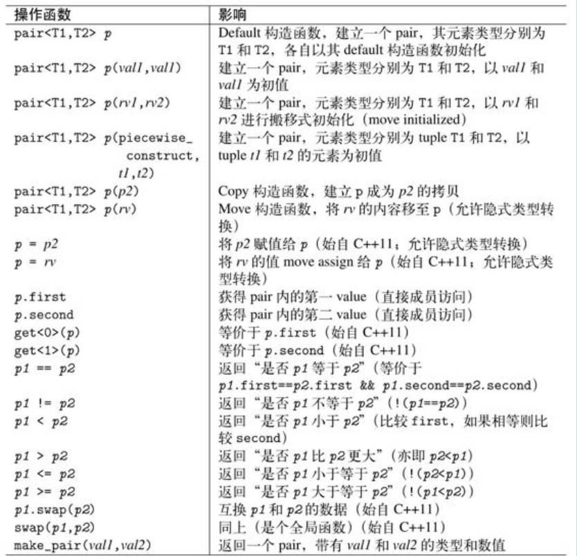
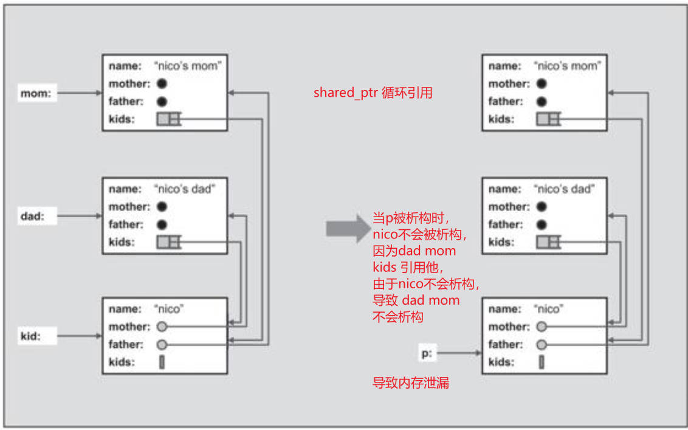
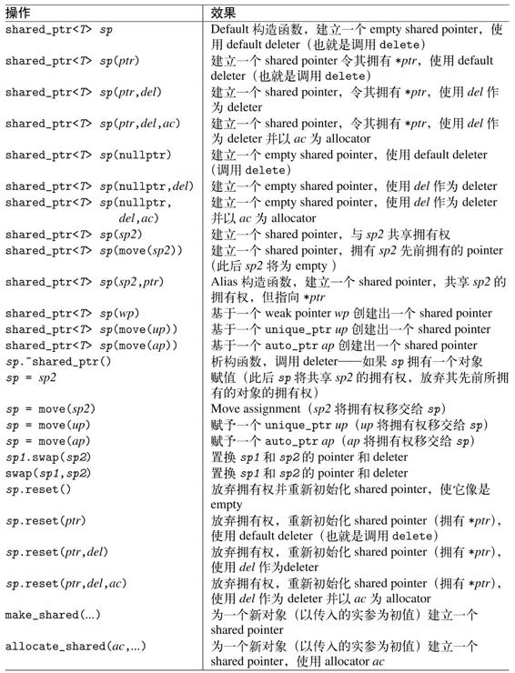
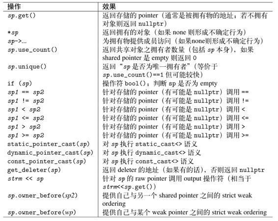
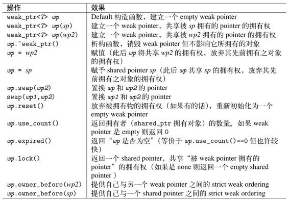
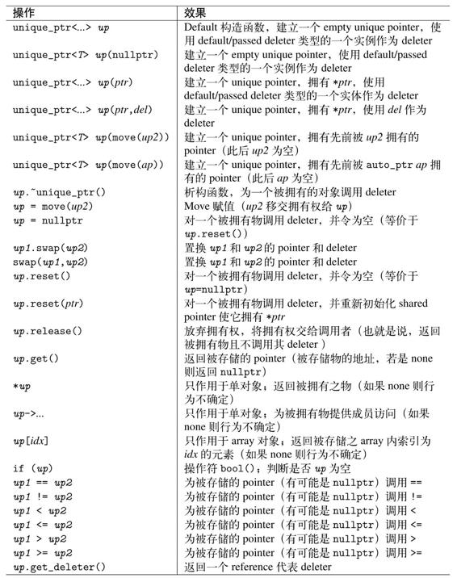
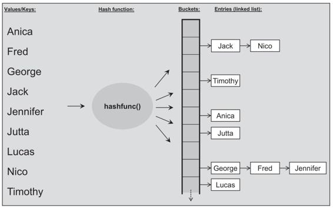
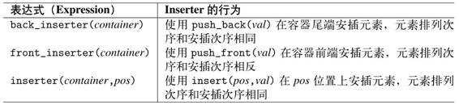
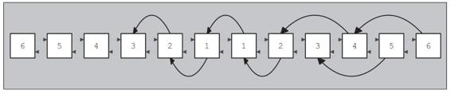

# 语言新特性

## nullptr
nullptr 取代 NULL，因为编译器无法区分 NULL 和 0
```cc
void f(int)
void f(void *)

f(0)
f(NULL)
```

## auto

## 一致性初始化
在C++11之前，程序员，特别是初学者，很容易被这个问题混淆：如何初始化一个变量或对象。初始化可因为小括号、大括号或赋值操作符（assignment operator）的出现而发生。

为此C++11引入了“一致性初始化”（uniform initialization）概念，意思是面对任何初始化动作，你可以使用相同语法，也就是使用大括号。以下皆成立：

```cc
int values[] {1, 2, 3};
vector<string> s {
    "aa", "bb", "cc"
};

int i;   // 未初始化
int j{}; // 初始化为0
int *p;  // 未初始化
int *q{}; // 初始化为nullptr
```

为了支持“用户自定义类型之初值列”（initializer lists for user-defined types）概念，C++11 提供了 `class template std：：initializer_list＜＞`，

用来支持以一系列值（a list of values）进行初始化，或在“你想要处理一系列值（a list of values）”的任何地点进行初始化。例如：

```cc
#include <initializer_list>
#include <iostream>

using namespace std;

void print(initializer_list<int> value)
{
    for (auto i = value.begin(); i != value.end(); ++i)
        cout << *i << endl;
}

int main (int argc, char *argv[]) {
    print({1, 2, 3, 4});
    return 0;
}
```

```cc
class P {
    public:
        P(int, int);
        P(std::initializer_list<int>);
};

int main (int argc, char *argv[]) {
    P p(1, 2);     // P(int, int)
    P q{1 ,2};     // P(std::initializer_list)
    P r{1, 2, 3};  // P(std::initializer_list)
    P s = {1, 2};  // P(std::initializer_list)
    return 0;
}
```


## explicit

explicit 修饰的函数，只能进行显示调用，不能隐式调用，

explicit 只能在类定义中修饰函数

C++中的explicit关键字只能用于修饰只有一个参数的类构造函数, 它的作用是表明该构造函数是显示的, 而非隐式的, 
```
struct A
{
    A(int) { }      // converting constructor
    A(int, int) { } // converting constructor (C++11)
    operator bool() const { return true; }
};
 
struct B
{
    explicit B(int) { }
    explicit B(int, int) { }
    explicit operator bool() const { return true; }
};
 
int main()
{
    A a1 = 1;      // OK: copy-initialization selects A::A(int)
    A a2(2);       // OK: direct-initialization selects A::A(int)
    A a3 {4, 5};   // OK: direct-list-initialization selects A::A(int, int)
    A a4 = {4, 5}; // OK: copy-list-initialization selects A::A(int, int)
    A a5 = (A)1;   // OK: explicit cast performs static_cast
    if (a1) { }    // OK: A::operator bool()
    bool na1 = a1; // OK: copy-initialization selects A::operator bool()
    bool na2 = static_cast<bool>(a1); // OK: static_cast performs direct-initialization
 
//  B b1 = 1;      // error: copy-initialization does not consider B::B(int)
    B b2(2);       // OK: direct-initialization selects B::B(int)
    B b3 {4, 5};   // OK: direct-list-initialization selects B::B(int, int)
//  B b4 = {4, 5}; // error: copy-list-initialization does not consider B::B(int, int)
    B b5 = (B)1;   // OK: explicit cast performs static_cast
    if (b2) { }    // OK: B::operator bool()
//  bool nb1 = b2; // error: copy-initialization does not consider B::operator bool()
    bool nb2 = static_cast<bool>(b2); // OK: static_cast performs direct-initialization
 
    [](...){}(a4, a5, na1, na2, b5, nb2); // may suppress "unused variable" warnings
}
```

```cc
class P {
    public:
        P(int, int);
        explicit P(std::initializer_list<int>);
};

int main (int argc, char *argv[]) {
    P p(1, 2);     // P(int, int)
    P q{1 ,2};     // P(std::initializer_list)
    P r{1, 2, 3};  // P(std::initializer_list)
    // P s = {1, 2};  // Error 不能进行隐式转换
    return 0;
}
```
## Range-Based for
语法如下：
```cc
for ( decl : coll ) {
    statement
}
```

一般而言，如果coll提供成员函数begin（）和end（），那么一个range-based for 等同于
```cc
{
    for ( auto _pos = coll.begin(), _end = coll.end(); _pos != _end; ++_pos) {
        decl = *_pos;
        statement
    }
}
```
或者如果不满足上述条件，那么也等同于以下使用一个全局性begin（）和end（）且两者都接受coll为实参：
```cc
{
    for ( auto _pos = begin(coll), _end = end(coll); _pos != _end; ++_pos) {
        decl = *_pos;
        statement
    }
}
```

```cc
    for (int i  : {1, 2 }) {
        cout << i << endl;
    }
    
    vector<int> v;
    for (auto &i  : v ) { // 必须使用引用，否则for会作用在local copy上
        i += 3;
    }
```

### 注意
当元素在for循环中被初始化为decl，不得有任何显式类型转换（explicit type conversion）。因此下面的代码无法通过编译：

```cc
class C {
    public:
        explicit C(string &s);
};

vector<string> vs;
for (C &elem : vs) { // 无法进行 C &elem = *vs.iterator(); 的隐式类型转换
    cout << elem << endl;
}
```
## Move语义和 右值引用
C++11的一个最重要的特性就是，支持move semantic（搬迁语义）。这项特性更进一步进入了C++主要设计目标内，用以避免非必要拷贝（copy）和临时对象（temporary）。

当没有使用右值引用和move时，下面代码有两个问题：
```cc
X x;
coll.insert(x);
coll.insert(x + x); // 1. insert 内部对匿名变量进行拷贝构造，若是深拷贝，深层内存对象其实可以直接给新对象
coll.insert(x);     // 2. 之后x不再使用。x相当于匿名对象
```

进行优化
```cc
X x;
coll.insert(x);             // 左值拷贝
coll.insert(x + x);         // 匿名对象，右值拷贝
coll.insert(std::move(x));  // 右值拷贝
```


move 本身不进行搬运，而是进行类型转换，返回 `T &&` 的类型

当左值拷贝和右值拷贝能分区后，就可以定义不同处理逻辑的方法
```cc
class set {
    public:
        insert(const T &x); // 处理左值
        insert(T && x);     // 处理右值
};
```

在 `insert(T &&x)` 中，可以直接搬运 x的深层对象，不需要进行深拷贝。

## noexcept
指明某个函数无法——或不打算——抛出异常
```cc
void foo() noexcept;
```
声明了foo（）不打算抛出异常。若有异常未在foo（）内被处理——亦即如果foo（）抛出异常——程序会被终止，然后std：：terminate（）被调用并默认调用std：：abort（）

## constexpr
constexpr可用来让表达式核定于编译期。例如:
```cc
constexpr int square(int x)
{
    return x * x;
}
int a[square(3)];
```

## 变参模板

```cc
// 递归的终止函数
void print()
{
}

template <typename T, typename... Types>
void print(const T& firstArg, const Types&... args)
{
    std::cout << firstArg << endl;
    print(args...); // 递归打印剩余参数
}

int main (int argc, char *argv[]) {

    print(1, "hello", 3.0);

    return 0;
}
```

```cc
template <class... T>
void f(T... args)
{    
    cout << sizeof...(args) << endl; //打印变参的个数
}

f();        //0
f(1, 2);    //2
f(1, 2.5, "");    //3
```

## 模板别名

自 C++11 起，支持 template （partial） type definition。然而由于关键字 typename 用于此处时总是出于某种原因而失败，所以这里引入关键字 using，并因此引入一个新术语alias template。举个例子，写出以下代码

```cc
template <typename T>
using Vec = std::vector<T, MyAlloc<T>>;

Vec<int> coll;
// 相当于
Vec<int, MyAlloc<int>> coll;
```

## Lambda
C++11引入了lambda，允许inline函数的定义式被用作一个参数，或是一个local对象。

所谓lambda是一份功能定义式，可被定义于语句（statement）或表达式（expression）内部。因此你可以拿lambda当作inline函数使用。

lambda 语法
```
[捕获外部变量](形参列表) -> 返回值 {操作代码}

如果返回值不需要，->返回值可以省略
[捕获外部变量](形参列表) {操作代码}

捕获外部变量
[] : 不捕获任何变量
[=] : 已传值的方式捕获外部所有变量
[&] : 以传引用的方式捕获外部所有变量
[this] : 捕获外部this指针
[=, &a] : a使用引用方式捕获，其他变量使用传值方式捕获
[a, b] : a,b值传递捕获
```

### lambda 做了什么

lambda 本质上是定义一个类，这个类定义了 `operator()`

比如下面的lambda 
```
    auto f = [a, b](int c, int d) {
        return a + b + c + d;
    } ;
```
转换为类就是

```
class lambda_c {
    public:
        lambda_c(int a, int b): ma(a), mb(b) {}

        auto operator()(int c, int d) const {
            return ma + mb + c + d;
        }

    private:
        int ma;
        int mb;
};
```

注意 `operator()` 的 this 是 const，这会导致代码无法修改 a, b

```
    auto f = [a, b](int c, int d) {
        a = 1; // 错误
        b = 2; // 错误
        return a;
    } ;
```

原因是

```
class lambda_c {
    public:
        lambda_c(int a, int b): ma(a), mb(b) {}

        auto operator()(int c, int d) const {
            a = 1;    // 错误
            b = 2;    // 错误
            return a;
        }

    private:
        int ma;
        int mb;
};
```

这样修改

```
class lambda_c {
    public:
        lambda_c(int a, int b): ma(a), mb(b) {}

        auto operator()(int c, int d) const {
            a = 1;    // 错误
            b = 2;    // 错误
            return a;
        }

    private:
        mutable int ma;
        mutable int mb;
};
```

```
    auto f = [a, b](int c, int d) mutable {
        a = 1; // 错误
        b = 2; // 错误
        return a;
    } ;
```

## decltype 
 decltype 可让编译器找出表达式（expression）类型。这其实就是常被要求的typeof的特性体现。只不过原有的typeof缺乏一致性又不完全，C++11才引入这么一个关键字。举个例子：
 
```cc
map<string, float> coll;
decltype(coll)::value_type p;
```

decltype的应用之一是声明返回类型（见下），另一个用途是在metaprogramming（超编程，见5.4.1节第125页）或用来传递一个lambda类型（见10.3.4节第504页）。

###  新的函数声明语法
有时候，函数的返回类型取决于某个表达式对实参的处理。然而类似

```cc
// 这是错误语法，只是用于说明
template <typename T1, typename T2>
decltype(x+y) add(T1 x, T2 y);
```

在C++11之前是不可能的，因为返回式所使用的对象尚未被引入，或未在作用域内。

但是在C++11，你可以将一个函数的返回类型转而声明于参数列之后：

```cc
template <typename T1, typename T2>
auto add(T1 x, T2 y) -> decltype(x + y);
```

## 带域的枚举
C++11允许我们定义scoped enumeration——又称为 strong enumeration或enumeration class——这是C++enumeration value（或称enumerator）的一个较干净的实现。例如：

enum class Salutation : char {mr, ma, co, none};

重点在于，在enum之后指明关键字class。

Scoped enumeration有以下优点：

· 绝不会隐式转换至/自int。

· 如果数值（例如mr）不在enumeration被声明的作用域内，你必须改写为Salutation：：mr。

· 你可以明显定义低层类型（underlying type，本例是char）并因此获得一个保证大小（如果你略去这里的“：char”，默认类型是int）。

· 提前声明（forward declaration） enumeration type是可能的，那会消除“为了新的enu-merations value而重新编译”的必要——如果只有类型被使用的话。

注意，有了type trait std：：underlying_type，你可以核定（evaluate）一个enumeration type的低层类型（详见5.4.2节第131页）。

标准异常的差错状态值（error condition value）也是个scoped enumerator（见4.3.2节第45页）。

# 通用工具
## Pair Tuple
Pair 用于处理类型不同的两个值，常用于实现返回一个 value pair, 若容器元素是 key/value pair.

Tuple 是pair的延伸，可以接受任意个数的元素。

### Pair
Class pair 可将两个 value 视为一个单元。C++标准库内多处用到了这个 class。

尤其容器 map、multimap、unordered_map和 unordered_multimap就是使用 pair来管理其以key/value pair形式存在的元素（详见7.8节第331页）。

任何函数如果需返回两个value，也需要用到pair，例如minmax（）（见5.5.1节第134页）。

Struct pair定义于＜utility＞，提供表5.1所列的各项操作。原则上你可以对pair＜＞执行create、copy/assign/swap及compare操作。

此外它还提供 first_type和 second_type类型定义式，用来表示第一value和第二value

为了让外部访问，Pair是struct，所以成员都是public



#### make_pair

Template函数make_pair（）使你无须写出类型就能生成一个pair对象。举个例子，你不必这样写：

```cc
pair<int, char>(42, '@');
```

可以写成这样
```cc
make_pair(42, '@');
```

make_pair的声明如下，

其中返回值的细节和它们的类型V1和V2，取决于x和y的类型。

C++stan-dard明确指出，如果可能的话`make_pair（）`使用move语义，否则就使用copy语义。

此外它会蛀蚀（decay）实参，致使`make_pair（＂a＂，＂xy＂）`产出一个`pair＜const char*，const char*＞`而非一个`pair＜const char[2]，const char[3]＞`

```cc
template<typename _T1, typename _T2>
pair<V1, V2> make_pair(_T1&& __x, _T2&& __y)
```


面对C++11新语义，你可以借由强迫使用move semantic或reference semantic来影响`make_pair（）`的产出类型。

如果你的选择是move semantic，只需使用`std：：move（）`声明被传递的实参不再使用

```cc
string s, t;
auto p = make_pair(move(s), move(t));
... // s, t 不再使用
```


如果你的选择是 reference semantic，就必须使用 ref（），那会强迫形成一个 reference 类型，或使用 cref（）强迫形成一个constant reference类型

```cc
int i = 0;
auto p = make_pair(ref(i), ref(i));
++p.first;
++p.second;
cout << "i : " << i << endl;    // 2
```

自C++11起，你也可以使用定义于＜tuple＞内的tie（）接口，抽取出pair的value：

```cc
pair<char, char> p = make_pair('x', 'y');

char c;
tie(std::ignore, c) = p; // p->first 被忽略， p->second 被赋值给c
```

#### pair之间的比较
C++标准库提供了大家惯用的操作符。两个pair对象内的所有元素都相等，这两个pair对象才被视为相等（equal）

两个pair互相比较时，第一元素具有较高的优先级。所以如果两个pair的第一元素不相等，其比较结果就成为整个比较的结果。

如果first相等，才继续比较second，并把比较结果当作整体结果：


### Tuple
它扩展了pair的概念，拥有任意数量的元素。

#### Tuple的操作
原则上，tuple接口十分直观：
- 通过明白的声明，或使用便捷函数`make_tuple（）`，你可以创建一个tuple。
- 通过`get＜＞（） `function template，你可以访问tuple的元素。

```cc
auto t = make_tuple(1, 2.0, 'c');
cout << get<0>(t) << endl;
cout << get<1>(t) << endl;
cout << get<2>(t) << endl;
```


借由特别的函数对象 `reference_wrapper＜＞` 及便捷函数 `ref（）` 和 `cref（）` ，

你可以影响`make_tuple（）`产生的类型，例如以下表达式产出的tuple带有一个reference指向变量或对象s：

```cc
string s;
auto p = make_tuple(ref(s));
get<0>(p) = "my value"; // 修改 s
```

如果想最方便地在tuple中使用reference，可选择`tie（）`，它可以建立一个内含reference的tuple：

```cc
tuple<int, float, string> p(1, '2', "str");

int i;
float f;
string s;
tie(i, f, s) = p;
```

这里的`std：：tie（i，f，s）`会以i、f和s的reference建立起一个tuple，因此上述赋值操作其实就是将t内的元素分别赋值为Ti、f和s。

使用`tie（）`时，`std：：ignore`允许我们忽略tuple的某些元素，也就是我们可以用它来局部提取tuple的元素值：

```cc
tie(i, std::ignore, s) = p;
```

#### Tuple 和初始序列
Tuple的构造被声明为 explicit，所以必须进行显示转换

```cc
void foo(tuple<Args...> t);

foo(42); // 错误不能隐式转换
foo(make_tuple(42)); // OK

tuple<int, double> t1(1, 2); // OK 老语法
tuple<int, double> t1{1, 2}; // OK 新语法
tuple<int, double> t3 = { 1, 2}; // ERROR
```

#### 其他特性
有些辅助函数是特别为tuple而设计的，特别是为了支持泛型编程：
- `tuple_size＜tupletype＞`：value可获得元素个数。
- `tuple_element＜idx，tupletype＞`：type可取得第idx个元素的类型（也就是get（）返回值的类型）。
- `tuple_cat（）`可将多个tuple串接成一个tuple。

下面的例子示范了如何使用`tuple_size＜＞`和`tuple_element＜＞`

```cc
typename tuple<int, string> tuple_type;
tuple_size<tuple_type>::value; // 2
tuple_element<1, tuple_type>::type; // string
```

可以使用`tuple_cat（）`串接所有形式的tuple，甚至包括`pair＜＞`

```cc
int n;
auto tt = tuple_cat(make_tuple(1, "hello"), 
                    tie(n));
```

### pair 和 tuple的转换 
你可以拿一个pair作为初值，初始化一个双元素tuple，也可以将一个pair赋值给一个双元素tuple

## 智能指针
自C++11起，C++标准库提供两大类型的smart pointer：

1.Class shared_ptr实现共享式拥有（shared ownership）概念。

多个smart pointer可以指向相同对象，该对象和其相关资源会在“最后一个 reference 被销毁”时被释放。

为了在结构较复杂的情境中执行上述工作，标准库提供了 weak_ptr、bad_weak_ptr和enable_shared_from_this等辅助类。

2.Class unique_ptr实现独占式拥有（exclusive ownership）或严格拥有（strict ownership）概念，

保证同一时间内只有一个smart pointer可以指向该对象。

你可以移交拥有权。它对于避免资源泄漏（resource leak）——例如“以new创建对象后因为发生异常而忘记调用delete”——特别有用。

C++98只让C++标准库提供一个smart pointer class：`auto_ptr＜＞`，其设计是为了执行现今的unique_ptr所提供的服务。

然而由于当时缺乏语言特性如“针对构造和赋值”的move语义，以及其他瑕疵，这个class不易被理解且容易出错。

因此在TR1引入class shared_ptr，C++11引入class unique_ptr之后，class auto_ptr成为C++11中被正式反对（deprecated）的成分，

意味着你不该再使用它，除非你手上还有一些老旧代码需要编译。

所有smart pointer class都被定义于头文件＜memory＞内。

### class shared_ptr
多个shared_ptr可以共享（或说拥有）同一对象。对象的最末一个拥有者有责任销毁对象，并清理与该对象相关的所有资源。

#### 使用 shared_ptr
你可以像使用任何其他pointer一样地使用shared_ptr。你可以赋值、拷贝、比较它们，也可以使用操作符`*`和`->`访问其所指向的对象。看看下面这个例子：

```cc
#include <iostream>
#include <string>
#include <memory>
#include <vector>

using namespace std;

int main (int argc, char *argv[]) {
    shared_ptr<string> pnico(new string("nico"));
    shared_ptr<string> pjutta(new string("jutta"));

    (*pjutta)[0] = 'N';
    pjutta->replace(0, 1, "J");

    vector<shared_ptr<string>> who_make_coffee;
    who_make_coffee.push_back(pjutta);
    who_make_coffee.push_back(pjutta);
    who_make_coffee.push_back(pnico);
    who_make_coffee.push_back(pjutta);
    who_make_coffee.push_back(pnico);

    for (auto &p : who_make_coffee) {
        cout << *p << " ";
    }
    cout << endl;

    *pnico = "Nicolai";
 
    for (auto &p : who_make_coffee) {
        cout << *p << " ";
    }
    cout << endl;

    cout << "use_count : " << who_make_coffee[0].use_count() << endl;

    return 0;
}
```
在给智能指针赋值时，必须使用智能指针，并且不支持隐式类型转换


```cc
    //shared_ptr<string> pname = "nico";  // 错误不能使用普通指针
    shared_ptr<string> pname  = make_shared<string>("nico"); // 调用 string::allocator 分配一个对象，并让 shared_ptr 指向他
    shared_ptr<string> pname2{new string("nico")};           // 新语法的构造初始化
    shared_ptr<string> pname3(new string("nico"));           // 老语法的构造初始化

    shared_ptr<string> pname4;
    //pname4 = new string("nico");    // 错误不能使用普通指针赋值
    pname4.reset(new string("nico")); // 必须用shared_ptr.reset
```


普通指针和shared_ptr使用上的区分


```cc
    // 原生new和malloc的需要将右值取地址
    {
        int *n1 = new int; // int 取地址 -> int *
        int **n2 = new int*; // int * 取地址 -> int **
        int **n3 = new int *[10]; // int *[10] 取地址 -> int **

        int *p1 = (int *)malloc(sizeof(int));
        int **p2 = (int **)malloc(sizeof(int*));
        int **p3 = (int **)malloc(sizeof(int *[10]));
    }


    // 但 智能指针左右的类型相互对应

    {
        shared_ptr<int> n1(new int);
        shared_ptr<int *> n2(new int *);
        shared_ptr<int **> n3(new int **);

        // 指针的 shared_ptr 只能通过 operator * 访问
        *n1 = 0;
        // n1[0] = 0; 错误

        // 并且区分 指针和数组
        shared_ptr<int []> a1(new int[10]);
        shared_ptr<int [][20]> a2(new int[10][20]);
        shared_ptr<int *[20]> a3(new int *[20]);

        // 并且数组的 shared_ptr 智能通过 [] 访问
        a1[0] = 0;
        a1[1] = 0;
        // *a1 = 0; // 错误
    }
```
shared_ptr 不能进行 ++, -- 操作，要使用完全指针语义，需要先转换为普通指针

```cc
    shared_ptr<int []> parr(new int [10]);
    for (int i = 0; i < 10; ++i) {
        parr.get()[i] = i;
    }
```

#### 自定义 deleter
我们可以声明属于自己的deleter，例如让它在“删除被指向对象”之前先打印一条信息

```cc
    shared_ptr<string> p(new string("nico"),
            [](string *p) {
                cout << "delete " << *p << endl;
                delete p;
            }
            );
    p = nullptr; // p指向的对象没有 shared_ptr 引用，析构该对象 
```

#### 对付 array
shared_ptr提供的default deleter调用的是delete，不是`delete[]`

这意味着只有当shared pointer拥有“由new建立起来的单一对象”，default deleter方能适才适所。

很不幸，为array建立一个shared_ptr是可能的，却是错误的

```cc
shared_ptr<int> p(new int[10]);
```

你需要自定义deleter

```cc
shared_ptr<int> p(new int[10],[](int *p) { delete []p;});
```

也可以使用为 unique_ptr而提供的辅助函数（见5.2.5节第106页）作为 deleter，其内调用`delete[]`：

```cc
shared_ptr<int> p(new int[10], std::default_delete<int []>());
```

#### 其他析构策略
最末一个拥有者——亦即shared pointer——结束生命时，如果清理工作不仅仅是删除内存，你必须明确给出自己的deleter。你可以指定属于自己的析构策略。

第一个例子：假设我们想确保“指向某临时文件”之最末一个reference被销毁时，该文件即被移除。可以这么做：

```cc
#include <cstdlib>
#include <unistd.h>
#include <fstream>
#include <string>
#include <memory>
#include <cstdio>

using namespace std;

// 定义函数对象，用于存储文件名称
class FileDeleter {
    private:
        string filename;
    public:
        FileDeleter(const string &fn)
            :filename(fn) {

            }
        void operator() (std::ofstream *fp) {
            fp->close();
            remove(filename.c_str());
            delete fp;
        }
};

int main (int argc, char *argv[]) {

    {
        system("touch ./tmp.txt");
        shared_ptr<ofstream> fp(new ofstream("./tmp.txt"),
                // 将函数对象作为deleter
                FileDeleter("./tmp.txt")); 
    }

    return 0;
}
```

下面展示如何使用  shared_ptr 利用共享内存

```cc
#include <cstdlib>
#include <fcntl.h>
#include <cstring>
#include <unistd.h>
#include <sys/mman.h>
#include <cerrno>
#include <memory>
#include <cstdio>
#include <iostream>

using namespace std;

class SharedMemoryDetacher {
    public:
        void operator() (int *p) {
            cout << "unlink /tmp1234" << endl;
            // 释放虚拟内存
            munmap(p, m_sz);
            // 删除shm节点
            if (shm_unlink("/tmp1234") < 0) {
                cerr << "OOPS : shm_unlink failed" << endl;
            }
        }
        SharedMemoryDetacher(int sz) : m_sz(sz) {}
    private:
        int m_sz;
};

shared_ptr<int> getSharedMemory(int num) {

    void *mem;

    // 在 shm 文件系统中创建 节点
    int shmfd = shm_open("/tmp1234", O_CREAT | O_RDWR, 0644);
    if (shmfd < 0) {
        throw  string(strerror(errno));
    }

    // 预分配空间
    if ((ftruncate(shmfd, num * sizeof(int))) < 0) {
        throw  string(strerror(errno));
    }

    // 将 shm节点 page cache 映射到本进程的虚拟内存
    mem = mmap(nullptr, num * sizeof(int), PROT_READ | PROT_WRITE, MAP_SHARED, shmfd, 0);
    if (mem == MAP_FAILED) {
        cerr << "mmap : " << strerror(errno) << endl;
        return nullptr;
    }

    // 将普通指针 mem 转换为 shared_ptr 指针 ，并设置 deleter
    // 通过匿名对象的方式返回，
    return shared_ptr<int>(static_cast<int *>(mem), SharedMemoryDetacher(num));

    // 使用 lambda 的写法
    return shared_ptr<int>((int *)mem, 
            [num](int *p) {
                 munmap(p , num * sizeof(int));
                 shm_unlink("/tmp1234");
            });
}

int main (int argc, char *argv[]) {

    shared_ptr<int> smp(getSharedMemory(100));

    // 设置共享内存的内存
    // shared_ptr 不支持 operator++, 所以用 get() 获得普通指针，进行操作
    for (int i = 0; i < 100; ++i) {
        smp.get()[i] = i;
    }

    // 此处 smp 的 ref_count 设置为0，调用 SharedMemoryDetacher
    smp.reset();
    
    return 0;
}
```

### class weak_ptr

使用shared_ptr主要是为了避免操心pointer指向的资源。先前已说过，shared_ptr会自动释放“不再被需要的对象”的相应资源。

然而，某些情势下，这样的行为无法运作或不被期望：

- 例子之一是所谓的cyclic reference（环式指向）。如果两对象使用shared_ptr互相指向对方，而一旦不存在其他reference指向它们时，你想释放它们和其相应资源。这种情况下shared_ptr不会释放数据，因为每个对象的use_count（）仍是1。此时你或许会想使用寻常的pointer，但这么做却又得自行照顾和管理“相应资源的释放”。
- 另一个例子发生在你“明确想共享但不愿拥有”某对象的情况下。你要的语义是：reference 的寿命比其所指对象的寿命更长。因此 shared_ptr 绝不释放对象，而寻常pointer可能不会注意到它们指向的对象已经不再有效，导致“访问已被释放的数据”的风险。

于是标准库提供了class weak_ptr，允许你“共享但不拥有”某对象。这个class会建立起一个shared pointer。一旦最末一个拥有该对象的shared pointer失去了拥有权，任何weak pointer都会自动成空（empty）。因此，在default和copy构造函数之外，class weak_ptr只提供“接受一个shared_ptr”的构造函数。

你不能够使用操作符`*`和`->`访问weak_ptr指向的对象。而是必须另外建立一个shared pointer。

基于以上所述，class weak_ptr只提供小量操作，只够用来创建、复制、赋值weak pointer，以及转换为一个shared pointer，或检查自己是否指向某对象。

考虑下面示例

```cc
#include <string>
#include <memory>
#include <iostream>
#include <vector>

using namespace std;

class Person {
    public:
        string name;
        shared_ptr<Person> mother;
        shared_ptr<Person> father;
        vector<shared_ptr<Person>> kids;

        Person(const string &n,
                shared_ptr<Person> m = nullptr,
                shared_ptr<Person> f = nullptr) 
            : name(n), father(f), mother(m) {}

        ~Person() {
            cout << "delete" << name << endl;
        }
};

shared_ptr<Person> initFamily(const string &name) {
    shared_ptr<Person> mom(new Person(name + "'s mon"));
    shared_ptr<Person> dad(new Person(name + "'s dad"));
    shared_ptr<Person> kid(new Person(name, mom, dad));
    mom->kids.push_back(kid);
    dad->kids.push_back(kid);
    return kid;
}

int main (int argc, char *argv[]) {
    shared_ptr<Person> p = initFamily("Bill");
    p = initFamily("John");
    return 0;
}
```

由于循环引用导致内存泄漏



使用 weak_ptr 解决

```cc
class Person {
    public:
        string name;
        shared_ptr<Person> mother;
        shared_ptr<Person> father;

        //vector<shared_ptr<Person>> kids;
        vector<weak_ptr<Person>> kids;

        ...
};
```


#### 通过weak_ptr 访问对象
使用 weak_ptr 不能直接访问对象，如

```cc
p->mother->kids[0]->name
```

必须先使用 lock

```cc
p->mother->kids[0].lock()->name
```

这会导致新产生一个“得自于 kids容器内含之 weak_ptr”的 shared_ptr。

如果obj已经被释放，lock（）会产出一个empty shared_ptr。这种情况下调用`*`或`->`操作符会引发不明确行为。

如果不确定隐身于weak pointer背后的对象是否仍旧存活，你有以下数个选择：

1.调用`expired（）`，它会在weak_ptr不再共享对象时返回true。这等同于检查use_count（）是否为 0，但速度较快。

2.可以使用相应的shared_ptr构造函数明确将weak_ptr转换为一个shared_ptr。如果被指对象已经不存在，该构造函数会抛出一个 bad_weak_ptr 异常，那是一个派生自`std：：exception`的异常，其`what（）`会产出＂bad_weak_ptr＂。

3.调用 `use_count（）`，询问相应对象的拥有者数量。如果返回 0 表示不存在任何有效对象。然而请注意，通常只应为了调试而调用 `use_count（）`；C++标准库明确告诉我们：“`use_count（）`并不总是很有效率。”

### 误用 shared_ptr
常见的误用是 ： 

由于循环依赖（cyclic dependency）造成的“dangling pointer”（空荡指针）。

另一个可能出现的问题是，你必须确保某对象只被一组（one group of） shared pointer拥有。下面的代码是错的：

```cc
int * p = new int;
shared_ptr<int> sp1(p);
shared_ptr<int> sp2(p); // 错误，两个shared_ptr管理结构被创建
```

问题出在sp1和sp2都会在丢失p的拥有权时释放相应资源（亦即调用delete）。

因此，你应该总是在创建对象和其相应资源的那一刻直接设立smart pointer：

```cc
int *p = new int;
shared_ptr<int> sp1(p);     // 指针有效后立即绑定 shared_ptr, 会分配一个 shared_ptr manager
shared_ptr<int> sp2(sp1);   // 当需要多处引用时，让多个 shared_ptr 使用一个 shared_ptr manager
```

这个问题也可能间接发生。在先前介绍过的例子中，假设我们打算为Person引入一个成员函数，用来建立“从kid指向parent”的reference及其反向reference：

```cc
void Person::setParentAndTheirKids(shared_ptr<Person> m = nullptr,
        shared_ptr<Person> f = nullptr) {
    mother = m;
    father = f;

    // 错误：this指针 被两个 shared_ptr manager 引用
    if (m != nullptr) {
       m->kids.push_back(shared_ptr<Person>(this)); 
    }
    if (f != nullptr) {
       f->kids.push_back(shared_ptr<Person>(this)); 
    }
}

shared_ptr<Person> mom(new Person(name + "'s mon"));
shared_ptr<Person> dad(new Person(name + "'s dad"));
shared_ptr<Person> kid(new Person(name, mom, dad));
kid->setParentAndTheirKids(mom, dad);
```

正确的写法

```cc
class Person : public enable_shared_from_this<Person> {
    public:
        string name;
        shared_ptr<Person> mother;
        shared_ptr<Person> father;

        ...

        void setParentAndTheirKids(shared_ptr<Person> m = nullptr,
                shared_ptr<Person> f = nullptr) {
            mother = m;
            father = f;

            if (m != nullptr) {
                m->kids.push_back(shared_from_this());
            }
            if (f != nullptr) {
                f->kids.push_back(shared_from_this());
            }
        }

        ...
};
```


注意 要使用 `shared_from_this()` 必须继承 `enable_shared_from_this<> `

并且 `shared_from_this()` 不能在构造函数中使用

### 详细研究 shared_ptr weak_ptr
#### 细究 shared_ptr

Class shared_ptr＜＞被模板化，模板参数是“原始pointer所指对象”的类型：

```cc
  template<typename _Tp>
    class shared_ptr : public __shared_ptr<_Tp>
    {
      using element_type = typename __shared_ptr<_Tp>::element_type;
          using element_type = typename remove_extent<_Tp>::type;
                { typedef _Tp     type; };

      element_type*	   _M_ptr;         // Contained pointer.
      __shared_count<_Lp>  _M_refcount;    // Reference counter.
```


元素类型可以是void，意味着shared pointer共享的对象有着一个未具体说明的类型，例如`void*`。

一个empty shared_ptr并不能分享对象拥有权，所以`use_count（）`返回0。然而请注意，由于设计了一个特殊构造函数，使得empty shared pointer还是可以指向对象。

如果shared pointer取得一个新值（不论是由于被赋予新值或由于调用reset（）），相同事情发生：如果shared pointer先前拥有某对象，而且它是最末一个拥有者，相应的deleter（或delete）会为此对象而被调用。

Shared pointer可能使用不同的对象类型，前提是存在一个隐式的pointer转换。基于此，构造函数、赋值操作符和reset（）都是member template，比较操作符则针对不同类型模板化。

每一个比较操作符所比较的都是shared pointer内部那个raw pointer（也就是说，它们对get（）的返回值调用同一操作符）。它们全都有“接受nullptr为实参”的重载版本。因此你可以检查是否带有一个合法pointer，甚至检查是否raw pointer小于或大于nullptr。

构造函数收到的实参如果是个 weak_ptr而且是empty（亦即 expired（）产出 true），会抛出bad_weak_ptr异常





get_deleter（）会取得一个pointer to deleter（如果有定义deleter的话），要不就取得nullptr。

只要shared pointer还拥有那个deleter，该pointer就有效。然而为了取得deleter，你必须以其类型作为template实参

```cc
    auto del = [](int *p) {
        delete p;
    };
    shared_ptr<int> pint(new int);
    decltype(del) *pd = get_deleter<decltype(del)>(p);
```


#### 更复杂的 shared_ptr 使用示例

两个 shared_ptr 共享一个对象的所有权，但指向不同地址

```cc
    struct X {
        int a;
    };
    shared_ptr<X> px(new X);
    // pi 拷贝 px 的对象所有权，但 pi 指向 px->a
    shared_ptr<int> pi(px, &px->a);
```


`make_shared（）`和`allocate_shared（）`都用来优化“被共享对象及其相应之控制区块（如用以维护使用次数）”的创建。注意

下面方法的效率低，因为调用了两次 new, 第一次用于创建 X , 第二次用于创建 shared_ptr 控制块

```cc
shared_ptr<X> (new X())
```

使用下面方法优化，会快很多, 且更安全，因为他只调用一次 new

```cc
make_shared<X>(..)
```

allocate_shared（）允许传入你自己的allocator作为第一实参。

shared_ptr 支持 cast(类型转换 ) , 但是必须使用他提供的接口

```cc
    shared_ptr<void> sp = make_shared<int>(0);
    // 必须重新定义一个 shared_ptr<int> 接受类型转换的结果
    // 不能重复使用sp ，因为 sp 在编译时已经确定了类型为 shared_ptr<void>
    shared_ptr<int> pi = static_pointer_cast<int>(sp);
    sp.reset();
    *pi = 10;
```


#### 研究 weak_ptr
weak_ptr是shared_ptr的帮手，用来共享对象但不拥有对象。它的use_count（）返回的是对象被shared_ptr拥有的次数，至于weak_ptr对它的共享次数是不计的。

而且weak_ptr可以为空（empty）——如果它不是以一个shared_ptr为初值或其对应对象的最末一个拥有者被删除就会发生这种情况。

Default 构造函数会创建出一个 empty weak pointer，那意味着 expired（） 的结果是true。

由于lock（）会产出一个shared pointer，因此在那个shared pointer寿命期间，该对象的使用次数会多1。这是处理weak pointer所共享的对象的唯一途径。



#### 线程安全
shared pointer并非线程安全。

当你在多个线程中以shared pointer指向同一对象，你必须使用诸如mutex或lock等技术。

不过当某个线程改变对象时，其他线程读取其使用次数并不会导致data race，虽然读到的值有可能不是最新的。

```cc
shared_ptr<int> global;

void foo() {
    // 线程函数中操作局部的 shared_ptr
    shared_ptr<int> local = make_shared<int>(0);
    // ...
    // 当完成操作后，将结果传递到全局
    std::atomic_store(&global, local);
}
```


[](./pic/9.jpg)


### unique_ptr
unique_ptr是C++标准库自C++11起开始提供的类型。它是一种在异常发生时可帮助避免资源泄漏的smart pointer。

一般而言，这个smart pointer实现了独占式拥有概念，意味着它可确保一个对象和其相应资源同一时间只被一个pointer拥有。

一旦拥有者被销毁或变成empty，或开始拥有另一个对象，先前拥有的那个对象就会被销毁，其任何相应资源亦会被释放。

#### unique_ptr的目的
函数往往以下列方式运作：[13]

1.获得某些资源

2.执行某些操作

3.将取得的资源释放掉

如下面的例子

```cc
void f() {
    ClassA *ptr = new ClassA; // 创建资源
    ...                       // 处理资源
    delete ptr;               // 释放资源
}
```

一个较不明显的危险是它可能抛出异常，那将立刻退离函数，末尾的释放资源语句也就没机会被调用，导致资源泄漏。

为了避免如此的资源泄漏，通常函数会捕捉所有异常，例如：

```cc
void f() {
    ClassA *ptr= new ClassA; // 创建资源

    try {                    // 安全的处理资源
        ...
    }
    catch (...) {            // 异常时释放资源
        delete ptr;
        throw;
    }

    delete ptr;              // 正常时释放资源
}
```


为了在异常发生时能够适当处理好对象的删除，代码变得比较复杂，而且累赘。如果第二个对象也以此方式处理，或需要一个以上的catch子句，情况会变得更糟。

这是一种不好的编程风格，应该避免，因为它复杂而又容易出错。

对此，smart pointer可以带来帮助。Smart pointer可以在它自身被销毁时释放其所指向的数据。

而且，由于它是个local变量，所以会在函数结束时被自动销毁——不论是正常结束或异常结束。Class unique_ptr就是这样的一个smart pointer。

unique_ptr是“其所指向之对象”的唯一拥有者。自然而然地，当unique_ptr被销毁，其所指向的对象也就自动被销毁。unique_ptr的必要条件就是，它指向的对象只有一个拥有者。

用unique_ptr改写先前的例子如下：

```cc
#include <memory>

void f() {
    std::unique_ptr<ClassA> ptr(new ClassA);
    ...
}
```

#### 使用 unique_ptr

unique_ptr有着与寻常pointer非常相似的接口，操作符`*`用来提领（dereference）指向对象，操作符`->`用来访问成员——如果被指向的对象来自class或struct

```cc
    unique_ptr<string> up(new string("Hello"));
    (*up)[0] = 'h';
    up.get()[2] = 'E';
    up->append("world");
    cout << *up << endl;
```

然而它不提供pointer算术如++等，这被视为优点，因为 pointer算术运算往往是麻烦的来源。

注意，`class unique_ptr＜＞`不允许你以赋值语法将一个寻常的pointer当作初值。因此你必须直接初始化unique_ptr，像下面这样：

```cc
        // unique_ptr<int> up = new int; // errr
        unique_ptr<int> up(new int);
```

你也可以对它赋予nullptr或调用reset（）：

```cc
        up = nullptr;
        up.reset();
```

此外，你可以调用release（），获得unique_ptr拥有的对象并放弃拥有权，于是调用者现在对该对象有了责任：

```cc
    string *sp = up.release();
    int *isp = iup.release();
```

你可以调用操作符bool（）用以检查是否unique pointer拥有（任何）对象：

```cc
    if (up)
        cout << *up << endl;
```

你也可以拿unique pointer和 nullptr比较，或查询 unique_ptr内的raw pointer——如果unique_ptr未拥有任何对象，就会获得一个nullptr：

```cc
    if (up != nullptr)
        cout << *up << endl;

    if (up.get() != nullptr)
        cout << *up << endl;
```

#### 转移 unique_ptr 拥有权
unique_ptr提供的语义是“独占式拥有”。然而其实责任在程序员，由他/她确保“没有任何两个unique pointer以同一个pointer作为初值”：

```cc
        string *sp = new string("Hello");
        unique_ptr<string> up1(sp);
        unique_ptr<string> up2(sp); // Error
```

要进行所有权转移，需使用 right copy

```cc
        string *sp = new string("Hello");
        unique_ptr<string> up1(sp);
        unique_ptr<string> up2;
        // up2 = up1; // error
        up2 = std::move(up1);
        cout << *up2 << endl;;
```

当所有权转移时，原有的obj会被delete

```cc
        string *sp = new string("Hello");
        unique_ptr<string> up(sp);
        up = unique_ptr<string>(new string("aaa")); // hello 会被delete
```

#### unique_ptr 和函数

利用所有权转移，可以实现函数参数或返回值传递 obj

```cc
unique_ptr<string> sink(unique_ptr<string> up)
{
    if (up)
        cout << *up << endl;
    // 返回时会创建临时对象 X
    // X = up;
    return up;
}

int main (int argc, char *argv[]) {

    unique_ptr<string> up(new string("hello"));
    // 临时对象是右值， up2 = X; 调用 operator=(unique_ptr<string>&&)
    unique_ptr<string> up2 = sink(std::move(up));

    return 0;
}
```

#### unique_ptr 做成员
在class内使用unique_ptr可避免资源泄漏。如果你使用unique_ptr取代寻常pointer，就不再需要析构函数，因为对象被删除会连带使所有成员被删除。

此外 unique_ptr也可协助避免“对象初始化期间因抛出异常而造成资源泄漏”。

注意，只有当一切构造动作都完成了，析构函数才有可能被调用。因此一旦构造期间发生异常，只有那些已完全构造好的对象，其析构函数才会被调用。

所以，对于“拥有多个raw pointer”的class，如果构造期间第一个new成功而第二个失败，就可能导致资源泄漏。例如：

```cc
class B {
    public:
        // 如果第二个new 失败，可能内存泄漏
        B(int v1, int v2)
        :m_p1(new A(v1)), m_p2(new A(v2)) {}

        // 如果第二个new 失败，可能内存泄漏
        B(const B &x)
        :m_p1(new A(*x.m_p1)), m_p2(new A(*x.m_p2)) {}

        ~B() {
            delete m_p1;
            delete m_p2;
        }

        B &operator=(const B &x) {
            *m_p1 = *x.m_p1;
            *m_p2 = *x.m_p2;
            return *this;
        }

    private:
        A *m_p1;
        A *m_p2;
};
```

使用unique_ptr，就可以避免上述可能的资源泄漏：

```cc
class B {
    public:
        // 不可能内存泄漏
        B(int v1, int v2)
        :m_p1(new A(v1)), m_p2(new A(v2)) {}

        // 不可能内存泄漏
        B(const B &x)
        :m_p1(new A(*x.m_p1)), m_p2(new A(*x.m_p2)) {}

        B &operator=(const B &x) {
            // 修改 unique_ptr 指向的 obj，而非unique_ptr 
            // 所以不需要 move
            *m_p1 = *x.m_p1;
            *m_p2 = *x.m_p2;
            return *this;
        }

        // 不需要析构

    private:
        unique_ptr<A> m_p1;
        unique_ptr<A> m_p2;
};
```


#### 处理 array

C++语言又规定，对于array应该使用delete[]而不是delete，所以下面的语句是错误的

```cc
        unique_ptr<string> up(new string[10]); // Error
        shared_ptr<string> up(new string[10]); // Error
```

对于shared_ptr 可以这样，或者自定义 deleter

但是太麻烦了，

很幸运地，C++标准库为class unique_ptr提供了一个偏特化版本用来处理array，这个版本会在遗失其所指对象的拥有权时，对该对象调用`delete[]`。你只需这么声明：

```cc
        shared_ptr<string[]> up(new string[10]);
        unique_ptr<string[]> up(new string[10]);
```

然而请注意，这个偏特化版本提供的接口稍有不同。它不再提供操作符*和-＞，改而提供操作符[]，用以访问其所指向的array中的某一个对象：

```cc
        // cout << *up << endl; // error
        cout << up[0] << endl;
```

#### Class default_delete＜＞

让我们把目光移近class unique_ptr的声明式。概念上，这个class被声明如下


```cc
  template <typename _Tp, typename _Dp = default_delete<_Tp>>
    class unique_ptr
    {
        ...
      typename add_lvalue_reference<element_type>::type
      operator*() const
      {
	__glibcxx_assert(get() != pointer());
	return *get();
      }

      /// Return the stored pointer.
      pointer
      operator->() const noexcept
      {
	_GLIBCXX_DEBUG_PEDASSERT(get() != pointer());
	return get();
      }
      ...
    };

  template<typename _Tp, typename _Dp>
    class unique_ptr<_Tp[], _Dp>
    {
        ...
      operator[](size_t __i) const
      {
	__glibcxx_assert(get() != pointer());
	return get()[__i];
      }
      ...
    };
```


可以看出，其中有个特殊版本负责处理array。该版本提供操作符[]而非*和-＞，用以处理array而非单一对象。但二者都使用class std：：default_delete＜＞作为 deleter，那又被特化使得面对array时调用delete[]而非delete：

```cc
  template<typename _Tp>
    struct default_delete<_Tp[]>
    {
          ..
      void
      operator()(_Tp* __ptr) const
      {
	static_assert(!is_void<_Tp>::value,
		      "can't delete pointer to incomplete type");
	static_assert(sizeof(_Tp)>0,
		      "can't delete pointer to incomplete type");
	delete __ptr;
      }
        ..
    };

  template<typename _Tp>
    struct default_delete<_Tp[]>
    {
        ..
      template<typename _Up>
	typename enable_if<is_convertible<_Up(*)[], _Tp(*)[]>::value>::type
	operator()(_Up* __ptr) const
	{
	  static_assert(sizeof(_Tp)>0,
			"can't delete pointer to incomplete type");
	  delete [] __ptr;
	}
        ..
    };
```

#### 其他相应资源的Deleter
当你所指向的对象要求的不只是调用delete或`delete[]`，你就必须具体指定自己的deleter。

然而此处deleter的定义方式略略不同于shared_ptr。你必须具体指明deleter的类型作为第二个template 实参。

该类型可以是个reference to function，或是个function pointer或function object。

如果是个function object，其function call操作符（）应该接受一个“指向对象”的pointer。

举个例子，以下代码在delete对象之前先打印一份额外信息：

```cc
class MyDeleter {
    public:
        void operator() (B * p) {
            cout << "call delete for B obj" << endl;
            delete p;
        }
};

unique_ptr<B, MyDeleter> up(new B(1, 2));
```

如果你给的是个函数或lambda，你必须声明deleter的类型为`void（*）（T*）`或`std：：function＜void（T*）＞`，要不就使用decltype。

例如，若要为一个array of int指定自己的deleter，并以lambda形式呈现，应该写：

```cc
    unique_ptr<int, void (*)(int *)> up(new int[10],
            [](int *p) {
            delete [] p;
            } );
```


或

```cc
    unique_ptr<int, function<void (int *)>> up(new int[10],
            [](int *p) {
            delete [] p;
            } );
```

或

```cc
    auto l = [] (int *p) {
        delete [] p;
    };

    unique_ptr<int, decltype(l)> up(new int[10], l);
```

为了避免“传递function pointer或lambda时必须指明deleter的类型”，你可以使用所谓的alias template，这是自C++11起提供的语言特性

```cc
template <typename T>
using uniquePtr = std::unique_ptr<T, void (*)(T*)>;

void main () {
    uniquePtr<int> up(new int[10], 
            [](int *p) {
            delete [] p;
            });
}
```

#### 细究 unique_ptr



## Type Trait和Type Utility
Type trait，由TR1引入而在C++11中大幅扩展的一项机制，定义出因type而异的行为。它们可被用来针对type优化代码，以便提供特别能力。

### Type Trait的目的
所谓type trait，提供一种用来处理type属性（property of a type）的办法。它是个template，可在编译期根据一或多个template实参（通常也是type）产出一个type或value。


### Reference Wrapper（外覆器）
对于一个给定类型T，这个class提供ref（）用以隐式转换为 T&，一个cref（）用以隐式转换为 const T&，

这往往允许function template得以操作reference而不需要另写特化版本。

template <typename T>
void foo(T val);

int x;
foo (std::ref(x));  // T变成 int &

int x
foo (std::cref(x)); // T变成 const int &

### Function Type Wrapper（外覆器）

使用 function<> 可以将普通函数和lambda 转换为函数对象。

void foo(int a, int b)
{
    cout << a << "-- " << b << endl;
}

int main (int argc, char *argv[]) {

    vector<function<void (int, int)>> tasks;

    tasks.push_back([](int a, int b) {cout << a << b << endl;});
    tasks.push_back(foo);

    for (function<void (int, int)> pos : tasks) {
        pos(1, 2);
    }
    
    return 0;
}

使用member function时，`function<>` 的第一个形参必须为类

class A {
    public:
        void fun(int a, int b) const {
            cout << "A : " << a << b << endl;
        }
};

int main (int argc, char *argv[]) {

    function<void (const A&, int, int)> f;
    f = &A::fun;
    f(A(), 1, 2 );
 
## 辅助函数
C++标准库提供若干小型辅助函数，用来挑选最小值、挑选最大值、交换两值或提供增补的比较操作符。

### min max

[](./pic/11.jpg)

其中 Compare 可以是 function 或 function object

### swap

  template<typename _Tp>
    inline void
    swap(_Tp& __a, _Tp& __b)
    {
      _Tp __tmp = _GLIBCXX_MOVE(__a);
      __a = _GLIBCXX_MOVE(__b);
      __b = _GLIBCXX_MOVE(__tmp);
    }

在其内部，数值被moved或被move assigned

swap（） 的最大优势在于，通过 template specialization （模板特化）或 function overloading （函数重载），我们可以为更复杂的类型提供特殊实现版本；

这些特殊实现有可能交换内部成员，而非对对象赋值，这无疑大大节省了时间。

class MyArray {
    private:
        int *elems;
        int numElems;
    public:
        void swap(MyArray &x) {
            // 利用std::swap进行快速实现复杂的swap
            std::swap(elems, x.elems);
            std::swap(numElems, x.numElems);
        }
};

// 重载全局的swap
inline void swap(MyArray &a1, MyArray &a2)
{
    a1.swap(a2);
}

### 增补的比较操作符 
有四个function template分别定义了！=、＞、＜=和＞=四个比较操作符。它们都是利用操作符==和＜完成。这四个函数定义于＜utility＞，通常被定义如下：

  namespace rel_ops
  {
    template <class _Tp>
      inline bool
      operator!=(const _Tp& __x, const _Tp& __y)
      { return !(__x == __y); }

    template <class _Tp>
      inline bool
      operator>(const _Tp& __x, const _Tp& __y)
      { return __y < __x; }

    template <class _Tp>
      inline bool
      operator<=(const _Tp& __x, const _Tp& __y)
      { return !(__y < __x); }

    template <class _Tp>
      inline bool
      operator>=(const _Tp& __x, const _Tp& __y)
      { return !(__x < __y); }
  }

只需定义好＜和==操作符就可以使用它们。只要写上`using namespace std：：rel_ops`，上述四个比较操作符就自动获得了定义。例如：

class MyArray {
    public:
        bool operator==(const MyArray &x) const;
        bool operator<(const MyArray &x) const;
};

void foo()
{
    using namespace std::rel_ops;

    MyArray a1, a2;
    if (a1 != a2) {
    }

    if (a1 > a2) {
    }
}

### 编译期分数计算
Ratio utility是一个多用途工具，由Walter E.Brown发起，允许我们轻易且安全地在编译期间计算分数

###  Clock和Timer
C++11开始提供一个精度中立（precision-neutral）的程序库，它常被称为chrono程序库，因为它的特性被定义于＜chrono＞。

此外，C++标准库也提供一个基本的C和POSIX接口，用来处理日历时间。你可以使用也始自C++11的thread程序库，等待某个线程或程序（主线程）一段时间。

# 标准模板库

## 组件
若干精心勾画的组件共同合作，构筑起STL的基础。这些组件中最关键的是容器、迭代器和算法。

- 容器（Container），用来管理某类对象的集合。每一种容器都有其优点和缺点，所以，为了应付不同的需求，STL准备了不同的容器类型。
- 迭代器（Iterator），用来在一个对象集合（collection of objects）内遍历元素。这个对象集合或许是个容器，或许是容器的一部分。迭代器的主要好处是，为所有各式各样的容器提供了一组很小的共通接口。例如其中一个操作是行进至集合内的下一元素。至于如何做到当然取决于集合的内部结构。不论这个集合是array或tree或hash table，此一行进动作都能成功，因为每一种容器都提供了自己的迭代器，而这些迭代器了解容器的内部结构，知道该做些什么。
- 算法（Algorithm），用来处理集合内的元素。它们可以出于不同的目的而查找、排序、修改、使用元素。通过迭代器的协助，我们只需撰写一次算法，就可以将它应用于任意容器，因为所有容器的迭代器都提供一致的接口。

你还可以提供一些特殊的辅助函数供算法调用，从而获取更佳的灵活性。这样你就可以一方面运用标准算法，一方面配合自己特殊或复杂的需求。

STL 的基本观念就是将数据和操作分离。数据由容器类加以管理，操作则由可定制（configurable）的算法定义之。

迭代器在两者之间充当黏合剂，使任何算法都可以和任何容器交互运作。

[](./pic/12.jpg)

STL甚至提供更泛化的组件。借由特定的适配器（adapter）和函数对象（function ob-ject，functor），你可以补充、约束或定制算法以满足特别需求。

## 容器 

容器用来管理一大群元素。为了适应不同需要，STL提供了不同的容器，

[](./pic/13.jpg)

总的来说，容器可分为三大类：

1. 序列式容器（Sequence container），这是一种有序（ordered）集合，其内每个元素均有确凿的位置——取决于插入时机和地点，与元素值无关。

如果你以追加方式对一个集合置入6个元素，它们的排列次序将和置入次序一致。

STL提供了5个定义好的序列式容器：array、vector、deque、list和forward_list。[1]

2. 关联式容器（Associative container），这是一种已排序（sorted）集合，元素位置取决于其value（或key——如果元素是个key/value pair）和给定的某个排序准则。

如果将6个元素置入这样的集合中，它们的值将决定它们的次序，和插入次序无关。

STL提供了4个关联式容器：set、multiset、map和multimap。

3. 无序容器（Unordered （associative） container），这是一种无序集合（unordered collec-tion），其内每个元素的位置无关紧要，唯一重要的是某特定元素是否位于此集合内。

元素值或其安插顺序，都不影响元素的位置，而且元素的位置有可能在容器生命中被改变。

如果你放6个元素到这种集合内，它们的次序不明确，并且可能随时间而改变。

STL内含4个预定义的无序容器：unordered_set、unordered_multiset、unordered_map和unordered_multimap。

### Sequence container
STL内部预先定义好了以下序列式容器：
- Array（其class名为array）
- Vector
- Deque
- List(singly/doubly linked)


#### Vector

Vector将其元素置于一个dynamic array中管理。它允许随机访问，也就是说，你可以利用索引直接访问任何一个元素。

在array尾部附加元素或移除元素都很快速，[3]但是在array的中段或起始段安插元素就比较费时，因为安插点之后的所有元素都必须移动，以保持原本的相对次序。


#### Deque

所谓deque（发音类似“check”[4]），是“double-ended queue”的缩写。它是一个dynamic array，可以向两端发展，因此不论在尾部或头部安插元素都十分迅速。

在中间部分安插元素则比较费时，因为必须移动其他元素。

#### Array

一个array[5]对象乃是在某个固定大小的array （有时称为一个static array或C array）内管理元素。

因此，你不可以改变元素个数，只能改变元素值。你必须在建立时就指明其大小。

Array也允许随机访问，意思是你可以直接访问任何一个元素——只要你指定相应的索引。

#### List

从历史角度看，我们只有一个list class。然而自C++11 开始，STL 竟提供了两个不同的list 容器：`class list＜＞` 和`class forward_list＜＞`。

因此， list 可能表示其中某个class，或者是个总体术语，代表上述两个 list class。

然而就某种程度来说，forward list 只不过是受到更多限制的list，现实中二者的差异并不怎么重要。

因此当我使用术语list，通常我指的是`class list＜＞`，它的能力往往超越`class forward_list＜＞`。

如果特别需要指出`class forward_list＜＞`，我会使用术语forward list。所以本节讨论的是寻常的list，是一开始就成为STL一部分的那个东西。

`list＜＞`由双向链表（doubly linked list）实现而成。这意味着list内的每个元素都以一部分内存指示其前导元素和后继元素。

List不提供随机访问，因此如果你要访问第10个元素，你必须沿着链表依次走过前9个元素。

不过，移动至下一个元素或前一个元素的行为，可以在常量时间内完成。因此一般的元素访问动作会花费线性时间，因为平均距离和元素数量成比例。

这比vector和deque提供的摊提式（amortized）常量时间，效率差很多。

List 的优势是：在任何位置上执行安插或删除动作都非常迅速，因为只需改变链接（link）就好。这表示在list中段处移动元素比在vector和deque快得多。

#### Forward List

自C++11之后，C++标准库提供了另一个list容器：forward list。`forward_list＜＞`是一个由元素构成的单向（singly） linked list。

就像寻常 list那样，每个元素有自己一段内存，为了节省内存，它只指向下一元素。

因此，forward list原则上就是一个受限的list，不支持任何“后退移动”或“效率低下”的操作。基于这个原因，它不提供成员函数如push_back（）乃至size（）。

现实中，这个限制比乍听之下甚至更尴尬棘手。问题之一是，你无法查找某个元素然后删除它，或是在它的前面安插另一个元素。

因为，为了删除某个元素，你必须位于其前一元素的位置上，因为正是那个元素才能决定

### Associative Container

关联式容器依据特定的排序准则，自动为其元素排序。

元素可以是任何类型的value，也可以是key/value pair，其中key可以是任何类型，映射至一个相关value，而value也可以是任意类型。排序准则以函数形式呈现，

用来比较value，或比较key/value中的key。默认情况下所有容器都以操作符＜进行比较，不过你也可以提供自己的比较函数，定义出不同的排序准则。

通常关联式容器由二叉树（binary tree）实现出来。在二叉树中，每个元素（节点）都有一个父节点和两个子节点；左子树的所有元素都比自己小，右子树的所有元素都比自己大。关联式容器的差别主要在于元素的种类以及处理重复元素时的方式（态度）。

关联式容器的主要优点是，它能很快找出一个具有某特定value的元素，因为它具备对数复杂度（logarithmic complexity），而任何循序式容器的复杂度是线性。因此，使用关联式容器，面对1 000个元素，平均而言你将有10次而不是500次比较动作。然而它的一个缺点是，你不能直接改动元素的value，因为那会破坏元素的自动排序。

下面是STL定义的关联式容器：

- Set 元素依据其value自动排序，每个元素只能出现一次，不允许重复。
- Multiset 和set的唯一差别是：元素可以重复。也就是multiset可包括多个“value相同”的元素。
- Map 每个元素都是key/value pair，其中key是排序准则的基准。每个key只能出现一次，不允许重复。Map也可被视为一种关联式数组（associative array），也就是“索引可为任意类型”的数组
- Multimap 和map的唯一差别是：元素可以重复，也就是multimap允许其元素拥有相同的key。Multimap可被当作字典（dictionary）使用。

所有关联式容器都有一个可供选择的template实参，指明排序准则；默认采用操作符＜。排序准则也被用来测试等同性（equivalence）：[7]如果两个元素的value/key互不小于对方，则两者被视为重复。

你可以将set视为一种特殊的map：元素的value等同于key。实际产品中所有这些关联式容器通常都由二叉树（binary tree）实现而成。

#### Set Multiset 示例

#include <set>
#include <iostream>
#include <string>

using namespace std;

int main (int argc, char *argv[]) {
    multiset<string> ms = {"dd", "ee"};

    ms.insert("cc");
    ms.insert("bb");
    ms.insert("aa");

    for (string &pos : ms) {
        cout << pos << " ";
    }
    cout << endl;

    return 0;
}

#### Map Multimap 示例
#include <map>
#include <iostream>
#include <string>

using namespace std;

int main (int argc, char *argv[]) {
    map<int, string> coll;

    coll = {
        {2, "bb"},
        {4, "dd"},
        {1, "aa"},
        {3, "cc"},
    };

    for (auto &pos : coll) {
        cout << pos.second << " ";
    }
    cout << endl;

    return 0;
}

### Unordered Container
在无序（unordered）容器中，元素没有明确的排列次序。也就是如果安插3个元素，当你迭代容器内的所有元素时会发现，它们的次序有各种可能。

如果安插第4个元素，先前3个元素的相对次序可能会被改变。

我们唯一关心的是，某个特定元素是否位于容器内。甚至如果你有2个这种容器，其内有着完全相同的元素，元素的排列次序也可能不同。试着想象它是个袋子（bag）。

无序（unordered）容器常以hash table实现出来），内部结构是一个“由linked list 组成”的array。

通过某个hash 函数的运算，确定元素落于这个array 的位置。Hash函数运算的目标是：让每个元素的落点（位置）有助于用户快速访问



无序（unordered）容器的主要优点是，当你打算查找一个带某特定值的元素，其速度甚至可能快过关联式容器。

事实上无序容器提供的是摊提的常量复杂度（amortized constant complexity），前提是你有一个良好的hash函数。

然而提供一个良好的hash函数并非易事（见7.9.2节第363页），你可能需要提供许多内存作为bucket。

根据关联式容器的分类法，STL定义出下面这些无序容器：

- Unordered set是无序元素的集合，其中每个元素只可出现一次。也就是不允许元素重复。
- Unordered multiset 和 unordered set 的唯一差别是它允许元素重复。也就是 unordered multiset可能内含多个有着相同value的元素。
- Unordered map的元素都是key/value pair。每个key只可出现一次，不允许重复。它也可以用作关联式数组（associative array），那是“索引可为任意类型”的array
- Unordered multimap和unordered map的唯一差别是允许重复。也就是unordered mul-timap可能内含多个“拥有相同key”的元素。它可以用作字典（dictionary）

所有这些无序容器的class都有若干可有可无的template实参，用来指明hash函数和等效准则，该准则被用来寻找某给定值，以便判断是否发生重复。默认的等效准则是操作符==。

你可以把unordered set视为一种特殊的unordered map，只不过其元素的value等同于key。现实中所有无序容器通常都使用hash table作为底层实现。

#### 示例

### 关联式数组
不论map或unordered map，都是key/value pair形成的集合，每个元素带着独一无二的key。

如此的集合也可被视为一个关联式数组（associative array），也就是“索引并非整数”的array。也因此，刚才说的那两个容器都提供了下标操作符[]。

考虑下面这个例子：

#include <unordered_map>
#include <iostream>
#include <string>

using namespace std;

int main (int argc, char *argv[]) {
    unordered_map<string, int> m;

    m["aa"] = 1;
    m["bb"] = 2;
    m["cc"];
    m["dd"] = 4;

    m["aa"] += 3;

    cout << m["aa"] + m["cc"] << endl;

    // 使用 at 访问不存在的元素，触发异常 out_of_range
    m.at("ee");

    return 0;
}

### 其他容器
#### String
你可以把string当作一种STL容器。String很类似vector，但其元素都是字符

#### 寻常的C-Style Array

C++程序不再需要直接使用C-style array。Vector和array提供了寻常C-style array的所有特性，并具备更安全更方便的接口。

#### 用户自定义容器

现实中你可以给予任何“与容器相仿（container-like）的对象”一个相应的STL接口，使它得以迭代元素，或提供标准操作以运用元素内容。

例如你可以引入一个class用以表现目录（directory），而你能够迭代其中各文件，视它们为元素并操纵运用它们。

#### 容器适配器

除了以上数个根本的容器类，为满足特殊需求，C++标准库还提供了一些所谓的容器适配器，它们也是预定义的容器，提供的是一定限度的接口，用以应付特殊需求。

这些容器适配器都是根据基本容器实现而成，包括：

Stack 名字足以说明一切。Stack容器对元素采取LIFO（后进先出）管理策略。

Queue 对元素采取 FIFO （先进先出）管理策略。也就是说，它是个寻常的缓冲区（buffer）。

Priority queue 其内的元素拥有各种优先权。所谓优先权乃是基于程序员提供的排序准则（默认为操作符＜）而定义。
这种特殊容器的效果相当于这样一个缓冲区：“下一元素永远是容器中优先权最高的元素”。如果同时有多个元素具备最高优先权，则其次序无明确定义。

## 迭代器
迭代器是一个“可遍历STL容器全部或部分元素”的对象。迭代器用来表现容器中的某一个位置。基本操作如下：

- Operator＊返回当前位置上的元素值。如果该元素拥有成员，你可以通过迭代器直接以操作符-＞取用它们。
- Operator++令迭代器前进至下一元素。大多数迭代器还可使用operator--退至前一元素。
- Operators==和！=判断两个迭代器是否指向同一位置。
- Operator=对迭代器赋值（也就是指明迭代器所指向的元素的位置）。

迭代器是所谓的smart pointer，具有遍历复杂数据结构的能力，其内部运作机制取决于其所遍历的数据结构。

因此，每一种容器都必须提供自己的迭代器。事实上每一种容器的确都将其迭代器以嵌套（nested）方式定义于class内部。因此各种迭代器的接口虽然相同，类型却各自不同。

这直接引出了泛型程序设计的概念：所有操作都使用相同接口，纵使类型不同。因此，你可以使用template将泛型操作公式化，使之得以顺利运作那些“能够满足接口需求”的任何类型。

所有容器类都提供一些基本的成员函数，使我们得以取得迭代器并以之遍历所有元素。这些函数中最重要的是：
- begin（）返回一个迭代器，指向容器起点，也就是第一元素（如果有的话）的位置。
- end（）返回一个迭代器，指向容器终点。终点位于最末元素的下一位置，这样的迭代器又称作“逾尾（past-the-end）”迭代器。

### Range-Based for循环vs.迭代器

for (elem : coll) {
    ...
}

被解释为

for (auto pos = coll.begin() , end = coll.end(); pos != end; ++pos) {
    elem = *pos;
    ...
}

除了基本操作，迭代器还有其他能力。这些能力取决于容器的内部结构。STL总是只提供效率比较出色的操作，因此如果容器允许随机访问（例如vector或deque），它们的迭代器也必定能进行随机操作（例如直接让迭代器指向第5元素）。

根据能力的不同，迭代器被划分为五种不同类别。STL预先定义好的所有容器，其迭代器均属于以下三种分类：

1. 前向迭代器（Forward iterator） 只能够以累加操作符（increment operator）向前迭代。Class forward_list的迭代器就属此类。

其他容器如unordered_set、unordered_multiset、unordered_map和unordered_multimap也都至少是此类别（但标准库其实为它们提供的是双向迭代器〔forward iterator〕

2. 双向迭代器（Bidirectional iterator） 顾名思义它可以双向行进：以递增（increment）运算前进或以递减（decrement）运算后退。

list、set、multiset、map和multimap提供的迭代器都属此类。

3. 随机访问迭代器（Random-access iterator） 它不但具备双向迭代器的所有属性，还具备随机访问能力。

更明确地说，它们提供了迭代器算术运算的必要操作符（和寻常指针的算术运算完全对应）。

你可以对迭代器增加或减少一个偏移量、计算两迭代器间的距离，或使用 ＜和 ＞之类的relational（相对关系）操作符进行比较。

vector、deque、array和string提供的迭代器都属此类。

除此之外，STL还定义了两个类别：

· 输入型迭代器（Input iterator）向前迭代时能够读取/处理value。Input stream迭代器就是这样一个例子

· 输出型迭代器（Output iterator）向前迭代时能够涂写value。Inserter和output stream迭代器都属此类。

## 算法
为了处理容器内的元素，STL提供了一些标准算法，包括查找、排序、拷贝、重新排序、修改、数值运算等基本而普遍的算法。

算法并非容器类的成员函数，而是一种搭配迭代器使用的全局函数。

在面向对象编程（OOP）概念里，数据与操作合为一体，在这里则被明确划分开来，再通过特定的接口彼此互动。

当然这需要付出代价：首先是用法有失直观，其次某些数据结构和算法之间并不兼容。更有甚者，某些容器和算法虽然勉强兼容却毫无用处（也许导致很糟的效率）。

因此，深入学习STL概念并了解其缺陷，显得十分重要，唯其如此方能取其利而避其害。

#include <algorithm>
#include <vector>
#include <iostream>

using namespace std;

int main (int argc, char *argv[]) {
    vector<int> coll = {2, 4, 5, 1, 5};

    vector<int>::iterator minpos = min_element(coll.begin(), coll.end());
    auto maxpos = max_element(coll.begin(), coll.end());

    cout << "min : " << *minpos << endl;
    cout << "max : " << *maxpos << endl;

    sort(coll.begin(), coll.end());

    auto pos4 = find(coll.begin(), coll.end(), 4);

    reverse(pos4, coll.end());

    for (auto & elem  : coll ) {
        cout << elem << " ";
    }
    cout << endl;

    return 0;
}

### 区间
所有算法都是用来处理一或多个区间内的元素。这样的区间可以（但非必须）涵盖容器内的全部元素。

为了操作容器元素的某个子集，我们必须将区间首尾当作两个实参（argument）传给算法，而不是一口气把整个容器传递进去。

这样的接口灵活又危险。调用者必须确保经由两实参定义出来的区间是有效的（valid）。

所谓有效就是，从起点出发，逐一前进，能够到达终点。

也就是说，程序员自己必须确保两个迭代器隶属同一容器，而且前后的放置是正确的，否则结果难料，可能引起无穷循环，也可能访问到内存禁区。

就此而言，迭代器就像寻常指针一样危险。不过请注意，所谓“结果难料”（或说行为不明确〔undefined behavior〕）意味着任何STL实现均可自由选择合适的方式来处理此类错误。

稍后你会发现，确保区间有效并不像听起来那么简单。

所有算法处理的都是半开区间（half-open range）——包括起始元素的位置但不包括末尾元素的位置。

#include <algorithm>
#include <list>
#include <iostream>
using namespace std;

int main (int argc, char *argv[]) {
    list<int> coll;

    for (auto i = 20; i < 40; ++i) {
        coll.push_back(i);
    }

    // 没有3 ， 返回 coll.end()
    auto pos3 = find(coll.begin(), coll.end(), 3);

    // 因为 pos3 为 coll.end()
    // 所以 reverse 的区间为空，不进行翻转
    reverse(pos3, coll.end());

    auto pos25 = find(coll.begin(), coll.end(), 25);
    auto pos35 = find(coll.begin(), coll.end(), 35);

    cout << "max : " << *max_element(pos25, pos35) << endl;

    // 因为 pos 不是随机迭代器，所以不支持 pos35 + 1, 只能用 ++pos35
    cout << "min : " << *min_element(pos25, ++pos35) << endl;

    return 0;
}

本节的所有例子都可以正常运作的前提是，你知道pos25在pos35之前。否则[pos25，pos35）就不是个有效区间。

现在假设你并不知道元素25和元素35的前后关系，甚至连它们是否存在也心存疑虑。如果你手上是随机访问迭代器（random-access iterator），你可以使用operator＜进行检查：

如果你手上并非随机访问迭代器，那还真没什么直截了当的办法可以确定哪个迭代器在前。你只能在“起点和某个迭代器”之间，以及“该迭代器和终点”之间，寻找另外那个迭代器。

不是一口气在整个区间中查找两值，而是试着了解，哪个值先来到。例如：

    // 25 35
    pos25 = find(coll.begin(), coll.end(), 25);
    pos35 = find(pos25, coll.end(), 35);
    if (pos25 != coll.end() && pos35 != coll.end()) {

        cout << "max : " << *max_element(pos25, pos35) << endl;
        cout << "min : " << *min_element(pos25, pos35) << endl;
    }
    else {
        // 35 25
        pos35 = find(coll.begin(), pos25, 35);

        cout << "max : " << *max_element(pos35, pos25) << endl;
        cout << "min : " << *min_element(pos35, pos25) << endl;
    }

更好的写法

    auto pos = find_if(coll.begin(), coll.end(),
            [](int i) {
                return i == 25 || i == 35;
            });
    if (pos == coll.end()) {
        cout << "25 和 35 不存在";
    }
    else if (*pos == 25) {
        pos25 = pos;
        pos35 = find(++pos, coll.end(), 35);

        cout << "max : " << *max_element(pos25, pos35) << endl;
        cout << "min : " << *min_element(pos25, pos35) << endl;
    }
    else if (*pos == 35) {
        pos35 = pos;
        pos25 = find(++pos, coll.end(), 25);
        cout << "max : " << *max_element(pos35, pos25) << endl;
        cout << "min : " << *min_element(pos35, pos25) << endl;
    }


### 多重区间
有数个算法可以（或说需要）同时处理多重区间。

通常你必须设定第一个区间的起点和终点，至于其他区间，只需设定起点即可，终点通常可由第一区间的元素数量推导出来。

例如以下程序片段中，equal（）从头开始逐一比较coll1和coll2的所有元素：

    if (equal(coll1.begin(), coll1.end(),   // first range
                coll2.begin())) {           // second range
        ..
    }

于是，coll2之中参与比较的元素数量，间接取决于coll1内的元素数量

这使我们收获一个重要心得：如果某个算法用来处理多重区间，那么当你调用它时，务必确保第二（以及其他）区间所拥有的元素个数至少和第一区间内的元素个数相同。

特别是执行涂写动作时，务必确保目标区间（destination range）够大。

下面这段程序会立即报错， 

    vector<int> coll1 = {1, 2, 3, 4};
    vector<int> coll2;

    copy(coll1.begin(), coll1.end(), coll2.begin());

vector虽然是动态数组，然而由于该算法执行的是覆写动作（overwrite）而非安插动作（insert），

所以目标区间必须拥有足够的元素被覆写, 意味着你会覆写coll2.end（）之后的任何东西

想要避免上述错误, 你可以

（1）确认目标区间内有足够的元素空间，

    coll2.resize(coll1.size());

或是

（2）采用insert iterator。Insert iterator


## 迭代器适配器
迭代器（Iterator）是一个纯抽象概念：任何东西，只要其行为类似迭代器，它就是一个迭代器。

因此，你可以撰写一些类（class）具备迭代器接口，但有着各不相同的行为。

C++标准库提供了数个预定义的特殊迭代器，亦即所谓迭代器适配器（iterator adapter）。它们不仅是辅助性质而已，它们赋予整个迭代器抽象概念更强大的威力。

以下数小节简介下面各种迭代器适配器（iterator adapter）：

1.Insert iterator（安插型迭代器）

2.Stream iterator（串流迭代器）

3.Reverse iterator（逆向迭代器）

4.Move iterator（搬移迭代器）

### Insert Iterator
它可以使算法以安插（insert）方式而非覆写（overwrite）方式运作。使用它可以解决算法的“目标空间不足”问题。

Insert iterator内部将接口做了新的定义：

- 如果你对某个元素赋值（assign），会引发“对其所属集合的安插（insert）动作”。至于插入位置是在容器的最前或最后，或某特定位置上，要视三种不同的insert iterator而定。
- 单步前进（step forward）不会造成任何动静（是个no-op）。

#include <algorithm>
#include <deque>
#include <iterator>
#include <list>
#include <set>
#include <vector>
using namespace std;

int main (int argc, char *argv[]) {

    list<int> coll1 = {1, 2, 3 ,4, 5};

    vector<int> coll2;
    copy(coll1.begin(), coll1.end(), back_inserter(coll2));

    deque<int> coll3;
    copy(coll1.begin(), coll1.end(), front_inserter(coll3));

    set<int> coll4;
    copy(coll1.begin(), coll1.end(), inserter(coll4, coll4.begin()));

    return 0;
}

1. Back inserter （安插于容器最末端） 其内部调用 push_back（），在容器末端插入元素

2. Front inserter（安插于容器最前端）其内部调用push_front（），将元素安插于容器最前端

Front inserter只能用于提供有push_front（）的容器，在C++标准库中这样的容器是deque、list和forward_list。

3. General inserter这种一般性的inserter，简称inserter，它的作用是在“初始化时接受之第二实参”所指位置的前方插入元素。

它内部调用成员函数insert（），并以新值和新位置作为实参传入。所有STL容器都提供insert（）成员函数



###  Stream Iterator（串流迭代器）

Stream iterator被用来读/写stream。

它们提供了必要的抽象性，使得来自键盘的输入像是个集合（collection），你能够从中读取内容。

同样道理，你也可以把一个算法的输出结果重新导向到某个文件或屏幕上。

#include <algorithm>
#include <string>
#include <iostream>
#include <iterator>
#include <vector>
using namespace std;

int main (int argc, char *argv[]) {

    vector<string> coll;

    copy(istream_iterator<string>(cin),
            istream_iterator<string>(),
            back_inserter(coll));

    sort(coll.begin(), coll.end());

    // unique_copy 不复制相邻的重复项
    unique_copy(coll.cbegin(), coll.cend(),
            ostream_iterator<string>(cout, "\n"));

    return 0;
}

    istream_iterator<string>(cin);

会产生一个可从“标准输入串流（standard input stream） cin”读取数据的stream iterator。

其中的template实参string表示这个stream iterator专司读取该种类型的元素。

这些元素通过一般的`operator>>`被读取进来。因此每当算法企图处理下一元素时，istream iterator就会将这种企图转化为以下行动：

    cin >> string

针对string而执行的input操作符通常读取以空白分隔的文字

    istream_iterator<string>();

会调用istream iterator的default构造函数，产生一个代表“串流结束符”（end-of-stream）的迭代器，这个东西代表的意义是：你不能再从中读取任何东西。

    ostream_iterator<string>(cout, "\n");

会产生一个output stream iterator，通过`operator<<`向cout写入string。

cout之后的第二实参（可有可无）被用作元素之间的分隔符。本例指定为一个换行符，因此每个元素都被打印于独立的一行。

### Reverse Iterator（反向迭代器）

Reverse iterator会造成算法逆向操作，其内部将对increment（递增）操作符的调用转换为对decrement（递减）操作符的调用，反之亦然。

所有提供双向（bidirectional）或随机访问（random-access）迭代器的容器（也就是forward_list之外的所有序列式容器和所有关联式容器）

都可以通过它们的成员函数rbegin()和rend() 产生一个反向迭代器。

forward_list 和所有无序容器都没有提供回向迭代（backward-iteration）接口，即rbegin（）、rend（）等等。

原因是那些容器内部实现只是使用singly linked list串起所有元素。

###  Move Iterator（搬移迭代器）

这种迭代器始自C++11，用来将任何“对低层元素（underlying element）的访问”转换为一个move操作。

也就是说，它们允许从一个容器移动元素至另一个容器，不论是在构造函数内或是在运用算法时。

## 用户自定义的泛型函数


##  更易型算法（Manipulating Algorithm）

### 移除（Removing）元素

算法remove（）自某个区间删除元素。然而如果你用它来删除容器内的所有元素，其行为肯定会让你吃惊。例如：

#include <algorithm>
#include <iostream>
#include <iterator>
#include <list>
using namespace std;

int main (int argc, char *argv[]) {

    list<int> coll;

    for (int i = 1; i < 6; ++i) {
        coll.push_back(i);
        coll.push_front(i);
    }

    cout << "pre :\t";
    copy(coll.begin(), coll.end(),
            ostream_iterator<int>(cout, ", "));
    cout << endl;

    std::remove(coll.begin(), coll.end(), 3);

    cout << "post :\t";
    copy(coll.begin(), coll.end(),
            ostream_iterator<int>(cout, ", "));
    cout << endl;

    return 0;
}

输出
pre :   5, 4, 3, 2, 1, 1, 2, 3, 4, 5,
post :  5, 4, 2, 1, 1, 2, 4, 5, 4, 5,

元素的次序改变了，有些元素被删除了。数值为 3的元素被其后的元素覆盖了。至于集合尾端那些未被覆盖的元素，原封不动



这个算法返回了一个新终点。你可以利用该终点获得新区间、缩减后的容器大小，或是获得被删除元素的个数

    auto end = std::remove(coll.begin(), coll.end(), 3);
    coll.erase(end, coll.end());  // 使用 list<int>::erase 而非 全局 erase


更简洁的写法

    coll.erase(remove(coll.begin(), coll.end(), 3), coll.end());

为何算法不自己调用erase（）呢？

这个问题正好点出STL为获取弹性而付出的代价。

通过“以迭代器为接口”，STL将数据结构和算法分离开来。

然而迭代器只不过是“容器内部某一位置”的抽象概念而已。

一般说来，迭代器对自己所属的容器一无所知。任何“以迭代器访问容器”的算法，都不得（无法）通过迭代器调用容器类所提供的任何成员函数。

这个设计导致一个重要结果：算法的操作对象不一定得是“容器内的全部元素”所形成的区间，而可以是那些元素的子集。

甚至算法可作用于一个“并未提供成员函数erase（）”的容器身上（array就是个例子）。所以，为了达成算法的最大弹性，不强求“迭代器必须了解其容器细节”还是很有道理的。

注意，通常并无必要删除那些“已被移除”的元素。以逻辑终点取代容器的实际终点，通常就足以应对现实情况。你可以拿这个逻辑终点搭配任何算法演出。

### 更易Associative（关联式）和Unordered（无序）容器

更易型算法（指那些会移除〔remove〕、重排〔reorder〕、修改〔modify〕元素的算法）若用于关联式容器或无序容器，会出问题。
关联式和无序容器不能被当作操作目标，原因很简单：如果更易型算法用于关联式和无序容器身上，会改变某位置上的值，进而破坏容器本身对次序的维护

现在问题来了，如何从关联容器和无序容器中删除元素？好吧，很简单：调用它们的成员函数！每一种关联式容器和无序容器都提供

#include <set>
#include <iostream>
#include <algorithm>
#include <iterator>

using namespace std;

int main (int argc, char *argv[]) {
    set<int> coll = {3, 5 ,1 ,4 ,2};

    copy(coll.begin(), coll.end(), ostream_iterator<int>(cout, " "));
    cout << endl;

    // 目标元素不存在，返回0 nullptr
    // 存在返回被删除元素
    int num = coll.erase(3);

    cout << "remove num " << num << endl;

    copy(coll.begin(), coll.end(), ostream_iterator<int>(cout, " "));
    cout << endl;

    return 0;
}

###  算法vs.成员函数
就算我们符合种种条件，得以使用某个算法，那也未必就一定是好。容器本身可能提供功能相似而效能更佳的成员函数。

如果高效能是你的首要目标，你应该总是优先选用成员函数。

问题是你必须先知道，某个容器确实存在效能明显突出的成员函数。面对list却使用remove（）算法，决不会收到任何警告信息或报错通知。

然而如果你决定使用成员函数，一旦换用另一种容器，就不得不更改代码

#include <algorithm>
#include <list>
#include <iterator>
#include <iostream>
 
int main()
{
    std::list<int> l = {1, 100, 2, 3, 10, 1, 11, -1, 12};
 
    l.remove(1);
    l.remove_if([](int n){ return n > 10; });
 
    std::cout << "Finally, the list contains: ";
    std::copy(l.begin(), l.end(), std::ostream_iterator<int>(std::cout, ", "));
    std::cout << '\n';
}

## 以函数作为算法的实参

有些算法可以接受用户自定义的辅助性函数，借以提高弹性和能力。这些函数将被算法内部调用。

## 函数对象（Function Object）

传递给算法的“函数型实参”（functional argument）不一定得是函数，可以是行为类似函数的对象。这种对象称为函数对象（function object），或称为仿函数（functor）

函数对象相对于回调函数带来更复杂的代码，然而函数对象有其过人之处，比起寻常函数，它们有以下优点：

1. 函数对象是一种带状态（with state）的函数。“行为像 pointer”的对象我们称之为“smart pointer”，同样道理，“行为像function”的对象我们可以称之为“smart function”，

因为它们的能力超越了operator （）。函数对象可拥有成员函数和成员变量，这意味着函数对象拥有状态（state）。

事实上，在同一时间点，相同类型的两个不同的函数对象所表述的相同机能（same functionality），可具备不同的状态。

这在寻常函数中是不可能的。另一个好处是，你可以在运行期初始化它们——当然必须在它们被使用（被调用）之前。

2. 每个函数对象有其自己的类型。寻常函数，唯有在其签名式（signature）不同时，才算类型不同。

而函数对象即使签名式相同，也可以有不同的类型。事实上由函数对象定义的每一个函数行为都有其自己的类型。

这对于“运用template实现泛型编程”乃是一个卓越的贡献，因为这么一来我们便可以将函数行为当作template参数来运用。

这使得不同类型的容器可以使用同类型的函数对象作为排序准则。也可确保你不会在“排序准则不同”的集合（collection）间赋值、合并或比较。

你甚至可以设计函数对象的继承体系，以此完成某些特别事情，例如在一个总体原则下确立某些特殊情况。

3. 函数对象通常比寻常函数速度快。就template概念而言，由于更多细节在编译期就已确定，所以通常可能进行更好的优化。

所以，传入一个函数对象（而非寻常函数）可能获得更好的执行效能。

### Binder

使用特殊的function adapter（函数适配器），或所谓binder，将预定义的函数对象和其他数值结合为一体。

#include <algorithm>
#include <deque>
#include <functional>
#include <set>
#include <iterator>
#include <iostream>

using namespace std;
using namespace std::placeholders;

template <typename T>
void print_elemt(T &coll, const char *str)
{
    cout << str;
    for (auto elem : coll) {
        cout << elem << " ";
    }
    cout << endl;
}
 
int main (int argc, char *argv[]) {
    
    set<int, greater<int>> coll1 = {1, 2, 3, 4, 5};
    deque<int> coll2;

    print_elemt(coll1, "coll1 = ");

    transform(coll1.begin(), coll1.end(),
            back_inserter(coll2),
            bind(multiplies<int>(), _1, 10));

    print_elemt(coll2, "coll2 = ");

    replace_if(coll2.begin(), coll2.end(),
            bind(equal_to<int>(), _1, 10),
            40);

    print_elemt(coll2, "coll2 = ");

    coll2.erase(remove_if(coll2.begin(), coll2.end(),
                bind(logical_and<int>(), 
                    bind(greater_equal<int>(), _1, 20),
                    bind(less_equal<int>(), _1, 30)
                )));

    print_elemt(coll2, "coll2 = ");

    return 0;
}

## 容器内的元素

容器内的元素必须符合某些条件，因为容器乃是以一种特别方式来操作它们。

###  容器元素的必要条件

STL的容器、迭代器、算法都是template，因此它们可以操作任何类型，都可以。

然而，由于某些加诸元素身上的操作，导致出现某些条件。STL容器元素必须满足以下三个基本要求：

1.元素必须可复制或可搬移（copyable or movable）。也就是说，元素类型必须隐式或显式提供一个copy或move构造函数。

2.元素必须可被assignment操作符加以搬移或赋值。容器和算法以新元素覆写旧元素时用的是assignment操作符。

3.元素必须可被一个析构函数销毁。当元素被移除（remove），容器会销毁该元素的内部拷贝。因此，析构函数一定不能是private。

此外，一如C++惯常的做法，析构函数一定不可抛出异常，否则世事难料。

这三个条件对任何class而言其实都是隐含成立的。如果某个class既没有为上述动作定义特殊版本，也没有定义任何特殊成员破坏这些动作的健全性，那么它自然而然也就满足了上述条件。

下面的条件也应当获得满足：

· 对序列式容器而言，元素的default构造函数必须可用。我们可以在没有给予任何初值的情况下创建一个非空容器，或增加容器的元素个数。这些元素都将以default构造函数完成，不需任何实参。

· 对于某些操作，必须定义操作符==以执行相等测试。如果你想查找元素，这一点特别重要。

· 在关联式容器中，元素必须定义出适用于排序准则的操作。默认情况下是操作符＜，它将被函数对象less＜＞调用。

· 无序容器应该为元素提供一个hash函数，和一个等同时测试准则（equivalence criterion）。

### Value语义vs.Reference语义

通常，所有容器都会建立元素拷贝（copy），返回的也是元素拷贝。这意味着容器内的元素与你放进去的东西相等（equal）但非同一（identical）。

如果你修改容器的元素，实际上改变的是拷贝而不是原件。

Value 被复制意味着 STL 容器所提供的是 value 语义。它们容纳的是你安插的对象值，而不是对象本身。

然而现实中你也许需要用到 reference 语义，让容器容纳元素的reference。

STL只支持value语义，不支持reference语义。这当然是利弊参半。好处是：

· 复制元素很简单。

· 使用reference时容易导致错误。你必须确保reference所指对象仍然健在，并须小心对付偶尔出现的环式指向（circular reference）状态。

缺点是：

· 复制元素可能会导致不良的效率；有时甚至无法复制。

· 无法在数个不同的容器中管理同一份对象。

现实中你同时需要两种做法。你不但需要一份独立（于原先对象）的拷贝（此乃value语义），也需要一份代表原数据、但能相应改变原值的拷贝（此乃reference语义）。

不幸的是，C++标准库不支持reference语义。不过我们可以利用value语义实现reference语义。

一个显而易见的方法是以pointer作为元素。然而寻常的pointer有些常见问题，例如它们指向的对象也许不复存在，pointer之间的“比较”行为也未必如你预期，

因为实际比较的是pointer而非其所指对象。所以使用寻常pointer作为容器元素，必须非常谨慎。

好一点的办法是使用某种smart pointer，那是一种对象，有着类似pointer的接口，但内部做了一些额外检查和处理。

事实上自TR1起，C++标准库提供了class shared_ptr，这是个“可以共享相同对象”的smart pointer。

此外，你可以使用class std：：reference_wrapper＜＞让STL容器持有reference。

## STL内部的错误和异常

### 错误处理

STL的设计宗旨是效能优先，安全次之

误用STL的方法有百千种，STL没有义务预防你的各种可能不慎。因此，在软件开发阶段使用“安全版本”的STL是个好主意。

第一个STL安全版本由Cay Horstmann开发（见[SafeSTL]），另一个例子是STLport

# STL容器

## 容器的共通能力

1. 所有容器提供的都是“value语义”而非“reference语义”。容器进行元素的安插动作时，内部实施的是copy和/或move动作，而不是管理元素的reference。

如果你想要存放的对象不具有public copy构造函数，或如果你要的不是复制（如复制动作花费太多时间，或你要的是被多个容器共享的元素），

那么你就只能使用move操作，要么容器元素就必须是pointer或“用以指向对象”的pointer object

2. 元素在容器内有其特定顺序。每一种容器都会提供若干“返回迭代器”的操作函数，这些迭代器可用来遍历各个元素。

这是STL算法的关键接口。如果你在元素之间迭代多次，你会获得相同的次序，前提是不曾安插或删除元素。

这甚至对无序（unordered）容器也适用——只要你不调用那种会增加或删除元素的操作，或强迫内部重整。


3. 各项操作并非绝对安全，也就是说它们并不会检查每一个可能发生的错误。

调用者必须确保传给操作函数的实参符合条件。违反条件（例如使用非法索引）会导致不明确的行为，那就是说任何事情都有可能发生。

通常STL自己不会抛出异常。

## 容器共通方法

### 初始化

    // 初始化列表的方法
    const vector<int> v1 = {1, 2, 3, 4};
    const vector<int> v2 {1, 2, 3, 4};
    vector<string> v3 = {"11", string(), ""};

    // 用一个容器的元素，构造另一个元素
    list<int> l1;
    vector<float> v4(l1.begin(), l1.end());
    vector<float> v5(make_move_iterator(l1.begin()), make_move_iterator(l1.end()));

    // C风格数组构造容器
    int arr[] = {1, 2, 3, 4};
    vector<int> v6(begin(arr), end(arr));

    // 使用流进行初始化
    vector<int> v7((istream_iterator<int>(cin)), istream_iterator<int>());
    
    // 内部会调用右值引用的 拷贝构造
    vector<int> v8 = std::move(v7);

### 赋值

当你对着容器赋予元素时，来源容器的所有元素被复制到目标容器内，后者原本的元素全被移除。所以，容器的赋值动作代价相对高昂。

自C++11起，你可以使用move assignment语义


    vector<int> v8;
    v8 = std::move(v7);

所有容器都提供成员函数swap（），用来置换两容器的内容。事实上它只是置换若干内部pointer，

所以swap（）保证常量复杂度，不像copy assignment是线性复杂度。

容器的迭代器和用以指向元素的reference，都“密切紧盯”被置换的元素。

因此swap（）之后原本存在的迭代器和reference都仍然指向原先所指的元素，只不过那些元素如今位于另一个容器中了。

### 比较

有序容器, 常用的比较操作符==、!=、＜、＜=、＞和＞=都依据以下三个规则被定义出来：

1.比较动作的两端（两个容器）必须属于同一类型。

2.如果两个容器的所有元素依序相等，那么这两个容器相等。操作符==被用来检查元素是否相等。

3.采用“字典式（lexicographical）比较”来判断某个容器是否小于另一容器

无序（unordered）容器只定义操作符==和!=，当容器内的每一个元素在另一容器内有相等元素，这些操作就返回true。元素次序无关紧要，因为它们是无序容器。


若要比较两个不同类型的容器，必须使用STL比较算法

### 元素访问

    vector<int> v;

    for (const auto &elem : v) {
        cout << elem << endl;
    }
    for (auto &elem : v) {
        cout << elem << endl;
    }

    for (auto pos = v.cbegin(); pos != v.cend(); ++pos) {
        const auto &elem = *pos;
        // ...
    }
    for (auto pos = v.cbegin(); pos != v.cend(); ++pos) {
        auto &elem = *pos;
        // ...
    }


如果其他元素被删除，所有容器（除了vector和deque）都保证迭代器以及用以指向元素的reference继续保持有效。但对于vector，只有删除点之前的元素才保持有效。

如果你以 clear（）移除所有元素，对vector、deque和string而言，任何由 end（）或cend（）返回的逾尾（past-the-end）迭代器都可能失效。

如果你安插元素，只有list、forward list和关联式容器保证原本的迭代器和用以指向元素的reference继续保持有效。

对vector而言，这份保证只有当安插动作不超出容量才成立。

至于无序（unordered）容器，上述保证对于reference一般是成立的，

但对于迭代器则只有当“不发生rehashing”才成立，而只要安插后的最终元素总数小于bucket个数乘以最大负载系数，就不会发生rehashing。

## array
它包覆一个寻常的static C-style array并提供一个STL容器接口

观念上所谓array是指一系列元素，有着固定大小。因此你无法借由增加或移除元素而改变其大小。它只允许你替换元素值

它比寻常的array安全，而且效率并没有因此变差。

### array的实现


    struct array
      typedef __array_traits<_Tp, _Nm> _AT_Type;
      typename _AT_Type::_Type                         _M_elems;

    struct __array_traits
      typedef _Tp _Type[_Nm];

可见

array<int, 10> a;
相当于

typedef int _Type[10];
_Type a;

即在栈上定义一个数组

并且 数组的大小是在编译时期确定

### array 的迭代器

  template<typename _Tp, std::size_t _Nm>            // int, 10
    struct array
      typedef _Tp 	    			      value_type;  // int
      typedef value_type*          		      iterator; // int *

      begin() noexcept
      { return iterator(data()); }   // (int *)(data())

      end() noexcept
      { return iterator(data() + _Nm); } (int *)(data() + 10)

      _GLIBCXX17_CONSTEXPR pointer
      data() noexcept
      { return _AT_Type::_S_ptr(_M_elems); }  // 返回数组首元素的指针

  template<typename _Tp, std::size_t _Nm>
    struct __array_traits
      static constexpr _Tp*
      _S_ptr(const _Type& __t) noexcept
      { return const_cast<_Tp*>(__t); }  // 传入指针，强制转换为 int *的指针

可见array的速度上和C风格的数组是一样的，但是提供了STL的接口

### 初始化

array可以使用 initializer_list 初始化，但需要注意写法

struct stu {
    int id;
    string name;
    stu() {}
    stu(int i, const string &name) : id(i), name(name) {}
};

int main() {
    std::array<stu, 10> stu2 = { stu(1, "aaa")};
    for (auto &elem : stu2) {
        cout << elem.id << " " << elem.name << endl;
    }
    return 0;
}

### swap 和 move语义

array<string, 10> a1, a2;

### 示例

#include <array>
#include <algorithm>
#include <functional>
#include <iostream>
#include <numeric>

using namespace std;

#define PRINT(c)   \
    for (auto &e : c) \
        cout << e << " "; \
    cout << endl; \

int main (int argc, char *argv[]) {

    array<int, 10> a = {11, 33, 44, 22};

    PRINT(a);
    a.back() = 11;
    PRINT(a);
    a[a.size() - 2] = 22;
    PRINT(a);

    cout << "sum :" << accumulate(a.begin(), a.end(), 0) << endl;

    transform(a.begin(), a.end(), a.begin(), negate<int>());
    PRINT(a);
    return 0;
}

## vector

### 示例

#include <iterator>
#include <string>
#include <utility>
#include <vector>
#include <algorithm>
#include <iostream>

using namespace std;

int main (int argc, char *argv[]) {

    vector<string> v;

    v.reserve(5);

    v.push_back("hello,");
    v.insert(v.end(), {"how", "are", "you", "?"});

    copy(v.begin(), v.end(), ostream_iterator<string>(cout, " "));
    cout << endl;

    cout << "max_size() : " << v.max_size() << endl;
    cout << "size() : " << v.size() << endl;
    cout << "capacity() : " << v.capacity() << endl;

    swap(v[2], v[3]);

    v.insert(find(v.begin(), v.end(), "?"), "always");

    v.back() = "!";

    copy(v.cbegin(), v.cend(), ostream_iterator<string>(cout, " "));
    cout << endl;

    v.pop_back();
    v.pop_back();
    v.shrink_to_fit();

    cout << "max_size() : " << v.max_size() << endl;
    cout << "size() : " << v.size() << endl;
    cout << "capacity() : " << v.capacity() << endl;

    copy(v.cbegin(), v.cend(), ostream_iterator<string>(cout, " "));
    cout << endl;

    return 0;
}

## deque

Deque与vector相比，功能上的差异如下：

· 两端都能快速安插元素和移除元素（vector只在尾端逞威风）。这些操作可以在摊提的常量时间（amortized constant time）内完成。

· 访问元素时deque内部结构会多一个间接过程，所以元素的访问和迭代器的动作会稍稍慢一些。

· 迭代器需要在不同区块间跳转，所以必须是个smart pointer，不能是寻常pointer。

· 在内存区块大小有限制的系统中（例如PC系统），deque可以内含更多元素，因为它使用不止一块内存。因此deque的max_size（）可能更大。

· Deque不支持对容量和内存重新分配时机的控制。特别要注意的是，除了头尾两端，在任何地点安插或删除元素都将导致指向deque元素的任何pointer、reference和iterator失效。
不过，deque的内存重分配优于vector，因为其内部结构显示，deque不必在内存重新分配时复制所有元素。

· Deque会释放不再使用的内存区块。Deque的内存大小是可缩减的，但要不要这么做，以及如何做，由实现决定。

Deque的以下特性跟Vector差不多：

· 在中段安插、移除元素的速度相对较慢，因为所有元素都需移动以腾出或填补空间。

· 迭代器属于random-access iterator（随机访问迭代器）。

总之，以下情形最好采用deque：

· 你需要在两端安插和移除元素（这是deque的拿手好戏）。

· 无须指向（refer to）容器内的元素。

· 要求“不再使用的元素必须释放”

### 示例

#include <iterator>
#include <string>
#include <deque>
#include <algorithm>
#include <iostream>

using namespace std;

int main (int argc, char *argv[]) {
    deque<string> d;

    d.assign(3, string("string"));
    d.push_back("last string");
    d.push_front("first string");

    copy(d.begin(), d.end(), ostream_iterator<string>(cout, ","));
    cout << endl;

    d.pop_back();
    d.pop_front();

    for (unsigned i = 1 ; i < d.size(); ++i) {
        d[i] = "another" + d[i];
    }

    d.resize(4, "resize string");
    copy(d.begin(), d.end(), ostream_iterator<string>(cout, ","));
    cout << endl;


    return 0;
}

## List
List（我说的是容器类list＜＞的一个实例）使用一个doubly linked list（双向串列）管理元素，如图7.5所示。按惯例，C++标准库并未明定实现方式，只是遵守list的名称、限制和规格。

list在几个主要方面与array、vector或deque不同：

· List不支持随机访问。如果你要访问第5个元素，就得顺着串链逐一爬过前4个元素。所以，在list中随机巡访任意元素是很缓慢的行为。然而你可以从两端开始航行整个list，所以访问第一个或最末一个元素的速度很快。

· 任何位置上（不只两端）执行元素的安插和移除都非常快，始终都是常量时间内完成，因为无须移动任何其他元素。实际上内部只是进行了一些pointer操作而已。

· 安插和删除动作并不会造成指向其他元素的各个pointer、reference和iterator失效。

· List对于异常的处理方式是：要么操作成功，要么什么都不发生。你绝不会陷入“只成功一半”这种进退维谷的尴尬境地。

List所提供的成员函数反映出它和array、vector以及deque的不同：

· List提供front（）、push_front（）和pop_front（）、back（）、push_back（）和pop_back（）等操作函数。

· 由于不支持随机访问，list既不提供subscript（下标）操作符，也不提供at（）。

· List并未提供容量、空间重新分配等操作函数，因为全无必要。每个元素有自己的内存，在元素被删除前一直有效。

· List提供不少特殊成员函数，专门用于移动和移除元素。较之同名的STL通用算法，这些函数执行起来更快速，因为它们无须复制或搬移元素，只需调整若干pointer即可。

### 随机访问

c = c2  将c2所有元素赋值给c
c = rv  将rv所有元素以转移语义赋值给c
c = initlist 
c.assign(n, elem) 复制n个elem给c
c.assign(beg, end) [beg, end)区间内所有元素复制给c
c.assign(initlist)
c1.swap(c2)
swap(c1, c2)

c.front()  返回第一个元素 (不检查是否存在)
c.back()   返回最后一个元素 (不检查是否存在)

### 插入删除
c.push_back(elem)
c.pop_back()
c.push_front(elem)
c.pop_front()
c.insert(pos, elem) pos之前插入元素,返回新元素的迭代器
c.insert(pos, n, elem) pos之前插入n个元素, 返回新元素的第一个元素迭代器
c.insert(pos, beg, end) 
c.insert(pos, initlist)
c.emplace(pos, args, ...) 在pos之前，插入一个以 args构造的元素,返回新元素的位置
c.emplace_back(args, ...)
c.emplace_front(args, ...)
c.erase(pos) 移除pos指向的元素，返回下一个元素
c.erase(beg, end) 移除[beg, end) 返回下一个元素
c.remove(val) 移除所有值为val的元素
c.remove_if(op) 移除所有op(elem)为真的元素
c.resize(num) 将元素数量改为num,多出的元素以default构造
c.resize(num, elem)
c.clear() 移除所有元素

### 排序合并
c.unique() 如果相邻元素重复，就移除重复元素
c.unique(op) 若相邻元素 op(elem, elem1) 为真，就移除相邻元素
c.splice(pos, c2) 将c2所有元素转移到c之内，迭代器pos之前
c.splice(pos, c2, c2pos) 将 c2容器内 c2pos 所指的一个元素移动到pos之前
c.splice(pos, c2, c2beg, c2end) 将 [c2beg, c2end) 所有元素移动到pos之前
c.sort() 以operator<进行排序
c.sort(op) 以op(*e1, *e2) 进行排序  
c.merge(c2) 假设c c2内已经排序，将c2所有元素转移到c,并保证合并后的list为已排序
c.merge(c2, op) 假设c c2内已经排序，将c2所有元素转移到c,并保证合并后的list在op()准则下已排序
c.reverse() 反转

### 示例
#include <iterator>
#include <list>
#include <algorithm>
#include <iostream>

using namespace std;

inline static void
print_list(list<int> &l1, list<int> &l2)
{
    cout << "list1 :";
    copy(l1.begin(), l1.end(), ostream_iterator<int>(cout, " "));
    cout << endl;

    cout << "list2 :";
    copy(l2.begin(), l2.end(), ostream_iterator<int>(cout, " "));
    cout << endl;
}

int main (int argc, char *argv[]) {
    list<int> l1, l2;

    for (int i = 0; i < 6 ; ++i) {
        l1.push_back(i);
        l2.push_front(i);
    }

    print_list(l1, l2);

    // 将 l1所有元素移动到 l2 中3的前一个位置
    l2.splice(find(l2.begin(), l2.end(), 3), l1);

    print_list(l1, l2);

    // 将 l2.begin() 指向的元素移动到 l2.end() 的前一个位置
    l2.splice(l2.end(), l2, l2.begin());

    print_list(l1, l2);

    l2.sort();
    l1 = l2;
    l2.unique();
    print_list(l1, l2);

    // 假设 l1 l2已经排序，将 l1 l2 合并到 l1 ，并排序
    l1.merge(l2);
    print_list(l1, l2);

    return 0;
}

## forward_list

### 构造析构

forward_list<elem> c; default构造，没有任何元素
forward_list<elem> c(c2); 拷贝构造
forward_list<elem> c = c2; 拷贝构造
forward_list<elem> c(rv); 转移语义拷贝构造
forward_list<elem> c = rv; 转移语义拷贝构造
forward_list<elem> c(n); 利用元素的default构造，生成n个元素
forward_list<elem> c(n, elem); 利用元素的拷贝构造，生成n个元素
forward_list<elem> c(beg, end); 
forward_list<elem> c(initlist); 
forward_list<elem> c = initlist;
c.~forward_list();

### 非更易操作
forward list不提供size（）。如果你必须计算元素个数，可使用distance（）

forward_list<int> l;
cout << "l.size() : " << distance(l.begin(), l.end()) << endl;

### 赋值
c = c2;
c = rv;
c = initlist;
c.assign(n, elem);
c.assign(beg, end);
c.assign(initlist);
c1.swap(c2);
swap(c1, c2);

### 元素访问
list相比，你唯一能够直接访问的元素是第一元素

c.front();

### 迭代器
由于你只能以前行方向（forward order）遍历元素，所以这些迭代器是forward迭代器，不支持reverse迭代器

因此，你无法调用那种需要用到双向（bidirectional）或随机（random-access）迭代器的算法,

而所有“会大量改变元素次序”的算法，特别是sorting算法，都属此类。因此，forward list为排序提供了特殊成员函数sort（）

此外还提供了before_begin（）和cbefore_begin（），产出更先于“第一元素”的一个虚拟元素位置。这是为了能够改动第一元素。


c.begin()
c.end()
c.cbegin()
c.cend()
c.before_begin()  
c.cbefore_begin()

注意before_begin（）和cbefore_begin（）并不代表forward list的一个合法位置；提领（dereferencing）这些位置会导致不明确行为。

也就是说，以before_begin（）为任何STL算法的第一实参都会导致运行期差错：

copy(fwlist.before_begin(), fwlist.end(), ...); //error

除了复制和赋值动作，对before_begin（）返回值的合法操作只有++、==和！=。


### 插入删除

面对forward list提供的所有安插、安放、抹除（insert，emplace，and erase）成员函数，你会有个疑问：它们需要获得一个元素位置，但对于forward list，你无法回头。

这个不同也反映在成员函数的名称上。所有以_after为名称后缀的成员函数，会将新元素安插（或删除）于“给定元素”之后。

    forward_list<int> l = {1, 2, 3};

    // 在 1 后面追加 4, 5 ,6
    l.insert_after(l.begin(), {4, 5, 6});

    copy(l.begin(), l.end(), ostream_iterator<int>(cout, " "));
    cout << endl;

    // 错误
    /*l.insert_after(l.end(), {10});*/

    // 将10插入首部
    l.insert_after(l.before_begin(), {10});

forward_list支持的插入删除操作

c.push_front(elem) 在头部插入elem的拷贝
c.pop_front() 移除第一个元素，但不返回
c.insert_after(pos, elem) 在pos之后插入元素elem的拷贝 ,并返回插入的元素的位置
c.insert_after(pos, beg, end)
c.insert_after(pos, initlist)
c.emplace_after(pos, args, ...) 在pos之后插入一个以args构造的元素,并返回插入元素的位置
c.emplace_front(args)
c.erase_after(pos) 移除pos之后的一个元素, 不返回任何东西 
c.erase_after(beg, end) 移除[beg, end) 区间的所有元素
c.remove(val) 移除所有值为val的元素
c.remove_if(op) 
c.resize(num)
c.resize(num, elem)
c.clear()


### 查找、移除或安插
手上握着一个singly linked list，你就只能勇往向前。它的最大缺点是：当你尝试找出某元素，准备在那儿安插或删除，“找到的当下”代表“你已经过头了”，

因为，欲在该处安插或删除元素，你必须改写该处的前一元素。因此你的查找准则应该是“下一元素满足条件”的当时元素

    forward_list<int> l = {1, 2, 3};

    // 在 2 前面插入新元素
    auto pos_before = l.before_begin();
    auto pos = l.begin();
    for (; pos != l.end(); ++pos, ++pos_before) {
        if (*pos == 2)
            break;
    }

    if (pos != l.end()) {
        l.insert_after(pos_before, {222});
    }

另一种简便的写法是对迭代器使用next

    auto pos_before = l.before_begin();
    for (; next(pos_before) != l.end(); ++pos_before) {
        if (*next(pos_before) == 2)
            break;
    }

    if (next(pos_before) != l.end()) {
        l.insert_after(pos_before, {222});
    }


可以将常用操作封装为函数

/*
 * 找到 (first, last) 区间，值为val 的元素的前一个元素的位置
 * 如果没有找到返回 last
 */
template<typename forward_iterator, typename Tp>
inline forward_iterator
find_before(forward_iterator first, forward_iterator last, Tp &&val)
{
    if (first == last)
        return first;

    forward_iterator next = std::next(first);

    while (next != last && *next != val) {
        ++next;
        ++first;
    }

    if (next == last)
        return last;

    return first;
}

template<typename forward_iterator, typename pred>
inline forward_iterator
find_before_if(forward_iterator first, forward_iterator last, pred op)
{
    if (first == last)
        return last;

    forward_iterator next = std::next(first);

    while (next != last && !op(*next)) {
        ++next;
        ++first;
    }

    if (next == last)
        return last;

    return first;
}

    forward_list<int> l = {1, 2, 3};

    auto it = find_before_if(l.begin(), l.end(), [](int i) {
            return i % 2 == 0;
            });
    cout << "首个偶数的前一个元素为 : " << *it << endl;


### 连接函数

list唯一不同的是，splice_after（）取代了splice（），因为传进去的是“splice所作用的元素位置”的前一元素位置。

    forward_list<int> l1 = {1, 2, 3};
    forward_list<int> l2 = {11, 222, 33};

    auto p1 = find_before(l1.begin(), l1.end(), 2); // p1 -> 1
    auto p2 = find_before(l2.begin(), l2.end(), 222); // p2 -> 11

    if (p1 != l1.end() && p2 != l2.end()) {
        // 把l2所有元素移动到 l1 的 p1 前面
        /*l1.splice_after(p1, l2);*/
        // 把l2 的 p2 后面一个元素移动到 l1 的 p1 前面
        /*l1.splice_after(p1, l2, p2);*/
        // 把l2 的 (p2, end) 元素移动到 l1 的 p1 前面
        /*l1.splice_after(p1, l2, p2, l2.end());*/

        // 把 p1后一个元素，放到 l2 的p2后面
        l1.splice_after(p2, l2,  // dest
                p1); // source

        cout << "l1 : ";
        copy(l1.begin(), l1.end(), ostream_iterator<int>(cout , " "));
        cout << endl;

        cout << "l2 : ";
        copy(l2.begin(), l2.end(), ostream_iterator<int>(cout , " "));
        cout << endl;
    }


其他操作

c.unique()  移除相邻重复元素,只保留一个
c.unique(op) 移除相邻且 op(elem) 都为真的元素，只保留一个
c.splice_after(pos, c2) 将c2所有元素移动到 c的 pos 后面
c.splice_after(pos, c2, pos2) 将 c2 的 pos2元素后的一个元素，移动到 pos后 
c.splice_after(pos, c2, beg2, end2) 将c2的 (beg2, end2) 所有元素移动到 pos后
c.sort() 以operator<排序
c.sort(op)
c.merge(c2) 假设c c2已排序，将c c2 按序大小顺序合并元素到 c
c.merge(c2, op)
c.reverse() 将所有元素反序

### 示例
template<typename List>
inline void
print_list(const char *prefix, List &&l)
{
    cout << prefix;
    for (auto &e : l) {
        cout << e << " ";
    }
    cout << endl;
}

int main (int argc, char *argv[]) {
    forward_list<int> l1 = {1, 2, 3, 4, 5};
    forward_list<int> l2 = {44, 55, 66};

    l2.insert_after(l2.before_begin(), 99);
    l2.push_front(10);
    l2.insert_after(l2.before_begin(), {10, 11, 12, 13});
    print_list("l2 :", l2);

    l1.insert_after(l1.before_begin(), l2.begin(), l2.end());
    print_list("l1 :", l1);

    l2.erase_after(l2.begin()); // 删除 begin 后一个元素
    l2.erase_after(find(l2.begin(), l2.end(), 99), l2.end()); // 删除99后所有元素
    print_list("l2 :", l2);

    l1.sort();
    l2 = l1;
    l2.unique();
    print_list("l1 :", l1);
    print_list("l2 :", l2);

    l1.merge(l2);
    print_list("l1 :", l1);
    print_list("l2 :", l2);


    return 0;
}

## set 和 multiset

set 和 multiset 通常以平衡二叉树实现。

自动排序的主要优点在于令二叉树于查找元素时拥有良好效能。

自动排序造成set和multiset的一个重要限制：你不能直接改变元素值，因为这样会打乱原本正确的顺序。

因此，要改变元素值，必须先删除旧元素，再插入新元素。以下接口反映了这种行为：

- Set和multiset不提供任何操作函数可以直接访问元素。

- 通过迭代器进行元素间接访问，有一个限制：从迭代器的角度看，元素值是常量。

### 构造

set c
set c(op) 以op为排序准则，构造空set
set c(c2)
set c = c2
set c(rv)
set c = rv
set c(beg, end)
set c(beg, end, op)
set c(initlist)
set c = initlist
c.~set()

其中set 可以使用以下形式
set<elem>
set<elem, op>
multiset<elem>
multiset<elem, op>

### 特殊的查找

c.count(val) 返回元素为val的元素个数
c.find(val) 返回元素为val的第一个元素，如果找不到返回end()
c.lower_bound(val) 返回val的第一个可安插位置，也就是元素值 >= val 的第一个元素
c.upper_bound(val) 返回val的最后一个可安插位置，也就是元素值 > val 的第一个元素
c.equal_range(val) 返回val的第一个和最后一个可安插位置，也就是元素值 == val 的第一个元素


int main (int argc, char *argv[]) {
    set<int> c;
    c.insert(1);
    c.insert(4);
    c.insert(3);
    c.insert(6);
    c.insert(2);

    copy(c.begin(), c.end(), ostream_iterator<int>(cout, " "));
    cout << endl;

    cout << "lower_bound(3) " << *c.lower_bound(3) << endl;
    cout << "upper_bound(3) " << *c.upper_bound(3) << endl;
    cout << "equal_range(3).first " << *c.equal_range(3).first << endl;
    cout << "equal_range(3).second " << *c.equal_range(3).second << endl;

    return 0;
}


### 赋值

c = c2
c = rv
c = initlist
c1.swap(c2)
swap(c1, c2)

### 插入删除

c.insert(val) 插入val的拷贝，返回新元素的位置
c.insert(pos, val)  插入val的拷贝，返回新元素的位置，pos只是提示，支持插入操作的查找起点，用于加快速度
c.insert(beg, end)
c.insert(initlist)
c.emplace(args, ...) 插入以args为初值的元素，返回新元素的位置
c.emplace_hint(pos, args, ...)
c.erase(val) 移除所有和val相等的元素，返回移除的个数
c.erase(pos)
c.erase(beg, end)
c.clear()


处理多个元素的安插和移除时，对区间内的所有元素使用单一调用，会比多次调用更快速。

multiset的insert（）、emplace（）和erase（）成员函数都会保存等值元素间的相对次序，插入的元素会被放在“既有的等值元素群”的末尾。

注意，用以安插元素的函数：insert（）和emplace（），其返回类型不尽相同：

set 的接口
      std::pair<iterator, bool>
      insert(value_type&& __x)

      iterator
      insert(const_iterator __position, const value_type& __x)

	std::pair<iterator, bool>
	emplace(_Args&&... __args)

	iterator
	emplace_hint(const_iterator __pos, _Args&&... __args)

multiset的接口

      iterator
      insert(const value_type& __x)

      iterator
      insert(const_iterator __position, const value_type& __x)

	iterator
	emplace(_Args&&... __args)

	iterator
	emplace_hint(const_iterator __pos, _Args&&... __args)

返回类型之所以不相同，原因是：multiset允许元素重复而set不允许。因此，如果将某元素安插至set内，

而该set已经内含同值元素，安插动作将告失败。所以set的返回类型是以pair组织起来的两个值


1.pair结构中的second成员表示安插是否成功。

2.pair结构中的first成员表示新元素的位置，或现存的同值元素的位置。


# 常见错误总结

## swap

swap的实现如下, 可见涉及转移语义的拷贝构造和赋值

      swap(array& __other)
      { std::swap_ranges(begin(), end(), __other.begin()); }
          _Tp __tmp = _GLIBCXX_MOVE(__a);
          __a = _GLIBCXX_MOVE(__b);
          __b = _GLIBCXX_MOVE(__tmp);

如下代码编译报错

struct stu {
    stu &operator=(const stu &s) {
        cout << "operator= stu&" << endl;
        age = s.age;
        return *this;
    }

    stu &operator=(stu &&s) {
        cout << "operator= stu&&" << endl;
        age = s.age;
        return *this;
    }

    int age;
};

    array<stu, 10> stu1, stu2;
    stu1.swap(stu2);

原因如下

当定义转移语义的赋值后，会优先使用转移语义的赋值，会导致`_Tp __tmp = _GLIBCXX_MOVE(__a);` 使用转移语义的拷贝构造，但编译器默认提供普通拷贝构造，导致报错

修改如下

struct stu {
    stu(stu &&s) {}
    stu &operator=(const stu &s) {
        cout << "operator= stu&" << endl;
        age = s.age;
        return *this;
    }

    stu &operator=(stu &&s) {
        cout << "operator= stu&&" << endl;
        age = s.age;
        return *this;
    }

    int age;
};

    array<stu, 10> stu1, stu2;
    stu1.swap(stu2);

但仍然会报错，因为提供了构造函数，编译器就不会再提供，导致 `array<stu, 10> stu1, stu2;` 找不到普通构造

修改如下

struct stu {
    stu() {}
    stu(stu &&s) {}
    stu &operator=(const stu &s) {
        cout << "operator= stu&" << endl;
        age = s.age;
        return *this;
    }

    stu &operator=(stu &&s) {
        cout << "operator= stu&&" << endl;
        age = s.age;
        return *this;
    }

    int age;
};

    array<stu, 10> stu1, stu2;
    stu1.swap(stu2);

## initializer_list

下面的代码 `stu() {}` 很可能被漏写

struct stu {
    int id;
    string name;
    stu() {}
    stu(const stu &s) : id(s.id), name(s.name) {}
    stu(int i, const string &name) : id(i), name(name) {}
};

int main() {
    // stu(1, "aaa") --> stu(int i, const string &name)
    // stu2[0] = stu(1, "aaa")  --> stu(const stu &s)
    // stu2[1] =  --> stu()
    // ...
    std::array<stu, 10> stu2 = { stu(1, "aaa")};

    for (auto &elem : stu2) {
        cout << elem.id << " " << elem.name << endl;
    }

    return 0;
}

改下构造

struct stu {
    int id;
    string name;
    stu() {}
    stu(const stu &s) : id(s.id), name(s.name) {}
    stu(int i, const string &name) : id(i), name(name) {}
};

    // 第一个元素 stu(int i, const string &name)
    // 其他元素 stu()
    stu stu2[20] = {{1, "aaa"}};

再改下
    struct stu {
        int id;
        string name;
        stu() {}
        stu(int i) :id(i) {}
        stu(const char *name) : name(name) {}
        stu(const stu &s) : id(s.id), name(s.name) {}
        stu(int i, const string &name) : id(i), name(name) {}
    };

    // 第一个元素 stu(int i)
    // 第二个元素 stu(const char *name)
    // 其他元素 stu()
    std::array<stu, 10> stu2 = {{1, "aaa"}};

再改下
    // 第一个元素 stu(int i)
    // 第二个元素 stu(const char *name)
    // 其他元素
    std::array<stu, 10> stu2 = {1, "aaa"};

再改下

    // 第一个元素 stu(int i, const string &name)
    // 其他元素 stu()
    std::array<stu, 10> stu2 = { stu(1, "aaa")};
