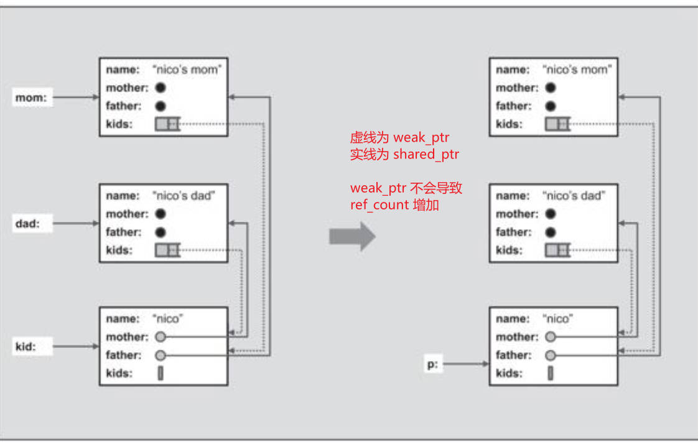

# 语言新特性

## nullptr
nullptr 取代 NULL，因为编译器无法区分 NULL 和 0
```cc
void f(int)
void f(void *)

f(0)
f(NULL)
```

## auto

## 一致性初始化
在C++11之前，程序员，特别是初学者，很容易被这个问题混淆：如何初始化一个变量或对象。初始化可因为小括号、大括号或赋值操作符（assignment operator）的出现而发生。

为此C++11引入了“一致性初始化”（uniform initialization）概念，意思是面对任何初始化动作，你可以使用相同语法，也就是使用大括号。以下皆成立：

```cc
int values[] {1, 2, 3};
vector<string> s {
    "aa", "bb", "cc"
};

int i;   // 未初始化
int j{}; // 初始化为0
int *p;  // 未初始化
int *q{}; // 初始化为nullptr
```

为了支持“用户自定义类型之初值列”（initializer lists for user-defined types）概念，C++11 提供了 `class template std：：initializer_list＜＞`，

用来支持以一系列值（a list of values）进行初始化，或在“你想要处理一系列值（a list of values）”的任何地点进行初始化。例如：

```cc
#include <initializer_list>
#include <iostream>

using namespace std;

void print(initializer_list<int> value)
{
    for (auto i = value.begin(); i != value.end(); ++i)
        cout << *i << endl;
}

int main (int argc, char *argv[]) {
    print({1, 2, 3, 4});
    return 0;
}
```

```cc
class P {
    public:
        P(int, int);
        P(std::initializer_list<int>);
};

int main (int argc, char *argv[]) {
    P p(1, 2);     // P(int, int)
    P q{1 ,2};     // P(std::initializer_list)
    P r{1, 2, 3};  // P(std::initializer_list)
    P s = {1, 2};  // P(std::initializer_list)
    return 0;
}
```


## explicit

explicit 修饰的函数，只能进行显示调用，不能隐式调用，

explicit 只能在类定义中修饰函数

C++中的explicit关键字只能用于修饰只有一个参数的类构造函数, 它的作用是表明该构造函数是显示的, 而非隐式的, 
```
struct A
{
    A(int) { }      // converting constructor
    A(int, int) { } // converting constructor (C++11)
    operator bool() const { return true; }
};
 
struct B
{
    explicit B(int) { }
    explicit B(int, int) { }
    explicit operator bool() const { return true; }
};
 
int main()
{
    A a1 = 1;      // OK: copy-initialization selects A::A(int)
    A a2(2);       // OK: direct-initialization selects A::A(int)
    A a3 {4, 5};   // OK: direct-list-initialization selects A::A(int, int)
    A a4 = {4, 5}; // OK: copy-list-initialization selects A::A(int, int)
    A a5 = (A)1;   // OK: explicit cast performs static_cast
    if (a1) { }    // OK: A::operator bool()
    bool na1 = a1; // OK: copy-initialization selects A::operator bool()
    bool na2 = static_cast<bool>(a1); // OK: static_cast performs direct-initialization
 
//  B b1 = 1;      // error: copy-initialization does not consider B::B(int)
    B b2(2);       // OK: direct-initialization selects B::B(int)
    B b3 {4, 5};   // OK: direct-list-initialization selects B::B(int, int)
//  B b4 = {4, 5}; // error: copy-list-initialization does not consider B::B(int, int)
    B b5 = (B)1;   // OK: explicit cast performs static_cast
    if (b2) { }    // OK: B::operator bool()
//  bool nb1 = b2; // error: copy-initialization does not consider B::operator bool()
    bool nb2 = static_cast<bool>(b2); // OK: static_cast performs direct-initialization
 
    [](...){}(a4, a5, na1, na2, b5, nb2); // may suppress "unused variable" warnings
}
```

```cc
class P {
    public:
        P(int, int);
        explicit P(std::initializer_list<int>);
};

int main (int argc, char *argv[]) {
    P p(1, 2);     // P(int, int)
    P q{1 ,2};     // P(std::initializer_list)
    P r{1, 2, 3};  // P(std::initializer_list)
    // P s = {1, 2};  // Error 不能进行隐式转换
    return 0;
}
```
## Range-Based for
语法如下：
```cc
for ( decl : coll ) {
    statement
}
```

一般而言，如果coll提供成员函数begin（）和end（），那么一个range-based for 等同于
```cc
{
    for ( auto _pos = coll.begin(), _end = coll.end(); _pos != _end; ++_pos) {
        decl = *_pos;
        statement
    }
}
```
或者如果不满足上述条件，那么也等同于以下使用一个全局性begin（）和end（）且两者都接受coll为实参：
```cc
{
    for ( auto _pos = begin(coll), _end = end(coll); _pos != _end; ++_pos) {
        decl = *_pos;
        statement
    }
}
```

```cc
    for (int i  : {1, 2 }) {
        cout << i << endl;
    }
    
    vector<int> v;
    for (auto &i  : v ) { // 必须使用引用，否则for会作用在local copy上
        i += 3;
    }
```

### 注意
当元素在for循环中被初始化为decl，不得有任何显式类型转换（explicit type conversion）。因此下面的代码无法通过编译：

```cc
class C {
    public:
        explicit C(string &s);
};

vector<string> vs;
for (C &elem : vs) { // 无法进行 C &elem = *vs.iterator(); 的隐式类型转换
    cout << elem << endl;
}
```
## Move语义和 右值引用
C++11的一个最重要的特性就是，支持move semantic（搬迁语义）。这项特性更进一步进入了C++主要设计目标内，用以避免非必要拷贝（copy）和临时对象（temporary）。

当没有使用右值引用和move时，下面代码有两个问题：
```cc
X x;
coll.insert(x);
coll.insert(x + x); // 1. insert 内部对匿名变量进行拷贝构造，若是深拷贝，深层内存对象其实可以直接给新对象
coll.insert(x);     // 2. 之后x不再使用。x相当于匿名对象
```

进行优化
```cc
X x;
coll.insert(x);             // 左值拷贝
coll.insert(x + x);         // 匿名对象，右值拷贝
coll.insert(std::move(x));  // 右值拷贝
```


move 本身不进行搬运，而是进行类型转换，返回 `T &&` 的类型

当左值拷贝和右值拷贝能分区后，就可以定义不同处理逻辑的方法
```cc
class set {
    public:
        insert(const T &x); // 处理左值
        insert(T && x);     // 处理右值
};
```

在 `insert(T &&x)` 中，可以直接搬运 x的深层对象，不需要进行深拷贝。

## noexcept
指明某个函数无法——或不打算——抛出异常
```cc
void foo() noexcept;
```
声明了foo（）不打算抛出异常。若有异常未在foo（）内被处理——亦即如果foo（）抛出异常——程序会被终止，然后std：：terminate（）被调用并默认调用std：：abort（）

## constexpr
constexpr可用来让表达式核定于编译期。例如:
```cc
constexpr int square(int x)
{
    return x * x;
}
int a[square(3)];
```

## 变参模板

```cc
// 递归的终止函数
void print()
{
}

template <typename T, typename... Types>
void print(const T& firstArg, const Types&... args)
{
    std::cout << firstArg << endl;
    print(args...); // 递归打印剩余参数
}

int main (int argc, char *argv[]) {

    print(1, "hello", 3.0);

    return 0;
}
```

```cc
template <class... T>
void f(T... args)
{    
    cout << sizeof...(args) << endl; //打印变参的个数
}

f();        //0
f(1, 2);    //2
f(1, 2.5, "");    //3
```

## 模板别名

自 C++11 起，支持 template （partial） type definition。然而由于关键字 typename 用于此处时总是出于某种原因而失败，所以这里引入关键字 using，并因此引入一个新术语alias template。举个例子，写出以下代码

```cc
template <typename T>
using Vec = std::vector<T, MyAlloc<T>>;

Vec<int> coll;
// 相当于
Vec<int, MyAlloc<int>> coll;
```

## Lambda
C++11引入了lambda，允许inline函数的定义式被用作一个参数，或是一个local对象。

所谓lambda是一份功能定义式，可被定义于语句（statement）或表达式（expression）内部。因此你可以拿lambda当作inline函数使用。

lambda 语法
```
[捕获外部变量](形参列表) -> 返回值 {操作代码}

如果返回值不需要，->返回值可以省略
[捕获外部变量](形参列表) {操作代码}

捕获外部变量
[] : 不捕获任何变量
[=] : 已传值的方式捕获外部所有变量
[&] : 以传引用的方式捕获外部所有变量
[this] : 捕获外部this指针
[=, &a] : a使用引用方式捕获，其他变量使用传值方式捕获
[a, b] : a,b值传递捕获
```

### lambda 做了什么

lambda 本质上是定义一个类，这个类定义了 `operator()`

比如下面的lambda 
```
    auto f = [a, b](int c, int d) {
        return a + b + c + d;
    } ;
```
转换为类就是

```
class lambda_c {
    public:
        lambda_c(int a, int b): ma(a), mb(b) {}

        auto operator()(int c, int d) const {
            return ma + mb + c + d;
        }

    private:
        int ma;
        int mb;
};
```

注意 `operator()` 的 this 是 const，这会导致代码无法修改 a, b

```
    auto f = [a, b](int c, int d) {
        a = 1; // 错误
        b = 2; // 错误
        return a;
    } ;
```

原因是

```
class lambda_c {
    public:
        lambda_c(int a, int b): ma(a), mb(b) {}

        auto operator()(int c, int d) const {
            a = 1;    // 错误
            b = 2;    // 错误
            return a;
        }

    private:
        int ma;
        int mb;
};
```

这样修改

```
class lambda_c {
    public:
        lambda_c(int a, int b): ma(a), mb(b) {}

        auto operator()(int c, int d) const {
            a = 1;    // 错误
            b = 2;    // 错误
            return a;
        }

    private:
        mutable int ma;
        mutable int mb;
};
```

```
    auto f = [a, b](int c, int d) mutable {
        a = 1; // 错误
        b = 2; // 错误
        return a;
    } ;
```

## decltype 
 decltype 可让编译器找出表达式（expression）类型。这其实就是常被要求的typeof的特性体现。只不过原有的typeof缺乏一致性又不完全，C++11才引入这么一个关键字。举个例子：
 
```cc
map<string, float> coll;
decltype(coll)::value_type p;
```

decltype的应用之一是声明返回类型（见下），另一个用途是在metaprogramming（超编程，见5.4.1节第125页）或用来传递一个lambda类型（见10.3.4节第504页）。

###  新的函数声明语法
有时候，函数的返回类型取决于某个表达式对实参的处理。然而类似

```cc
// 这是错误语法，只是用于说明
template <typename T1, typename T2>
decltype(x+y) add(T1 x, T2 y);
```

在C++11之前是不可能的，因为返回式所使用的对象尚未被引入，或未在作用域内。

但是在C++11，你可以将一个函数的返回类型转而声明于参数列之后：

```cc
template <typename T1, typename T2>
auto add(T1 x, T2 y) -> decltype(x + y);
```

## 带域的枚举
C++11允许我们定义scoped enumeration——又称为 strong enumeration或enumeration class——这是C++enumeration value（或称enumerator）的一个较干净的实现。例如：

enum class Salutation : char {mr, ma, co, none};

重点在于，在enum之后指明关键字class。

Scoped enumeration有以下优点：

· 绝不会隐式转换至/自int。

· 如果数值（例如mr）不在enumeration被声明的作用域内，你必须改写为Salutation：：mr。

· 你可以明显定义低层类型（underlying type，本例是char）并因此获得一个保证大小（如果你略去这里的“：char”，默认类型是int）。

· 提前声明（forward declaration） enumeration type是可能的，那会消除“为了新的enu-merations value而重新编译”的必要——如果只有类型被使用的话。

注意，有了type trait std：：underlying_type，你可以核定（evaluate）一个enumeration type的低层类型（详见5.4.2节第131页）。

标准异常的差错状态值（error condition value）也是个scoped enumerator（见4.3.2节第45页）。

# 通用工具
## Pair Tuple
Pair 用于处理类型不同的两个值，常用于实现返回一个 value pair, 若容器元素是 key/value pair.

Tuple 是pair的延伸，可以接受任意个数的元素。

### Pair
Class pair 可将两个 value 视为一个单元。C++标准库内多处用到了这个 class。

尤其容器 map、multimap、unordered_map和 unordered_multimap就是使用 pair来管理其以key/value pair形式存在的元素（详见7.8节第331页）。

任何函数如果需返回两个value，也需要用到pair，例如minmax（）（见5.5.1节第134页）。

Struct pair定义于＜utility＞，提供表5.1所列的各项操作。原则上你可以对pair＜＞执行create、copy/assign/swap及compare操作。

此外它还提供 first_type和 second_type类型定义式，用来表示第一value和第二value

为了让外部访问，Pair是struct，所以成员都是public


#### make_pair

Template函数make_pair（）使你无须写出类型就能生成一个pair对象。举个例子，你不必这样写：

```cc
pair<int, char>(42, '@');
```

可以写成这样
```cc
make_pair(42, '@');
```

make_pair的声明如下，

其中返回值的细节和它们的类型V1和V2，取决于x和y的类型。

C++stan-dard明确指出，如果可能的话`make_pair（）`使用move语义，否则就使用copy语义。

此外它会蛀蚀（decay）实参，致使`make_pair（＂a＂，＂xy＂）`产出一个`pair＜const char*，const char*＞`而非一个`pair＜const char[2]，const char[3]＞`

```cc
template<typename _T1, typename _T2>
pair<V1, V2> make_pair(_T1&& __x, _T2&& __y)
```


面对C++11新语义，你可以借由强迫使用move semantic或reference semantic来影响`make_pair（）`的产出类型。

如果你的选择是move semantic，只需使用`std：：move（）`声明被传递的实参不再使用

```cc
string s, t;
auto p = make_pair(move(s), move(t));
... // s, t 不再使用
```


如果你的选择是 reference semantic，就必须使用 ref（），那会强迫形成一个 reference 类型，或使用 cref（）强迫形成一个constant reference类型

```cc
int i = 0;
auto p = make_pair(ref(i), ref(i));
++p.first;
++p.second;
cout << "i : " << i << endl;    // 2
```

自C++11起，你也可以使用定义于＜tuple＞内的tie（）接口，抽取出pair的value：

```cc
pair<char, char> p = make_pair('x', 'y');

char c;
tie(std::ignore, c) = p; // p->first 被忽略， p->second 被赋值给c
```

#### pair之间的比较
C++标准库提供了大家惯用的操作符。两个pair对象内的所有元素都相等，这两个pair对象才被视为相等（equal）

两个pair互相比较时，第一元素具有较高的优先级。所以如果两个pair的第一元素不相等，其比较结果就成为整个比较的结果。

如果first相等，才继续比较second，并把比较结果当作整体结果：


### Tuple
它扩展了pair的概念，拥有任意数量的元素。

#### Tuple的操作
原则上，tuple接口十分直观：
- 通过明白的声明，或使用便捷函数`make_tuple（）`，你可以创建一个tuple。
- 通过`get＜＞（） `function template，你可以访问tuple的元素。

```cc
auto t = make_tuple(1, 2.0, 'c');
cout << get<0>(t) << endl;
cout << get<1>(t) << endl;
cout << get<2>(t) << endl;
```


借由特别的函数对象 `reference_wrapper＜＞` 及便捷函数 `ref（）` 和 `cref（）` ，

你可以影响`make_tuple（）`产生的类型，例如以下表达式产出的tuple带有一个reference指向变量或对象s：

```cc
string s;
auto p = make_tuple(ref(s));
get<0>(p) = "my value"; // 修改 s
```

如果想最方便地在tuple中使用reference，可选择`tie（）`，它可以建立一个内含reference的tuple：

```cc
tuple<int, float, string> p(1, '2', "str");

int i;
float f;
string s;
tie(i, f, s) = p;
```

这里的`std：：tie（i，f，s）`会以i、f和s的reference建立起一个tuple，因此上述赋值操作其实就是将t内的元素分别赋值为Ti、f和s。

使用`tie（）`时，`std：：ignore`允许我们忽略tuple的某些元素，也就是我们可以用它来局部提取tuple的元素值：

```cc
tie(i, std::ignore, s) = p;
```

#### Tuple 和初始序列
Tuple的构造被声明为 explicit，所以必须进行显示转换

```cc
void foo(tuple<Args...> t);

foo(42); // 错误不能隐式转换
foo(make_tuple(42)); // OK

tuple<int, double> t1(1, 2); // OK 老语法
tuple<int, double> t1{1, 2}; // OK 新语法
tuple<int, double> t3 = { 1, 2}; // ERROR
```

#### 其他特性
有些辅助函数是特别为tuple而设计的，特别是为了支持泛型编程：
- `tuple_size＜tupletype＞`：value可获得元素个数。
- `tuple_element＜idx，tupletype＞`：type可取得第idx个元素的类型（也就是get（）返回值的类型）。
- `tuple_cat（）`可将多个tuple串接成一个tuple。

下面的例子示范了如何使用`tuple_size＜＞`和`tuple_element＜＞`

```cc
typename tuple<int, string> tuple_type;
tuple_size<tuple_type>::value; // 2
tuple_element<1, tuple_type>::type; // string
```

可以使用`tuple_cat（）`串接所有形式的tuple，甚至包括`pair＜＞`

```cc
int n;
auto tt = tuple_cat(make_tuple(1, "hello"), 
                    tie(n));
```

### pair 和 tuple的转换 
你可以拿一个pair作为初值，初始化一个双元素tuple，也可以将一个pair赋值给一个双元素tuple

## 智能指针
自C++11起，C++标准库提供两大类型的smart pointer：

1.Class shared_ptr实现共享式拥有（shared ownership）概念。

多个smart pointer可以指向相同对象，该对象和其相关资源会在“最后一个 reference 被销毁”时被释放。

为了在结构较复杂的情境中执行上述工作，标准库提供了 weak_ptr、bad_weak_ptr和enable_shared_from_this等辅助类。

2.Class unique_ptr实现独占式拥有（exclusive ownership）或严格拥有（strict ownership）概念，

保证同一时间内只有一个smart pointer可以指向该对象。

你可以移交拥有权。它对于避免资源泄漏（resource leak）——例如“以new创建对象后因为发生异常而忘记调用delete”——特别有用。

C++98只让C++标准库提供一个smart pointer class：`auto_ptr＜＞`，其设计是为了执行现今的unique_ptr所提供的服务。

然而由于当时缺乏语言特性如“针对构造和赋值”的move语义，以及其他瑕疵，这个class不易被理解且容易出错。

因此在TR1引入class shared_ptr，C++11引入class unique_ptr之后，class auto_ptr成为C++11中被正式反对（deprecated）的成分，

意味着你不该再使用它，除非你手上还有一些老旧代码需要编译。

所有smart pointer class都被定义于头文件＜memory＞内。

### class shared_ptr
多个shared_ptr可以共享（或说拥有）同一对象。对象的最末一个拥有者有责任销毁对象，并清理与该对象相关的所有资源。

#### 使用 shared_ptr
你可以像使用任何其他pointer一样地使用shared_ptr。你可以赋值、拷贝、比较它们，也可以使用操作符`*`和`->`访问其所指向的对象。看看下面这个例子：

```cc
#include <iostream>
#include <string>
#include <memory>
#include <vector>

using namespace std;

int main (int argc, char *argv[]) {
    shared_ptr<string> pnico(new string("nico"));
    shared_ptr<string> pjutta(new string("jutta"));

    (*pjutta)[0] = 'N';
    pjutta->replace(0, 1, "J");

    vector<shared_ptr<string>> who_make_coffee;
    who_make_coffee.push_back(pjutta);
    who_make_coffee.push_back(pjutta);
    who_make_coffee.push_back(pnico);
    who_make_coffee.push_back(pjutta);
    who_make_coffee.push_back(pnico);

    for (auto p : who_make_coffee) {
        cout << *p << " ";
    }
    cout << endl;

    *pnico = "Nicolai";
 
    for (auto p : who_make_coffee) {
        cout << *p << " ";
    }
    cout << endl;

    cout << "use_count : " << who_make_coffee[0].use_count() << endl;

    return 0;
}
```
在给智能指针赋值时，必须使用智能指针，并且不支持隐式类型转换

    //shared_ptr<string> pname = "nico";  // 错误不能使用普通指针
    shared_ptr<string> pname  = make_shared<string>("nico"); // 调用 string::allocator 分配一个对象，并让 shared_ptr 指向他
    shared_ptr<string> pname2{new string("nico")};           // 新语法的构造初始化
    shared_ptr<string> pname3(new string("nico"));           // 老语法的构造初始化

    shared_ptr<string> pname4;
    //pname4 = new string("nico");    // 错误不能使用普通指针赋值
    pname4.reset(new string("nico")); // 必须用shared_ptr.reset


普通指针和shared_ptr使用上的区分


    // 原生new和malloc的需要将右值取地址
    {
        int *n1 = new int; // int 取地址 -> int *
        int **n2 = new int*; // int * 取地址 -> int **
        int **n3 = new int *[10]; // int *[10] 取地址 -> int **

        int *p1 = (int *)malloc(sizeof(int));
        int **p2 = (int **)malloc(sizeof(int*));
        int **p3 = (int **)malloc(sizeof(int *[10]));
    }


    // 但 智能指针左右的类型相互对应

    {
        shared_ptr<int> n1(new int);
        shared_ptr<int *> n2(new int *);
        shared_ptr<int **> n3(new int **);

        // 指针的 shared_ptr 只能通过 operator * 访问
        *n1 = 0;
        // n1[0] = 0; 错误

        // 并且区分 指针和数组
        shared_ptr<int []> a1(new int[10]);
        shared_ptr<int [][20]> a2(new int[10][20]);
        shared_ptr<int *[20]> a3(new int *[20]);

        // 并且数组的 shared_ptr 智能通过 [] 访问
        a1[0] = 0;
        a1[1] = 0;
        // *a1 = 0; // 错误
    }


shared_ptr 不能进行 ++, -- 操作，要使用完全指针语义，需要先转换为普通指针

    shared_ptr<int []> parr(new int [10]);
    for (int i = 0; i < 10; ++i) {
        parr.get()[i] = i;
    }

#### 自定义 deleter
我们可以声明属于自己的deleter，例如让它在“删除被指向对象”之前先打印一条信息

    shared_ptr<string> p(new string("nico"),
            [](string *p) {
                cout << "delete " << *p << endl;
                delete p;
            }
            );
    p = nullptr; // p指向的对象没有 shared_ptr 引用，析构该对象 

#### 对付 array
shared_ptr提供的default deleter调用的是delete，不是`delete[]`

这意味着只有当shared pointer拥有“由new建立起来的单一对象”，default deleter方能适才适所。

很不幸，为array建立一个shared_ptr是可能的，却是错误的

shared_ptr<int> p(new int[10]);

你需要自定义deleter

shared_ptr<int> p(new int[10],[](int *p) { delete []p;});

也可以使用为 unique_ptr而提供的辅助函数（见5.2.5节第106页）作为 deleter，其内调用`delete[]`：

shared_ptr<int> p(new int[10], std::default_delete<int []>());

#### 其他析构策略
最末一个拥有者——亦即shared pointer——结束生命时，如果清理工作不仅仅是删除内存，你必须明确给出自己的deleter。你可以指定属于自己的析构策略。

第一个例子：假设我们想确保“指向某临时文件”之最末一个reference被销毁时，该文件即被移除。可以这么做：

#include <cstdlib>
#include <unistd.h>
#include <fstream>
#include <string>
#include <memory>
#include <cstdio>

using namespace std;

// 定义函数对象，用于存储文件名称
class FileDeleter {
    private:
        string filename;
    public:
        FileDeleter(const string &fn)
            :filename(fn) {

            }
        void operator() (std::ofstream *fp) {
            fp->close();
            remove(filename.c_str());
            delete fp;
        }
};

int main (int argc, char *argv[]) {

    {
        system("touch ./tmp.txt");
        shared_ptr<ofstream> fp(new ofstream("./tmp.txt"),
                // 将函数对象作为deleter
                FileDeleter("./tmp.txt")); 
    }

    return 0;
}

下面展示如何使用  shared_ptr 利用共享内存

#include <cstdlib>
#include <fcntl.h>
#include <cstring>
#include <unistd.h>
#include <sys/mman.h>
#include <cerrno>
#include <memory>
#include <cstdio>
#include <iostream>

using namespace std;

class SharedMemoryDetacher {
    public:
        void operator() (int *p) {
            cout << "unlink /tmp1234" << endl;
            // 释放虚拟内存
            munmap(p, m_sz);
            // 删除shm节点
            if (shm_unlink("/tmp1234") < 0) {
                cerr << "OOPS : shm_unlink failed" << endl;
            }
        }
        SharedMemoryDetacher(int sz) : m_sz(sz) {}
    private:
        int m_sz;
};

shared_ptr<int> getSharedMemory(int num) {

    void *mem;

    // 在 shm 文件系统中创建 节点
    int shmfd = shm_open("/tmp1234", O_CREAT | O_RDWR, 0644);
    if (shmfd < 0) {
        throw  string(strerror(errno));
    }

    // 预分配空间
    if ((ftruncate(shmfd, num * sizeof(int))) < 0) {
        throw  string(strerror(errno));
    }

    // 将 shm节点 page cache 映射到本进程的虚拟内存
    mem = mmap(nullptr, num * sizeof(int), PROT_READ | PROT_WRITE, MAP_SHARED, shmfd, 0);
    if (mem == MAP_FAILED) {
        cerr << "mmap : " << strerror(errno) << endl;
        return nullptr;
    }

    // 将普通指针 mem 转换为 shared_ptr 指针 ，并设置 deleter
    // 通过匿名对象的方式返回，
    return shared_ptr<int>(static_cast<int *>(mem), SharedMemoryDetacher(num));

    // 使用 lambda 的写法
    return shared_ptr<int>((int *)mem, 
            [num](int *p) {
                 munmap(p , num * sizeof(int));
                 shm_unlink("/tmp1234");
            });
}

int main (int argc, char *argv[]) {

    shared_ptr<int> smp(getSharedMemory(100));

    // 设置共享内存的内存
    // shared_ptr 不支持 operator++, 所以用 get() 获得普通指针，进行操作
    for (int i = 0; i < 100; ++i) {
        smp.get()[i] = i;
    }

    // 此处 smp 的 ref_count 设置为0，调用 SharedMemoryDetacher
    smp.reset();
    
    return 0;
}

### class weak_ptr

使用shared_ptr主要是为了避免操心pointer指向的资源。先前已说过，shared_ptr会自动释放“不再被需要的对象”的相应资源。

然而，某些情势下，这样的行为无法运作或不被期望：

- 例子之一是所谓的cyclic reference（环式指向）。如果两对象使用shared_ptr互相指向对方，而一旦不存在其他reference指向它们时，你想释放它们和其相应资源。这种情况下shared_ptr不会释放数据，因为每个对象的use_count（）仍是1。此时你或许会想使用寻常的pointer，但这么做却又得自行照顾和管理“相应资源的释放”。
- 另一个例子发生在你“明确想共享但不愿拥有”某对象的情况下。你要的语义是：reference 的寿命比其所指对象的寿命更长。因此 shared_ptr 绝不释放对象，而寻常pointer可能不会注意到它们指向的对象已经不再有效，导致“访问已被释放的数据”的风险。

于是标准库提供了class weak_ptr，允许你“共享但不拥有”某对象。这个class会建立起一个shared pointer。一旦最末一个拥有该对象的shared pointer失去了拥有权，任何weak pointer都会自动成空（empty）。因此，在default和copy构造函数之外，class weak_ptr只提供“接受一个shared_ptr”的构造函数。

你不能够使用操作符`*`和`->`访问weak_ptr指向的对象。而是必须另外建立一个shared pointer。

基于以上所述，class weak_ptr只提供小量操作，只够用来创建、复制、赋值weak pointer，以及转换为一个shared pointer，或检查自己是否指向某对象。

考虑下面示例

#include <string>
#include <memory>
#include <iostream>
#include <vector>

using namespace std;

class Person {
    public:
        string name;
        shared_ptr<Person> mother;
        shared_ptr<Person> father;
        vector<shared_ptr<Person>> kids;

        Person(const string &n,
                shared_ptr<Person> m = nullptr,
                shared_ptr<Person> f = nullptr) 
            : name(n), father(f), mother(m) {}

        ~Person() {
            cout << "delete" << name << endl;
        }
};

shared_ptr<Person> initFamily(const string &name) {
    shared_ptr<Person> mom(new Person(name + "'s mon"));
    shared_ptr<Person> dad(new Person(name + "'s dad"));
    shared_ptr<Person> kid(new Person(name, mom, dad));
    mom->kids.push_back(kid);
    dad->kids.push_back(kid);
    return kid;
}

int main (int argc, char *argv[]) {
    shared_ptr<Person> p = initFamily("Bill");
    p = initFamily("John");
    return 0;
}

由于循环引用导致内存泄漏


使用 weak_ptr 解决

class Person {
    public:
        string name;
        shared_ptr<Person> mother;
        shared_ptr<Person> father;

        //vector<shared_ptr<Person>> kids;
        vector<weak_ptr<Person>> kids;

        ...
};



