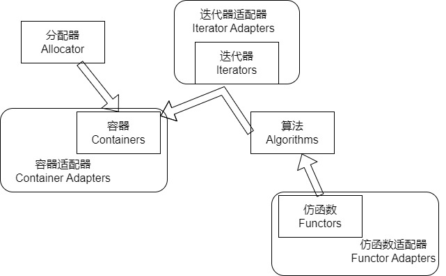
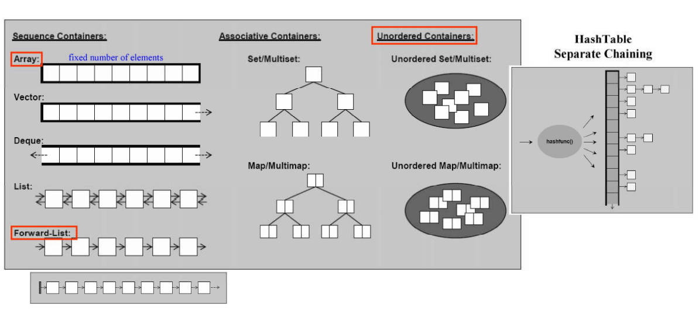

# 总览

## STL的构成
STL有6大组件:
* 容器
* 分配器
* 迭代器
* 算法
* 仿函数
* 适配器

他们的关系如下




示例

```cpp
#include <vector>
#include <algorithm>
#include <functional>
#include <iostream>

using namespace std;

int main() {
	int arr[6] = {1, 2, 3, 4, 5, 6};
    /*
     * vector : container
     * allocator : allocator
     */
	vector<int, allocator<int>> v(arr, arr + 6);

    /*
     * count_if : algorithm
     * v.begin v.end : iterator
     * not1 : function adapter (negator)
     * bind2nd : function adapter (binder)
     * less : function object
     */
	cout << count_if(v.begin(), v.end(), not1(bind2nd(less<int>(), 4))) << endl;
	return 0;
}
```

## 容器的内存结构



- 序列化容器: 元素放入顺序决定在容器的位置
  - Array: 固定大小数组无法扩容
  - Vector: 单方向增加元素，并自动扩容
  - Deque: 双方向增加元素，并自动扩容
  - List: 双向循环链表
  - Forward List: 单向循环链表

- 关联容器: 元素放入顺序不决定在容器的位置，由元素的Key按序存放
  - 标准库没有规定Set/Map用红黑树还是哈希表，但是由于红黑树性能好，所以实际都用红黑树实现。
  - Multi: 如果Key是会重复的，则应该用Multi
  - Set/Multiset: 节点只存放Key，即Key就是Value
  - Map/Multimap: 节点根据Key，存放Key和Value

- Unorder容器
  - 本质上使用哈希表实现，根据Key放到某链表，所以元素的顺序和Key无关
  - Unorder Set/Multiset
  - Unorder Map/Multimap


